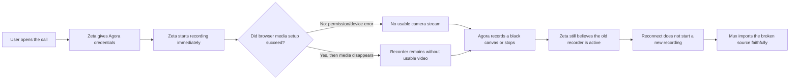

# Live Coaching Permission And Recording Recovery

## Context

Tickets #37 and #38 occurred in dev on 2026-07-15 for two bookings scheduled at 18:45 Europe/Rome. Ticket #37 shows iPhone Safari failing with `AgoraRTCError PERMISSION_DENIED: NotAllowedError`. Ticket #38 reports Mux asset `YKcBAeE3AaZKR3qqZ9VfaRKLb00qmQqY005WjNC302UvN4` showing video briefly and then a black screen.

## Confirmed Incident Findings

- Ticket #37 maps to booking `ec4b948c-9608-4c6c-babe-24696684651e`. Cloud Run issued expert UID 2 tokens repeatedly from 18:59:58 through 19:05:30 local, including at the screenshot's 19:01 time. The backend join authorization/token path succeeded; failure occurred in the browser.
- `AgoraService.join()` joins the channel, then calls fatal `AgoraRTC.getDevices()` before the intended independent mic/camera `Promise.allSettled` flow. On iOS Safari, one denied/unavailable permission aborts the whole setup and the UI exposes the raw SDK error.
- Ticket #38 maps to booking `6cbe799c-0a78-42c5-aa41-26971f88d5ff`. Recording started at 18:30:26 local when student UID 1 requested credentials, before browser join or media publication. Expert UID 2 did not request credentials until 18:43:47.
- Agora stored one 225-second MP4. Its first roughly one minute has normal-sized media segments; subsequent segments are small black-canvas output until the recorder leaves at 18:34:19. Agora Analytics shows UID 1 still in the channel, so channel membership did not mean usable published media.
- Zeta kept the recording row in `started` until cleanup at 19:35:03. Later participant reconnects did not restart recording because persisted `started` is treated as authoritative without querying Agora.
- Mux created the asset at 19:35:03, marked it ready four seconds later, and reports duration 3:45. Mux faithfully imported the already-truncated/black Agora source; Mux is not the cause.
- The tickets are connected by the same sequencing flaw: requesting RTC credentials starts recording before media setup succeeds. A permission failure can therefore create or strand a recorder with no valid human video.

## Plain-Language Failure Flow

Today Zeta treats "the user asked for access to the call" as if it meant "the user is in the call and their camera works." Those are not the same thing.

The intended flow is: credentials only open the door; the first confirmed human RTC join starts recording; recording continues while at least one human remains even if everyone disables camera and microphone; an empty channel grace stops the attempt; every later restart is preserved as another ordered video part in the same asset.

## Decision And Scope

Fix the permission regression immediately, then replace booking-level optimistic recording state with confirmed human-occupancy gating, provider reconciliation, and attempt-level persistence.

Product and architecture decisions:

1. One coaching booking produces one review asset.
2. One asset may contain multiple ordered video parts. One valid Agora recording attempt becomes one video part. Do not concatenate attempts: separate parts preserve gaps, failures, timestamps, and review context honestly.
3. Credentials never start recording. The first confirmed human RTC join plus a fresh authenticated heartbeat starts it. This permits reliable solo recording tests.
4. Recording continues while at least one human participant is present. Camera and microphone publication are UI/diagnostic state, not recording lifecycle gates. A person with both devices disabled is still an intentional participant and the recording may contain a branded placeholder or blank canvas.
5. Stop only after zero human participants remain for a short grace (initial decision: 60 seconds, configurable after dev observation). Do not count the Agora recorder UID or webpage-renderer UID as a human. Sixty seconds is preferable to 30 because a mobile refresh or brief network handoff is less likely to create an unnecessary new video part.
6. Agora Cloud Recording Query reconciles the recorder's actual state. Channel Management may be used as a secondary presence/reconciliation check, filtered to the known student/expert UIDs.
7. For fallback composite recording, set `maxIdleTime` from 120 to 60 seconds only after restartable attempts and provider reconciliation exist, aligning it with the human-empty grace. Web Page Recording does not use this as its lifecycle control; it requires explicit Stop plus a hard `maxRecordingHour` watchdog.
8. Do not buy Agora Analytics to drive recording. Its useful APIs are delayed and paid; SDK events, Zeta heartbeats, Cloud Recording Query, and optional Channel Management cover the runtime decision without that subscription.

Do not try to repair the reported Mux asset: the original GCS source is already black/truncated. Quarantine or remove that reviewable video only through an explicit operator decision.

## Existing Multi-Part Support And Required Gap

The core asset model already supports multiple `videos` rows for one `asset`. Normal multi-file upload, asset detail, per-video reviews, the video-part selector, and aggregate duration reporting already work. The live-recording path is the part that is singular today:

- `coaching_booking_recordings` and `coaching_recording_imports` allow only one row per booking;
- a later Agora start overwrites or is blocked by the earlier booking-level state;
- import creates a new one-video asset and scans a booking-wide prefix for the largest MP4;
- video ordering is implicit, and an asset could be finalized before a late second attempt imports.

Therefore this is an extension of the existing asset/video model, not a replacement of it.

## Phase 1: Permission And Join Hotfix

Areas:

- `web/dashboard-next/src/app/core/calls/agora.service.ts`
- `web/dashboard-next/src/app/pages/video-call/video-call-page.component.ts`
- a shared feature-level participant video tile/call-stage component reused by live and recording views
- `web/dashboard-next/src/app/pages/sessions/sessions-page.component.ts`
- `web/dashboard-next/public/i18n/{en,de,fr}.json`

Changes:

1. Split credential loading, media preparation, RTC join, and publication into explicit stages.
2. Request mic/camera from a visible user action on the call screen so iOS Safari retains user-activation context. Create mic and camera independently and permit audio-only or video-only participation when one device fails.
3. Make device enumeration best-effort and non-fatal. Enumerate after permission/track creation, or use the SDK's permission-skipping option where supported.
4. If failure occurs after `client.join`, close any created tracks and leave the Agora channel before returning an error.
5. Map permission denied, device missing, device busy, and unsupported-context errors to localized recovery UI. Provide Retry and clear browser-settings guidance; never display raw SDK messages.
6. Track human connection, audio publication/enabled state, and video publication/enabled state independently. Today `remoteJoined` incorrectly means "has an audio or video track," so a connected fully-muted participant appears absent. Listen to `user-joined`, `user-left`, `user-published`, and `user-unpublished`, and model student/expert state separately from recorder/system UIDs.
7. Introduce a reusable participant tile with name/role, avatar/initials fallback, waiting, camera-off, reconnecting, and microphone-off states. Use it on both the live session and recorder page so state semantics and styling do not drift.
8. On the live page, keep the normal participant-friendly composition (remote participant is primary, local self-view is PiP), but add the same avatar/camera-off/mute indicators. The recorder uses the separate deterministic student-primary composition below.
9. Show live participants a small scheduled-time pill: `Ends in 23:41`; after the scheduled end, show `Overtime +02:10` without automatically ending the call. Do not burn this timer into recorded output.
10. Remove the live client's direct `recording/stop` action from Leave. Leaving should only leave RTC/report presence; the backend stops only after the last human has been absent for the agreed grace.
11. Handle local track-ended, device changes, page foregrounding, and RTC reconnect state so camera publication can be restored after interruption.

Tests:

- Add direct unit tests for `AgoraService`, the shared participant tile/stage, and `VideoCallPageComponent` covering both permissions allowed, mic-only, camera-only, both denied, `getDevices` rejection, publish rejection, retry, partial cleanup, joined-with-no-media, track-ended, remote unpublish/republish, remote leave, recorder UID filtering, timer transition, Leave without recording Stop, and component destruction.
- Add Storybook or screenshot fixtures for waiting, camera-off/avatar, mic-off, reconnecting, audio-only, video-only, desktop, and portrait-mobile live states.
- Add an iPhone Safari manual matrix for allow, deny, previously denied, background/foreground, screen lock, incoming-call interruption, and reconnect.

## Phase 2: Decouple Credentials And Establish Human Presence

Areas:

- `internal/coaching/connect.go`
- `internal/coaching/recording.go`
- `internal/api/server.go`
- `db/queries/coaching.sql` and generated sqlc files
- dashboard coaching API client and call page

Changes:

1. Make `ConnectToBooking` side-effect free: validate participation/time and return RTC credentials only.
2. Add an idempotent participant-state endpoint called only after `client.join()` succeeds and after every publication/change. Record `joined`, `connection_state`, `audio_enabled`/published, `video_enabled`/published, connection generation, and `last_seen_at` separately for student UID 1 and expert UID 2. Send toggle/connection changes immediately and refresh every 10-15 seconds while connected; do not rely only on browser unload events.
3. Start Cloud Recording when the first authenticated human has both a confirmed RTC join and a fresh heartbeat. Do not require the second participant, camera, microphone, or a successful `publish()` call.
4. Do not hold a booking database transaction/row lock across Agora HTTP calls. Atomically claim a start attempt, commit, call Agora, then persist the provider result with compensation/reconciliation for partial failure.
5. On `user-joined`, `user-left`, `user-published`, and `user-unpublished`, update local UI state and report the matching presence/media state. A successful local `join()` is the start signal; publication state controls placeholders and diagnostics only.
6. Extend the participant-scoped connect/session presentation response with safe UI metadata: caller role, scheduled start/end, and student/expert UID, display name, role, and avatar. Reuse the same DTO in the renderer capability exchange; never include email or unrelated profile data.
7. Derive participant and recorder token expiry from booking end plus reconnect/cleanup grace; add renewal for sessions that can outlive the initial token.

Tests:

- Add handler tests for authorization, time boundaries, UID mapping, token generation, joined-state validation, idempotency, concurrent first-join calls, and recording-provider failure.
- Prove that credential requests and permission failures do not start recording.
- Prove that one joined participant starts recording and that camera-off, microphone-off, and audio-only/video-only changes do not stop it.

## Phase 3: Provider State, Recording Collection, And Attempts

Areas:

- new reversible migration for `coaching_recording_collections`, `coaching_recording_attempts`, attempt imports, and participant readiness/presence
- `db/queries/coaching.sql`, sqlc output, and mocks
- `internal/coaching/recording.go`
- scheduler endpoints/workflows for recording cleanup

Changes:

1. Add a booking-level recording collection containing one shared `asset_id`, aggregate status, and `sealed_at`. New attempts may be added until the collection is sealed after the session/reconnect window and all active work is terminal.
2. Model every Agora `acquire`/`start` lifecycle as a recording attempt with its own UUID, monotonic `attempt_number`, resource ID, SID, status, timestamps, exact file prefix, and last provider state. Enforce at most one active attempt per booking. Keep booking-level status derived from attempts rather than overwriting one row forever.
3. Add Agora Query support. Before trusting `started`, verify the provider task. Retry a temporary Query 404 with bounded backoff during Agora's recovery window, then convert a confirmed idle/ended task into terminal attempt state and start a new attempt when participants are ready and the booking remains connectable.
4. Reconcile active attempts periodically throughout the booking, not only after scheduled end. Log auto-stop and provider/DB disagreement explicitly.
5. Make `stopping` retryable after crashes. Treat Stop 404 as a reconciliation outcome with structured context, not silent success.
6. Keep an attempt active while at least one known human UID has a fresh presence lease, regardless of published media. When both human leases are absent/stale for 60 seconds, explicitly stop it. A return during grace cancels the pending stop and continues the same attempt; a return after confirmed stop creates attempt 2 with a new acquire/resource ID/SID and a new recorder UID.
7. Put a bounded restart cap/cooldown around flapping clients (initial proposal: at most 10 attempts per booking, configurable after observing dev data) so a broken browser cannot create unbounded provider tasks and cost.
8. Optionally call Agora Channel Management from the backend when local and provider state disagree. Count only the expected student/expert UIDs; exclude recorder/system UIDs. Do not poll it continuously.
9. Enforce a hard watchdog at the booking's allowed end/reconnect boundary plus cleanup grace so a ghost heartbeat or renderer cannot create an unbounded recording.

Tests:

- Cover solo start, second participant joining/leaving without a split, both participants with no published media, empty-channel grace, early attempt auto-stop followed by later join/restart, active query without duplicate start, temporary and terminal Query 404, concurrent starts, stop 404, crash in `stopping`, provider success plus DB failure, and long-session token renewal.
- Add Postgres integration tests for attempt transitions, locking, retry, and idempotency.

## Phase 4: Import And Quality Guardrails

Areas:

- `internal/coaching/recording_store.go`
- `internal/coaching/recording_import.go`
- Mux wrapper and recording import tests

Changes:

1. Give every attempt its own GCS prefix containing the attempt UUID. Import from the exact attempt/file manifest returned by Agora Query/Stop. Do not scan the whole booking prefix and choose the globally largest MP4.
2. Key import state and Mux passthrough by `attempt_id`. Each successful attempt appends one `videos` row to the collection's shared asset; an idempotency constraint prevents duplicate parts on retry.
3. Add an explicit video `position`/`sort_order` derived from `attempt_number`, so parts remain chronological even if imports finish out of order.
4. Validate source duration, object size, attempt identity, and provider completion before creating a reviewable part. Do not reject a part because only one person was present, everyone disabled media, the image is black/a placeholder, or the duration is short: those are now valid product states. Quarantine only structurally empty/corrupt output, impossible duration/manifest mismatches, or explicit provider failures. A failed attempt remains visible operationally but does not create an empty video part.
5. Persist and log source object metadata, provider duration/status, Mux duration/status, attempt ID, and candidate count. Never log tokens, device IDs, or raw participant PII.
6. Make delayed source discovery recoverable beyond the current retry cap and alert on exhausted/stuck imports.
7. Prevent asset finalization until the recording collection is sealed and no attempt/import is pending. After sealing, preserve the existing rule that every video part must be reviewed.

Tests:

- Cover two attempts producing one asset with two parts, out-of-order import with correct ordering, multiple MP4s, exact selection, delayed files, Mux create/get failures, idempotent retries, missing public playback, duration mismatch, quarantine behavior, and finalization before/after collection sealing.

## Phase 5: Asset-Centric API And Review UI

Areas:

- coaching booking API response and dashboard client models
- video details part selector and translations

Changes:

1. Return `recording.asset_id`, aggregate status, `parts_ready`, and `parts_total`. Deprecate the singular recording `video_id` after clients migrate.
2. Reuse the existing multi-part player/review flow. Label parts with useful context such as `Recording 1 · 18:45 · 12:30` rather than only `Part 1`.
3. Keep comments/review timestamps scoped to each video part, as they are today.
4. Show processing/failed-attempt state separately from playable parts without exposing provider implementation details to the learner or expert.

Tests:

- Add API detail tests for ordered parts and aggregate recording state.
- Add frontend tests for switching playback and reviews between two recorded parts, a pending second part, and a quarantined/failed attempt.

## Phase 6: Secure Web Page Recording Pilot

Rationale:

- The current Agora mode is composite `mix`. It is cheaper and simpler, but Agora documents that if nobody publishes audio or video during the entire attempt, `start` may return 200 while no recording file is generated (internal error 206). It therefore cannot guarantee the requested Teams-like all-muted recording.
- Web Page Recording records a Chrome-compatible page's rendered UI and page audio. A dedicated Zeta renderer can always draw participant tiles, names/roles, camera-off/microphone-off placeholders, and session state even when no RTC media exists.
- This improves the recording's meaning and continuity, but does not fix lifecycle by itself. Zeta still owns human presence, empty grace, attempts, Stop, Query, import, and restart.

Pilot areas:

- a minimal top-level dashboard route outside the normal shell/auth guards, for example `/recording-view`
- a public capability-exchange API registered outside WorkOS-protected coaching routes
- Agora Web Page Recording client, Query/Stop support, and attempt state
- feature/config parity across `.env.example`, dev/prod workflows, runtime binding, and documentation if a mode flag is introduced

Deterministic visual specification:

1. Use a fixed 16:9 canvas. Target 1280x720 for the cost-conscious pilot and verify 1920x1080 separately before considering Full HD pricing.
2. Student is always the primary full canvas. Expert is always a small bottom-right PiP, approximately 22-26% of canvas width and never more than 28%, with a 16:9 aspect ratio and player-control-safe bottom/right inset. Never promote the expert to half/full screen and never swap tiles based on active speaker or join order.
3. If only the expert is present, keep the student placeholder as the primary canvas and show the expert live in PiP. If only the student is present, keep the student primary and show an expert waiting placeholder in PiP. If both are present, keep the same positions with no layout jump.
4. Render student video with `object-fit: contain` on a neutral branded background so body movement/portrait video is not cropped. Expert PiP may use `cover` to use its small area efficiently.
5. Each tile has a restrained name/role label. Show a small crossed-microphone badge only when audio is muted/unavailable; absence of the badge means audio is active. Never rely on color alone.
6. For joined camera-off state, show the profile avatar centered with `Camera off`; fall back to initials, then a neutral role icon. For not-yet-joined state, show the same identity treatment with `Student/Expert will join soon`. For reconnecting, keep the stable tile and show `Reconnecting...`; never expose technical errors in the video.
7. Add only a small low-opacity Strido watermark in the bottom-left safe area. Do not burn elapsed time, remaining time, or overtime into the recording: the player already has part-relative time, while multi-attempt gaps and overtime make a baked timer misleading.
8. Use the shared participant tile/state model from the live page, but allow different composition: recorder is always student-primary; live remains remote-primary/local-PiP for a natural participant experience.

Security design:

1. Do not use a reusable password, user WorkOS session, application JWT, or RTC token directly in the URL. Agora documents a URL field but no custom request headers, cookies, mTLS identity, or proof that the visitor is Agora.
2. Generate a cryptographically random 256-bit capability for one recording attempt. Store only its hash; bind it to attempt ID, channel, reserved receive-only renderer UID, expiry, and revoked state.
3. Prefer `https://.../recording-view#cap=...`: URL fragments are not sent in the HTTP request, normal access logs, or referrer. The page exchanges the capability in a POST body, immediately removes it with `history.replaceState`, and receives only short-lived subscriber credentials plus safe layout metadata. Validate in the pilot that Agora preserves and loads fragment URLs; if not, use an opaque short-lived URL token with explicit access-log risk controls.
4. The public route serves only an inert renderer shell. Without a valid capability it returns no booking/participant data and cannot join RTC. A stolen capability is still a bearer credential during its TTL, so keep entropy high, scope narrow, TTL short but tolerant of renderer reload, revoke at Stop, rate-limit exchange, and never log it.
5. Apply `Cache-Control: no-store`, `Referrer-Policy: no-referrer`, strict CSP/self-hosted assets, no third-party scripts/navigation, and generic 404/410 failures. The renderer must never receive Agora App Certificate, REST credentials, storage credentials, or general Zeta API access.
6. Reserve a system UID for the renderer, grant only join/subscribe privileges, prevent it from publishing, hide it from participant UI, and exclude it from human occupancy.

Recording/reliability design:

1. The renderer joins the coaching channel, subscribes to the known student/expert UIDs, and renders deterministic role-indexed tiles/placeholders. All `<video>` elements must support unattended autoplay as required by Agora's webpage recorder. RTC join/publish/unpublish events provide immediate tile state; the scoped backend participant state is the fallback/reconciliation source.
2. Start Web Page Recording paused where supported, use a renderer-ready handshake, then resume. A successful Agora Start is not enough: an inaccessible URL can make the task exit after Start, so use Query with bounded backoff and renderer health state.
3. Explicitly Stop after 60 seconds with no human presence. The renderer's own channel membership must not keep the session alive. Set `maxRecordingHour` to a hard booking/reconnect bound because Web Page Recording keeps charging until Stop or that cap.
4. Do not run composite and webpage modes together in production. A short dev comparison may run both because they are separate resource IDs and both are billed.
5. Current public pricing is $14 per 1,000 HD webpage-recording minutes versus $5.99 per 1,000 HD cloud-recording minutes, approximately 2.34x. Measure real cost and output quality in dev before selecting it as primary.

Pilot acceptance:

- expert alone and student alone each create a playable recording;
- a participant muted with camera off from start to finish still produces a playable placeholder MP4;
- audio-only media is audible and camera/microphone toggles update layout without changing lifecycle;
- second participant join/leave updates layout but does not split while one human remains;
- both humans absent for less than 60 seconds and returning continue one part; absent longer then returning produce part 2 in the same asset;
- renderer URL failure, page crash/reload, expired/revoked/wrong-attempt capability, Query failure, and Stop retry are recoverable without duplicate parts or data exposure;
- the renderer cannot publish, is hidden from participant counts, and never prevents human-empty Stop.
- expert-only, student-only, and both-present screenshots match the deterministic student-primary/expert-PiP composition at 1280x720; expert never exceeds 28% width;
- camera-off renders avatar/initials, mic-off renders a visible badge, reconnect does not swap layout, and the live page shows the same state language/components;
- the live countdown transitions to overtime without stopping RTC, and no countdown is present in the recorded pixels.

## Presence And Analytics Decision

Use the cheapest signals in this order:

1. Agora Web SDK join/leave and publish/unpublish events for immediate human presence and tile state.
2. Zeta's authenticated heartbeat/media-state endpoint for durable backend state.
3. Cloud Recording Query for the recording task itself.
4. Agora Channel Management REST only for secondary reconciliation/diagnostics when states disagree.
5. Consider RTC webhooks later for operational corroboration; they require deduplication and ordering.
6. Do not add Agora Signaling yet. It has a free tier, but it introduces another SDK/token/channel and still does not prove RTC media publication.
7. Keep Agora Analytics for human investigation after an incident. Do not put delayed analytics data into the start/stop control loop and do not purchase a paid analytics tier for this feature.

Cost finding as of 2026-07-15: Agora Analytics Starter is free, Standard is $449/month, Premium is $999/month, and Enterprise is $1,599/month. The roughly €45/$39-$59 plans belong to Signaling bundles, not the real-time Analytics API needed for control. Signaling's free plan covers up to 1 million messages/month and 20 peak concurrent users, but is not required for this fix.

## Observability

- Add sanitized frontend call-stage telemetry: credentials, permission request, RTC joined, mic/camera acquired, published, track ended, reconnecting, left, and stable error code/browser family.
- Add backend events for readiness, attempt claimed, provider started/queried/auto-stopped/stopped, restart, source selected, import quarantined, Mux created/ready/errored, and reconciliation mismatch.
- Correlate by booking ID and recording-attempt ID. Keep UID role only (student/expert/recorder), with no token, email, full device label, or other raw PII.

## Release Order And Acceptance

1. Ship Phase 1 to dev as a hotfix and verify on real iPhone Safari plus desktop Safari/Chrome.
2. Ship Phases 2-3 behind dev-only recording enablement and validate first-human occupancy lifecycle with the current composite mode. Change composite `maxIdleTime` to 60 in the same release as attempts, Query, and restart support—never as a standalone hotfix.
3. Run the Phase 6 Web Page Recording pilot in dev. Make webpage mode primary only if all-muted output, audio capture, protected URL, renderer recovery, and measured cost pass acceptance; otherwise retain composite mode and explicitly accept that an entirely unpublished attempt may have no file.
4. Explicitly test a 15-minute interruption: attempt 1 stops, a participant returns while the booking is connectable, attempt 2 starts, and both parts import into one asset in chronological order.
5. Verify Agora timeline, raw GCS media, attempt rows, renderer state, Cloud Run logs, and Mux output agree before prod rollout.
6. Ship Phases 4-5 guardrails/UI, then decide how to quarantine the existing broken asset.

Acceptance criteria:

- Denied media permission produces actionable localized UI and a retry can succeed without a ghost Agora participant.
- One denied device still allows the other usable medium.
- Credential requests alone never start recording.
- The first confirmed human RTC join starts recording, including a solo participant.
- Camera and microphone publication never control recording start/stop. With webpage mode selected, a fully muted/camera-off attempt still creates a playable placeholder video.
- Recording continues when one participant leaves but another remains.
- Returning during the 60-second human-empty grace continues the same attempt; returning after confirmed Stop creates a new attempt.
- Provider auto-stop is detected and a valid reconnect creates a new attempt.
- A booking with a valid 15-minute interruption produces one asset with two ordered, independently playable/reviewable video parts.
- Recorder/system UIDs never count as human presence, and a hard watchdog prevents runaway recording/cost.
- The final review asset contains all intended valid attempts and no unexplained black tail.
- No paid Agora Analytics tier or separate Signaling integration is required for correct start/stop behavior.
- Logs make client stage, provider state, source selection, and Mux state traceable without sensitive data.

## External References

- [Agora Cloud Recording API overview](https://docs-legacy.agora.io/en/cloud-recording/cloud_recording_api_rest)
- [Agora Cloud Recording `start` and `maxIdleTime`](https://docs-legacy.agora.io/en/cloud-recording/cloud_recording_api_start?platform=RESTful)
- [Agora current Cloud Recording `start` reference](https://docs.agora.io/en/api-reference/api-ref/cloud-recording/start)
- [Agora Cloud Recording integration best practices](https://docs.agora.io/en/realtime-media/cloud-recording/build/best-practices/integration-best-practices)
- [Agora Cloud Recording `stop`](https://docs-legacy.agora.io/en/cloud-recording/cloud_recording_api_stop?platform=RESTful)
- [Agora Web Page Recording guide](https://doc.shengwang.cn/doc/cloud-recording/restful/user-guides/web-mode/set-webpage-recording)
- [Agora: no output when nobody publishes media](https://agoraio.zendesk.com/hc/en-us/articles/46605889090068-Recording-Not-Generated-Due-to-No-Published-Audio-or-Video-Streams-in-Channel)
- [Agora Web Page Recording URL authentication guidance](https://agoraio.zendesk.com/hc/en-us/articles/41503688884116-Resolving-ACCESS-URL-FAILED-Error-in-Agora-Webpage-Recording-with-GCP-Web-Server)
- [Agora Recording pricing](https://www.agora.io/en/pricing/recording/)
- [Agora Channel Management REST API](https://docs-legacy.agora.io/cn/video-legacy/rtc_channel_management_restfulapi?changePlatformAlert=iOS&platform=iOS)
- [Agora Signaling presence](https://docs.agora.io/en/signaling/core-functionality/presence)
- [Agora Signaling pricing](https://www.agora.io/en/pricing/signaling/)
- [Agora Analytics pricing](https://www.agora.io/en/pricing/analytics/)

## Investigation Verification

- Queried the dev PostgreSQL database through the running Cloud SQL proxy.
- Correlated `zeta-api-dev` Cloud Run logs from 16:20-17:45 UTC.
- Inspected raw GCS recording objects and segment sizes.
- Inspected both affected channels in signed-in Agora Analytics via Chrome.
- Inspected the Mux asset and event timestamps via Chrome.
- Traced frontend join/media code and backend recording/import state machines.
- Ran `go test ./internal/coaching` successfully during the test-gap scan.
- Local `ffprobe`/`ffmpeg` media analysis was unavailable because the Homebrew binary has a broken `libx265` dynamic-library reference; provider/GCS/Mux metadata was sufficient to establish the source-side truncation.
