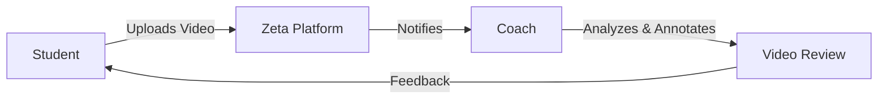
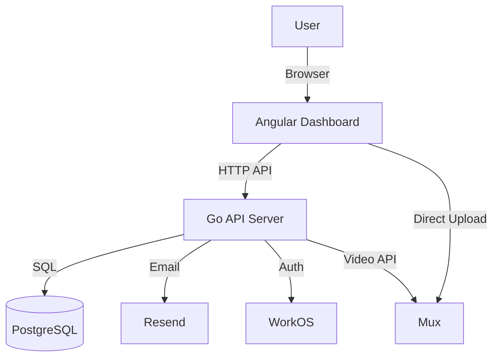
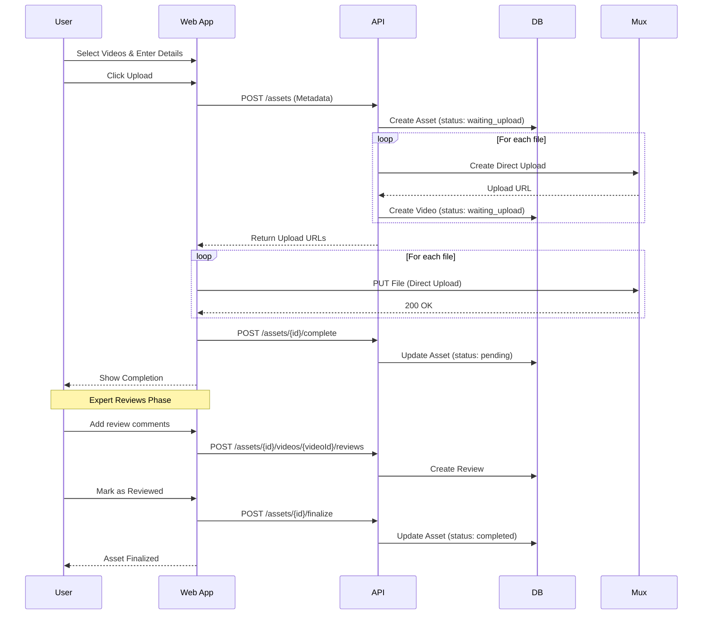
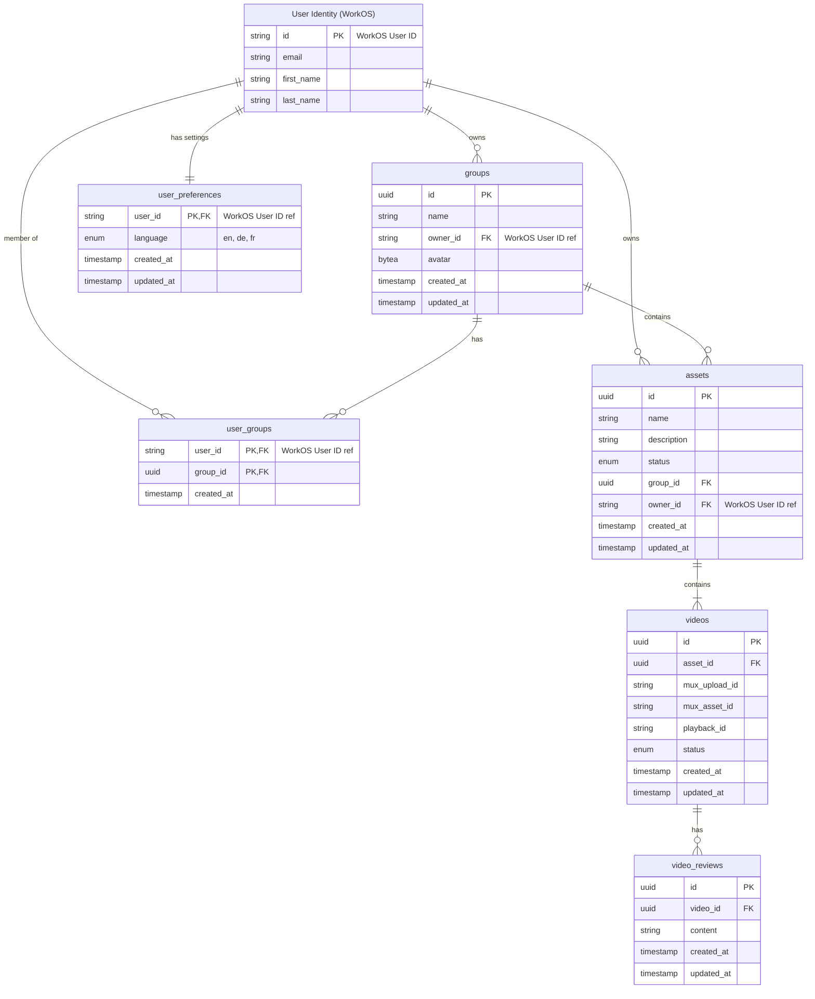

# Zeta: Digital Video Coaching Platform

Zeta is a modern platform designed to revolutionize remote coaching through digital video analysis. Connect with experts, upload your training sessions, and receive precise, time-stamped feedback—anytime, anywhere.

Inspired by the need for efficient remote coaching, Zeta bridges the gap between students and mentors, eliminating travel costs and scheduling conflicts while enabling professional monetization for experts.

## Key Features

- **remote Video Analysis**: Students upload videos of their practice; coaches provide detailed feedback.
- **Professional Dashboard**: Manage students, videos, and reviews in one place.
- **Groups Management**: Create and manage user groups.
- **Seamless Uploads**: Direct high-quality video uploads powered by Mux.
- **Secure Authentication**: Enterprise-grade auth via WorkOS.
- **Video Reviews**: Add comments and feedback directly to video clips.

## How to start

### Prerequisites

- Docker & Docker Compose
- Go 1.25+
- Node.js & pnpm (for the dashboard)
- WorkOS Account & Project
- Mux Account

### Environment Setup

1. Copy `.env.example` to `.env`:
   ```bash
   cp .env.example .env
   ```
2. Update `.env` with your WorkOS credentials.

3. **WorkOS Configuration**:
   - In WorkOS Dashboard > Configuration > Redirect URIs:
     - Add `http://localhost:8080/auth/callback`
   - In WorkOS Dashboard > Organization:
     - Ensure you have an Organization created (use its ID for `DEFAULT_ORG_ID`).
   - In WorkOS Dashboard > User Management > Roles:
     - Create Role `admin`
     - Create Role `expert`
     - Create Role `student` (Default)

4. **Mux Configuration**:
   - Create an Access Token in Mux Dashboard.

### Quick Start

1. **Start Infrastructure**:

   ```bash
   make infra:up
   ```

2. **Run Migrations**:

   ```bash
   make db:migrate:up
   ```

3. **Run Backend**:
   ```bash
   make api:start
   ```
4. **Run Frontend**:
   ```bash
   make web:start
   ```
   Dashboard available at `http://localhost:4200`.

### Auth Flow

- Public: `/health`
- Protected: `/assets` (Requires Login)
- Login: Click "Login via WorkOS" -> Redirects to WorkOS AuthKit -> Callback -> Logged In.

### API Examples

Check auth status:

```bash
curl -b "zeta_session=..." http://localhost:8080/auth/me
```

## Diagrams

### Core User Journey



### System Architecture



### Asset Lifecycle

Assets go through a simple three-state lifecycle:

1. **Waiting Upload** (`waiting_upload`): Files are being uploaded to Mux
2. **Pending Review** (`pending`): Files are uploaded and ready for expert review
3. **Reviewed** (`completed`): Expert has reviewed and the asset is finalized

### Video Upload Flow

The upload process is designed to ensure data consistency and clean user experience:

1. **Initiation**: Client requests upload URLs. Asset created in DB with status `waiting_upload`.
2. **Direct Upload**: Client uploads files directly to Mux storage (bypassing our API server for performance).
3. **Completion**: Client notifies API that uploads are finished via `POST /assets/{id}/complete`.
4. **Visibility**: Asset status updates to `pending` (awaiting review) and becomes visible in the dashboard.
5. **Review**: Expert adds reviews/comments to the asset.
6. **Finalization**: Expert marks asset as reviewed via `POST /assets/{id}/finalize`, status changes to `completed`.



## Database Schema


