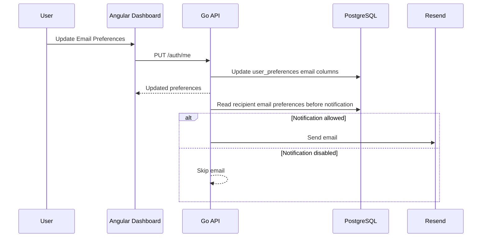
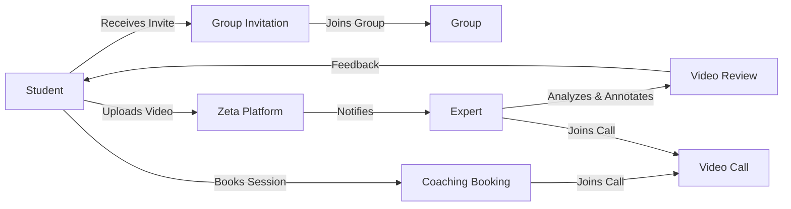
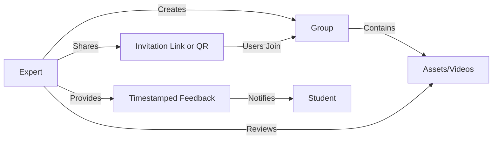
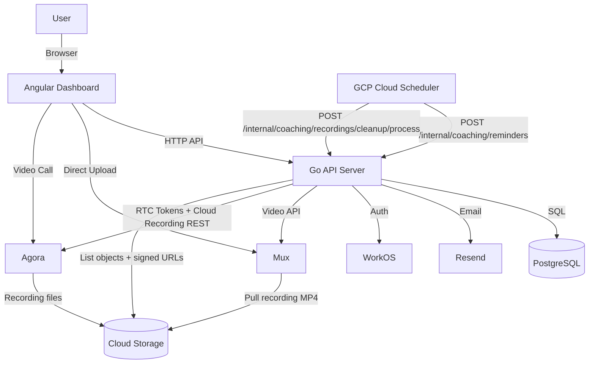
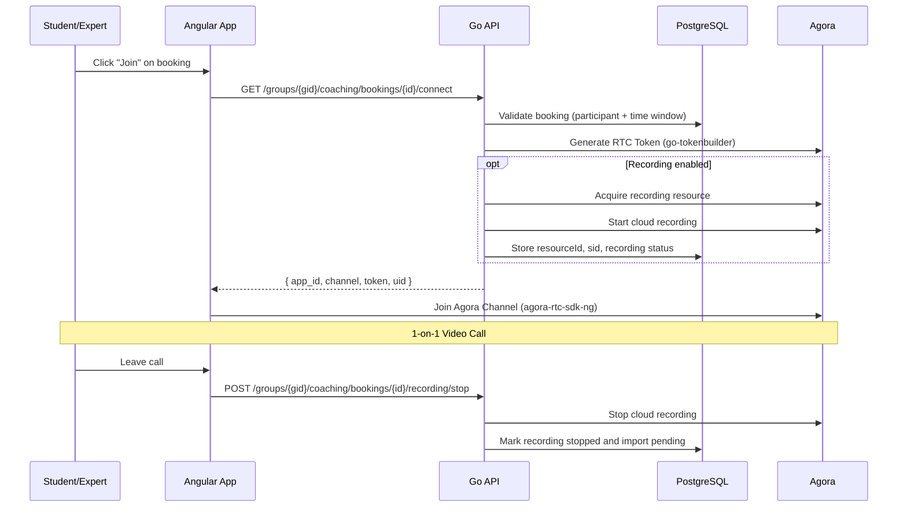
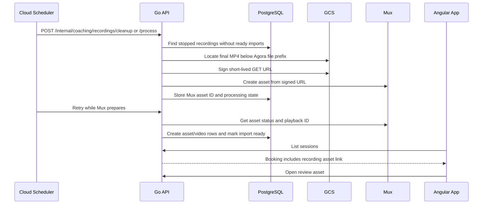
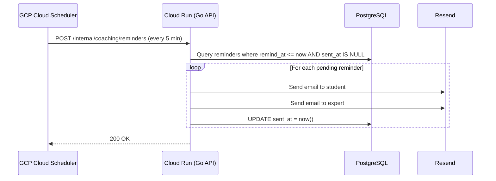
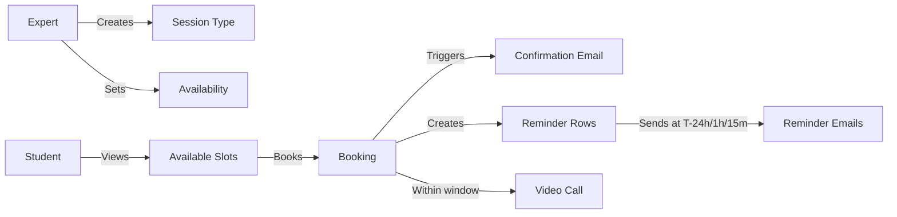
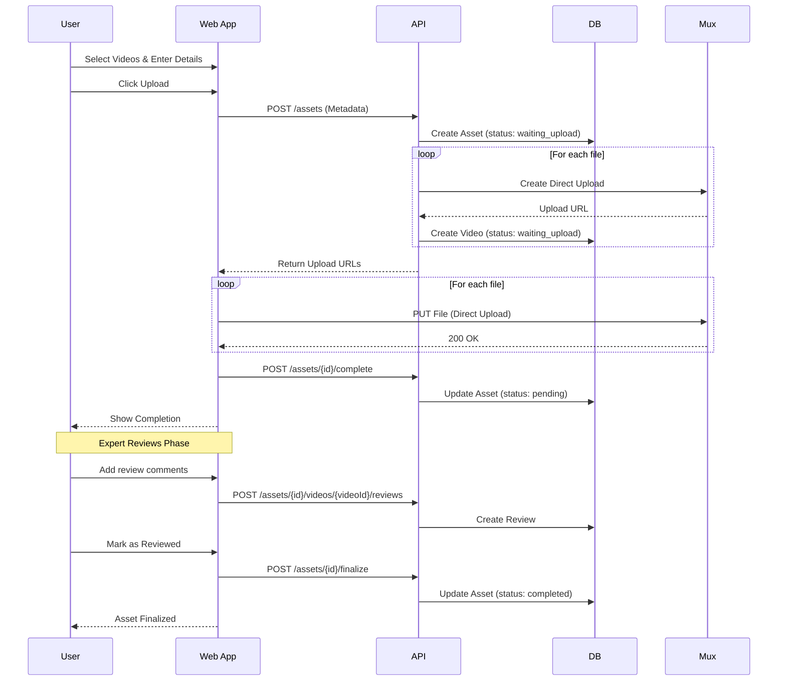
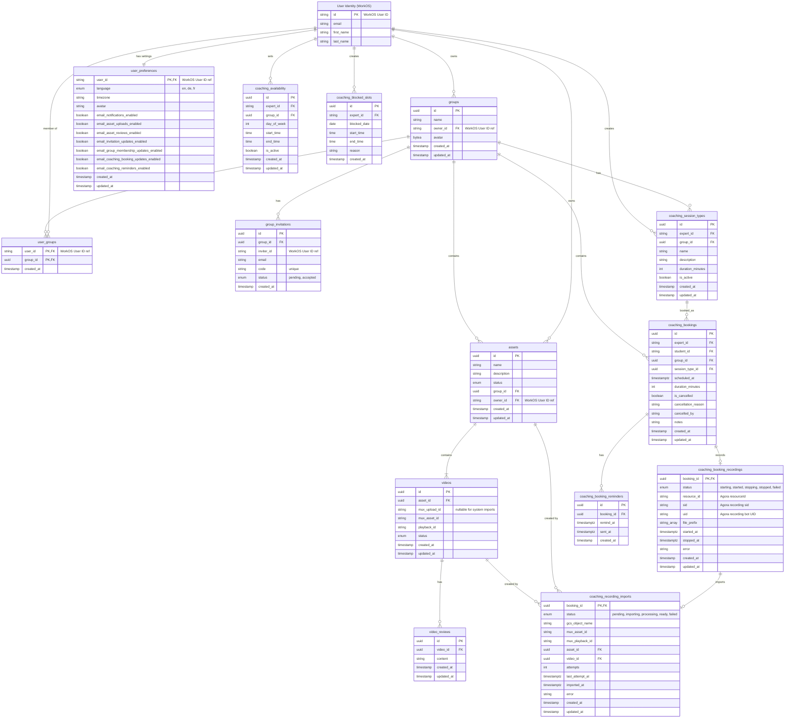

# Zeta: Digital Video Coaching Platform

Zeta is a modern platform designed to revolutionize remote coaching through digital video analysis. Connect with experts, upload your training sessions, and receive precise, time-stamped feedback—anytime, anywhere.

Inspired by the need for efficient remote coaching, Zeta bridges the gap between students and mentors, eliminating travel costs and scheduling conflicts while enabling professional monetization for experts.

## Key Features

- **Remote Video Analysis**: Students upload videos of their practice; experts provide detailed feedback.
- **Professional Dashboard**: Manage students, videos, and reviews in one place. Experts see the Videos page grouped into To review, In review, and Reviewed lists.
- **Groups Management**: Create and manage user groups.
- **Group Invitations**: Invite users to groups via email or reusable generic invitation links with QR code generation and confirmation flow.
- **Seamless Uploads**: Direct high-quality video uploads powered by Mux.
- **Secure Authentication**: Enterprise-grade auth via WorkOS.
- **Video Reviews**: Add comments and feedback directly to video clips.
- **Live Video Coaching**: 1-on-1 Agora-powered video calls with booking, availability management, and automated email reminders.
- **Live Session Recording**: Optional Agora Cloud Recording for live coaching sessions, with server-managed start/stop lifecycle and automatic import into the review flow.
- **Notification Preferences**: Users can control all email notifications or individual email categories from their Preferences page.

## How to start

### Prerequisites

- Docker & Docker Compose
- Go 1.25+
- Node.js & pnpm (for the dashboard)
- WorkOS Account & Project
- Mux Account
- Agora Account (App ID + App Certificate)

### Environment Setup

1. Copy `.env.example` to `.env`:
   ```bash
   cp .env.example .env
   ```
2. Update `.env` with your WorkOS credentials.

3. **WorkOS Configuration**:
   - In WorkOS Dashboard > Configuration > Redirect URIs:
     - Add `http://localhost:8080/auth/callback`
   - In WorkOS Dashboard > Organization:
     - Ensure you have an Organization created (use its ID for `DEFAULT_ORG_ID`).
   - In WorkOS Dashboard > User Management > Roles:
     - Create Role `admin`
     - Create Role `expert`
     - Create Role `student` (Default)

4. **Mux Configuration**:
   - Create an Access Token in Mux Dashboard.

5. **Resend Configuration**:
   - Create a Resend API key and set `RESEND_API_KEY`.
   - Verify the sender domain in Resend.
   - Set `RESEND_FROM_EMAIL` to an address on the verified domain, for example `notifications@dev.zeta.m4xon.com` for the deployed development environment.

6. **Agora Configuration**:
   - Create a project in [Agora Console](https://console.agora.io/).
   - Set `AGORA_APP_ID` and `AGORA_APP_CERTIFICATE` in `.env`.
   - To enable recording locally, enable Cloud Recording in Agora Console, create REST credentials, configure object storage that Agora can write to directly, and set `AGORA_CLOUD_RECORDING_ENABLED=true` with the `AGORA_REST_*` and `AGORA_RECORDING_*` variables.
   - In deployed `dev` and `prod`, Terraform provisions a Google Cloud Storage bucket plus HMAC credentials for Agora Cloud Recording. The deploy workflow injects static recording config as Cloud Run env vars and injects the generated HMAC credentials through Secret Manager.
   - Cloud Run receives read access to the private recording bucket and signs short-lived GCS URLs so Mux can import completed MP4 recordings. Users never receive direct GCS object access.

7. **Coaching Time Constraints** (optional, defaults are production-safe):
   - `MIN_BOOKING_NOTICE` — minimum lead time for new bookings (default: `2h`)
   - `CANCELLATION_NOTICE` — minimum notice to cancel (default: `1h`)
   - `CONNECT_WINDOW` — how early participants can join a call (default: `15m`)

### Quick Start

1. **Start Infrastructure**:

   ```bash
   make infra:up
   ```

2. **Run Migrations**:

   ```bash
   make db:migrate:up
   ```

3. **Run Backend**:
   ```bash
   make api:start
   ```
   For live reload during Go API development, run:
   ```bash
   make api:dev
   ```
   This uses the project-pinned Air tool through `go tool air`.

4. **Run Frontend**:
   ```bash
   make web:start
   ```
   Dashboard available at `http://localhost:4200`.

### Auth Flow

- Public: `/health`
- Protected: `/assets` (Requires Login)
- Login: Click "Login via WorkOS" -> Redirects to WorkOS AuthKit -> Callback -> Logged In.
- **Redirect Preservation**: When an unauthenticated user accesses a deep link (e.g., an invite URL), the initial path is captured to `localStorage` (with a 5-minute expiry) in `main.ts` before Angular bootstraps—ensuring route guards cannot redirect away before the path is saved. After successful authentication, the shell component reads and consumes the saved path, navigating the user back to the intended page.

### Asset Visibility

- Students can only see assets and videos they uploaded themselves.
- Experts and administrators can only see assets and videos submitted to groups where they are members.
- Video review endpoints require both the relevant `reviews:*` permission and visibility of the target video.
- Asset finalization requires both `assets:finalize` and visibility of the target asset.

### Group Invitation Flow

1. An admin or expert opens the group details page and clicks "Invite".
2. A dialog accepts an optional invitee email address.
3. The backend generates a unique 6-character code and, when an email is provided, sends an email with the invite link (`/groups?invite=<CODE>`).
4. The dialog displays a **QR code** (server-generated PNG) encoding the invite URL, with options to copy the link or download the QR image.
5. When a non-member opens the link (or scans the QR code), a confirmation dialog shows the group name and avatar.
6. On acceptance, the user is added to the group and redirected to the group details page.
7. If the current user already belongs to the group, the dashboard skips the invitation dialog and opens the group directly.
8. Email-specific invitations are single-use. Email-less invitation links remain reusable for sharing in print, on walls, or in group chats.

### Group Member Visibility

- The group details page separates members into Students and Experts lists.
- `GET /groups/{groupID}/users` returns students only and requires `groups:user-list:read`.
- `GET /groups/{groupID}/experts` returns experts and administrators and requires `groups:expert-list:read`.
- Expert and administrator roles should have both permissions. Student roles should only have `groups:expert-list:read`.

### Live Coaching Flow

1. An expert creates **session types** (name, duration 15–120 min in 5-minute increments) for a group and sets **weekly availability**.
2. A student browses available experts, picks a session type, and books a free slot.
3. Both participants receive a **booking confirmation email** via Resend.
4. Automated **reminders** are sent at 24 h, 1 h, and 15 min before the session (driven by GCP Cloud Scheduler polling every 5 min).
5. Within the connect window (default 15 min before start), a **Join** button appears on the dashboard.
6. Clicking Join calls the connect endpoint, which validates the booking and generates an **Agora RTC token**.
7. If enabled, the API starts **Agora Cloud Recording** for the booking before returning join data.
8. The Angular app joins the Agora channel and renders a **full-screen video call** page.
9. Leaving the call asks the API to stop the active recording; an internal cleanup endpoint can also stop recordings after their scheduled end.
10. Stopped recordings are queued for post-processing. The API locates the final MP4 in GCS, gives Mux a short-lived signed URL, creates a normal reviewable asset/video, and links it back to the booking.

### Notification Preferences Flow

1. A signed-in user opens the Preferences page.
2. The dashboard reads `/auth/me`, including the user's email notification preferences.
3. The user updates the master email setting or an individual notification category.
4. The dashboard saves the settings with `PUT /auth/me`.
5. Before sending account-owned notification emails, the API checks the recipient's `user_preferences` row.
6. Explicit invitation delivery to an entered email address remains tied to the inviter's send action and is not suppressed by a recipient preference.


```mermaid
sequenceDiagram
    participant U as User
    participant W as Angular Dashboard
    participant A as Go API
    participant D as PostgreSQL
    participant E as Resend

    U->>W: Update Email Preferences
    W->>A: PUT /auth/me
    A->>D: Update user_preferences email columns
    A-->>W: Updated preferences
    A->>D: Read recipient email preferences before notification
    alt Notification allowed
        A->>E: Send email
    else Notification disabled
        A-->>A: Skip email
    end
```

### API Examples

Check auth status:

```bash
curl -b "zeta_session=..." http://localhost:8080/auth/me
```

## Diagrams

### Core User Journey


```mermaid
graph LR
    Student[Student] -->|Receives Invite| Invite[Group Invitation]
    Invite -->|Joins Group| Group[Group]
    Student -->|Uploads Video| Zeta[Zeta Platform]
    Zeta -->|Notifies| Expert[Expert]
    Expert -->|Analyzes & Annotates| Review[Video Review]
    Review -->|Feedback| Student
    Student -->|Books Session| Booking[Coaching Booking]
    Booking -->|Joins Call| Call[Video Call]
    Expert -->|Joins Call| Call
```

### Core Expert Journey


```mermaid
graph LR
    Expert[Expert] -->|Creates| Group[Group]
    Expert -->|Shares| Invite[Invitation Link or QR]
    Invite -->|Users Join| Group
    Group -->|Contains| Assets[Assets/Videos]
    Expert -->|Reviews| Assets
    Expert -->|Provides| Feedback[Timestamped Feedback]
    Feedback -->|Notifies| Student[Student]
```

### System Architecture


```mermaid
graph TD
    User[User] -->|Browser| Web[Angular Dashboard]
    Web -->|HTTP API| API[Go API Server]
    API -->|SQL| DB[(PostgreSQL)]
    API -->|Email| Resend[Resend]
    API -->|Auth| WorkOS[WorkOS]
    API -->|Video API| Mux[Mux]
    Web -->|Direct Upload| Mux
    API -->|RTC Tokens + Cloud Recording REST| Agora[Agora]
    Agora -->|Recording files| Storage[(Cloud Storage)]
    API -->|List objects + signed URLs| Storage
    Mux -->|Pull recording MP4| Storage
    Web -->|Video Call| Agora
    Scheduler[GCP Cloud Scheduler] -->|POST /internal/coaching/reminders| API
    Scheduler -->|POST /internal/coaching/recordings/cleanup/process| API
```

### Video Call Sequence


```mermaid
sequenceDiagram
    participant U as Student/Expert
    participant W as Angular App
    participant A as Go API
    participant D as PostgreSQL
    participant AG as Agora

    U->>W: Click "Join" on booking
    W->>A: GET /groups/{gid}/coaching/bookings/{id}/connect
    A->>D: Validate booking (participant + time window)
    A->>AG: Generate RTC Token (go-tokenbuilder)
    opt Recording enabled
        A->>AG: Acquire recording resource
        A->>AG: Start cloud recording
        A->>D: Store resourceId, sid, recording status
    end
    A-->>W: { app_id, channel, token, uid }
    W->>AG: Join Agora Channel (agora-rtc-sdk-ng)
    Note over U,AG: 1-on-1 Video Call
    U->>W: Leave call
    W->>A: POST /groups/{gid}/coaching/bookings/{id}/recording/stop
    A->>AG: Stop cloud recording
    A->>D: Mark recording stopped and import pending
```

### Recording Post-Processing


```mermaid
sequenceDiagram
    participant S as Cloud Scheduler
    participant A as Go API
    participant D as PostgreSQL
    participant G as GCS
    participant M as Mux
    participant W as Angular App

    S->>A: POST /internal/coaching/recordings/cleanup or /process
    A->>D: Find stopped recordings without ready imports
    A->>G: Locate final MP4 below Agora file prefix
    A->>G: Sign short-lived GET URL
    A->>M: Create asset from signed URL
    A->>D: Store Mux asset ID and processing state
    S->>A: Retry while Mux prepares
    A->>M: Get asset status and playback ID
    A->>D: Create asset/video rows and mark import ready
    W->>A: List sessions
    A-->>W: Booking includes recording asset link
    W->>A: Open review asset
```

### Email Reminders Architecture


```mermaid
sequenceDiagram
    participant CS as GCP Cloud Scheduler
    participant CR as Cloud Run (Go API)
    participant D as PostgreSQL
    participant E as Resend

    CS->>CR: POST /internal/coaching/reminders (every 5 min)
    CR->>D: Query reminders where remind_at <= now AND sent_at IS NULL
    loop For each pending reminder
        CR->>E: Send email to student
        CR->>E: Send email to expert
        CR->>D: UPDATE sent_at = now()
    end
    CR-->>CS: 200 OK
```

### Coaching Booking Flow


```mermaid
graph LR
    Expert -->|Creates| SessionType[Session Type]
    Expert -->|Sets| Availability
    Student -->|Views| Slots[Available Slots]
    Slots -->|Books| Booking
    Booking -->|Triggers| Email[Confirmation Email]
    Booking -->|Creates| Reminders[Reminder Rows]
    Reminders -->|Sends at T-24h/1h/15m| ReminderEmail[Reminder Emails]
    Booking -->|Within window| VideoCall[Video Call]
```

### Asset Lifecycle

Assets go through a simple three-state lifecycle:

1. **Waiting Upload** (`waiting_upload`): Files are being uploaded to Mux
2. **Pending Review** (`pending`): Files are uploaded and ready for expert review
3. **Reviewed** (`completed`): Expert has reviewed and the asset is finalized

### Video Upload Flow

The upload process is designed to ensure data consistency and clean user experience:

1. **Initiation**: Client requests upload URLs. Asset created in DB with status `waiting_upload`.
2. **Direct Upload**: Client uploads files directly to Mux storage (bypassing our API server for performance).
3. **Completion**: Client notifies API that uploads are finished via `POST /assets/{id}/complete`.
4. **Visibility**: Asset status updates to `pending` (awaiting review) and becomes visible in the dashboard.
5. **Review**: Expert adds reviews/comments to the asset.
6. **Finalization**: Expert marks asset as reviewed via `POST /assets/{id}/finalize`, status changes to `completed`.


```mermaid
sequenceDiagram
    participant U as User
    participant W as Web App
    participant A as API
    participant D as DB
    participant M as Mux

    U->>W: Select Videos & Enter Details
    U->>W: Click Upload
    W->>A: POST /assets (Metadata)
    A->>D: Create Asset (status: waiting_upload)
    loop For each file
        A->>M: Create Direct Upload
        M-->>A: Upload URL
        A->>D: Create Video (status: waiting_upload)
    end
    A-->>W: Return Upload URLs
    loop For each file
        W->>M: PUT File (Direct Upload)
        M-->>W: 200 OK
    end
    W->>A: POST /assets/{id}/complete
    A->>D: Update Asset (status: pending)
    W-->>U: Show Completion

    Note over U,W: Expert Reviews Phase
    U->>W: Add review comments
    W->>A: POST /assets/{id}/videos/{videoId}/reviews
    A->>D: Create Review

    U->>W: Mark as Reviewed
    W->>A: POST /assets/{id}/finalize
    A->>D: Update Asset (status: completed)
    W-->>U: Asset Finalized
```

## Database Schema


```mermaid
erDiagram
    users ||--o{ groups : owns
    users ||--o{ user_groups : "member of"
    groups ||--o{ user_groups : has
    users ||--o{ assets : owns
    groups ||--o{ assets : contains
    assets ||--|{ videos : contains
    videos ||--o{ video_reviews : has

    users["User Identity (WorkOS)"] {
        string id PK "WorkOS User ID"
        string email
        string first_name
        string last_name
    }

    user_preferences {
        string user_id PK, FK "WorkOS User ID ref"
        enum language "en, de, fr"
        string timezone
        string avatar
        boolean email_notifications_enabled
        boolean email_asset_uploads_enabled
        boolean email_asset_reviews_enabled
        boolean email_invitation_updates_enabled
        boolean email_group_membership_updates_enabled
        boolean email_coaching_booking_updates_enabled
        boolean email_coaching_reminders_enabled
        timestamp created_at
        timestamp updated_at
    }

    users ||--|| user_preferences : "has settings"

    groups {
        uuid id PK
        string name
        string owner_id FK "WorkOS User ID ref"
        bytea avatar
        timestamp created_at
        timestamp updated_at
    }

    groups ||--o{ group_invitations : has

    group_invitations {
        uuid id PK
        uuid group_id FK
        string inviter_id "WorkOS User ID ref"
        string email
        string code "unique"
        enum status "pending, accepted"
        timestamp created_at
    }

    user_groups {
        string user_id PK, FK "WorkOS User ID ref"
        uuid group_id PK, FK
        timestamp created_at
    }

    assets {
        uuid id PK
        string name
        string description
        enum status
        uuid group_id FK
        string owner_id FK "WorkOS User ID ref"
        timestamp created_at
        timestamp updated_at
    }

    videos {
        uuid id PK
        uuid asset_id FK
        string mux_upload_id "nullable for system imports"
        string mux_asset_id
        string playback_id
        enum status
        timestamp created_at
        timestamp updated_at
    }

    video_reviews {
        uuid id PK
        uuid video_id FK
        string content
        timestamp created_at
        timestamp updated_at
    }

    coaching_session_types {
        uuid id PK
        string expert_id FK
        uuid group_id FK
        string name
        string description
        int duration_minutes
        boolean is_active
        timestamp created_at
        timestamp updated_at
    }

    coaching_availability {
        uuid id PK
        string expert_id FK
        uuid group_id FK
        int day_of_week
        time start_time
        time end_time
        boolean is_active
        timestamp created_at
        timestamp updated_at
    }

    coaching_blocked_slots {
        uuid id PK
        string expert_id FK
        date blocked_date
        time start_time
        time end_time
        string reason
        timestamp created_at
    }

    coaching_bookings {
        uuid id PK
        string expert_id FK
        string student_id FK
        uuid group_id FK
        uuid session_type_id FK
        timestamptz scheduled_at
        int duration_minutes
        boolean is_cancelled
        string cancellation_reason
        string cancelled_by
        string notes
        timestamp created_at
        timestamp updated_at
    }

    coaching_booking_recordings {
        uuid booking_id PK, FK
        enum status "starting, started, stopping, stopped, failed"
        string resource_id "Agora resourceId"
        string sid "Agora recording sid"
        string uid "Agora recording bot UID"
        string_array file_prefix
        timestamptz started_at
        timestamptz stopped_at
        string error
        timestamp created_at
        timestamp updated_at
    }

    coaching_recording_imports {
        uuid booking_id PK, FK
        enum status "pending, importing, processing, ready, failed"
        string gcs_object_name
        string mux_asset_id
        string mux_playback_id
        uuid asset_id FK
        uuid video_id FK
        int attempts
        timestamptz last_attempt_at
        timestamptz imported_at
        string error
        timestamp created_at
        timestamp updated_at
    }

    coaching_booking_reminders {
        uuid id PK
        uuid booking_id FK
        timestamptz remind_at
        timestamptz sent_at
        timestamp created_at
    }

    groups ||--o{ coaching_session_types : has
    users ||--o{ coaching_session_types : creates
    users ||--o{ coaching_availability : sets
    users ||--o{ coaching_blocked_slots : creates
    coaching_session_types ||--o{ coaching_bookings : booked_as
    groups ||--o{ coaching_bookings : contains
    coaching_bookings ||--o| coaching_booking_recordings : records
    coaching_booking_recordings ||--o| coaching_recording_imports : imports
    assets ||--o{ coaching_recording_imports : "created by"
    videos ||--o{ coaching_recording_imports : "created by"
    coaching_bookings ||--o{ coaching_booking_reminders : has
```
