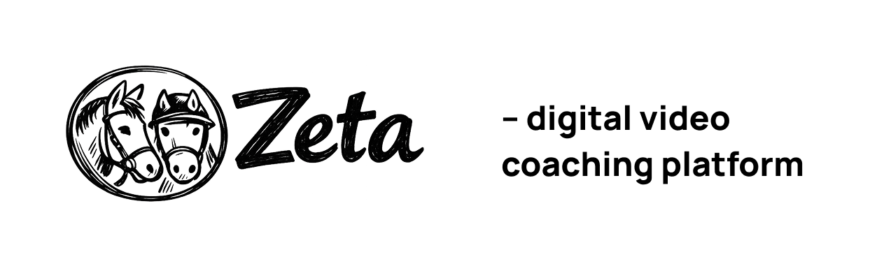
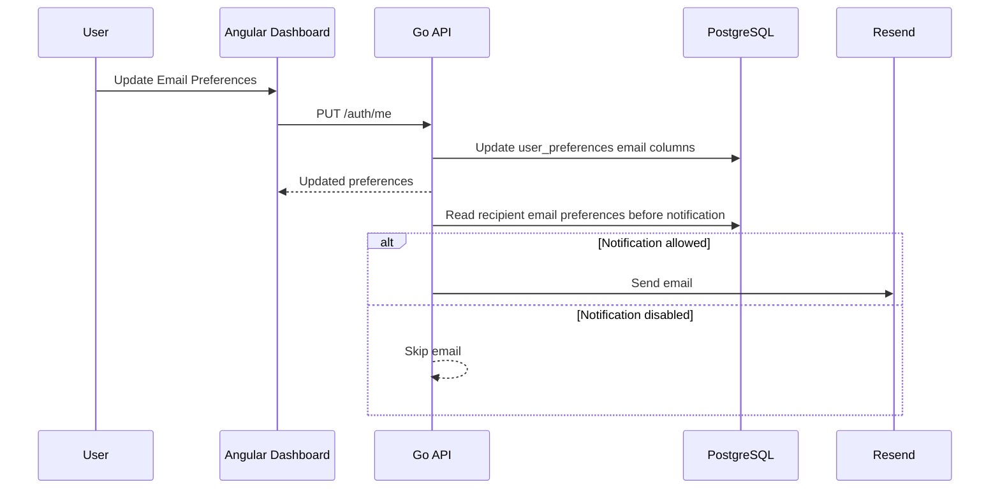
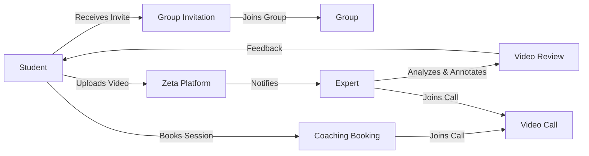
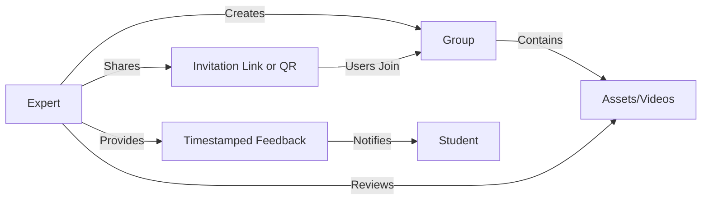
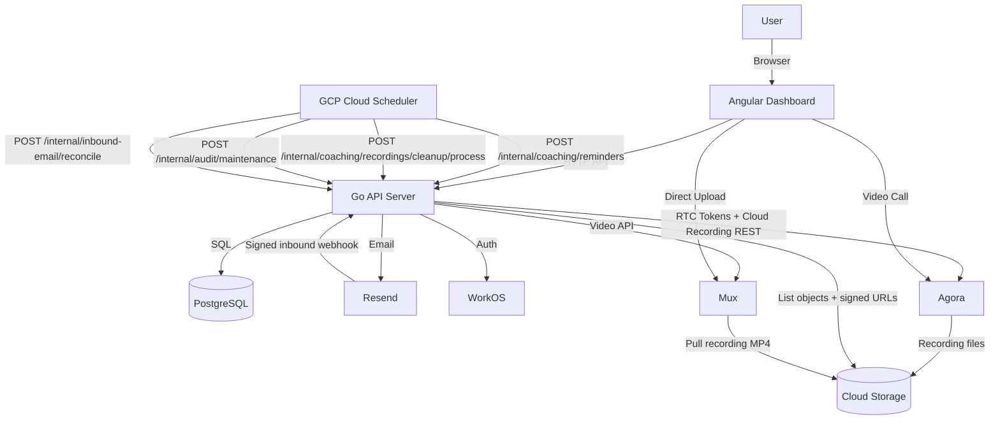
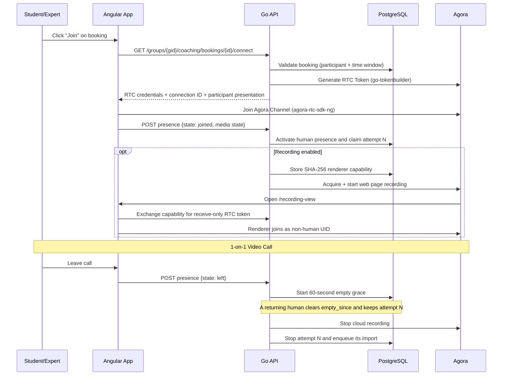
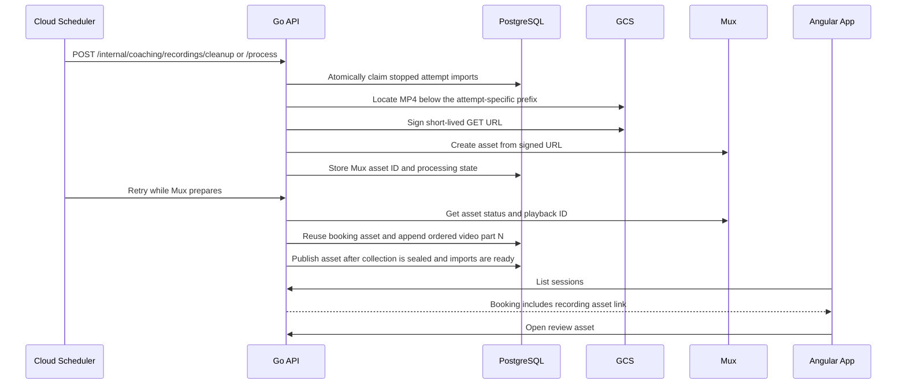
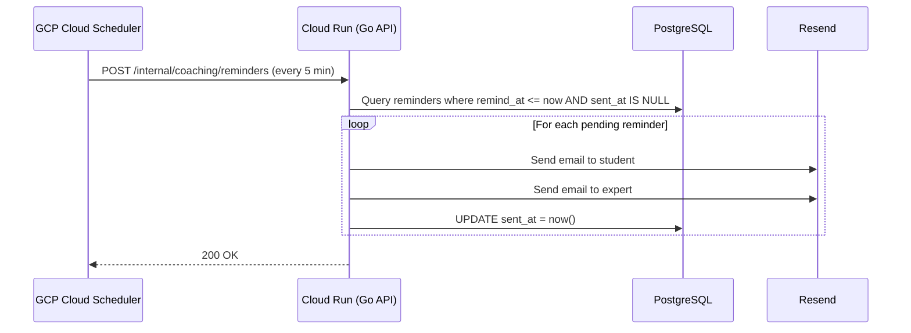
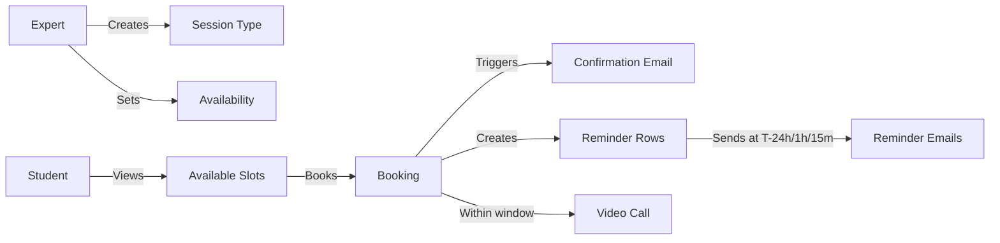
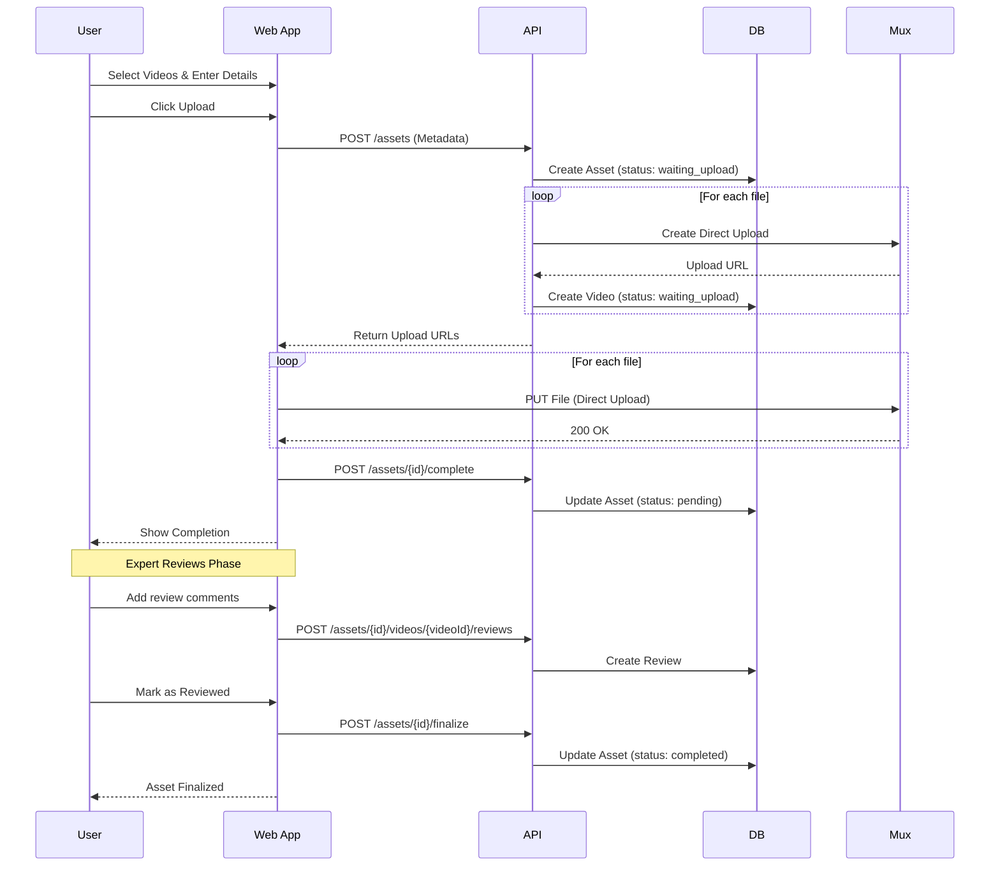

# Zeta: Digital Video Coaching Platform

Zeta is a modern platform designed to revolutionize remote coaching through digital video analysis. Connect with experts, upload your training sessions, and receive precise, time-stamped feedback—anytime, anywhere.

Inspired by the need for efficient remote coaching, Zeta bridges the gap between students and mentors, eliminating travel costs and scheduling conflicts while enabling professional monetization for experts.

## Key Features

- **Remote Video Analysis**: Students upload videos of their practice; experts provide detailed feedback.
- **Professional Dashboard**: Manage students, videos, and reviews in one place. Experts can filter the Videos page by To review, In review, and Reviewed statuses.
- **Groups Management**: Create and manage user groups.
- **Group Invitations**: Invite users to groups via email or reusable generic invitation links with QR code generation and confirmation flow.
- **Seamless Uploads**: Direct high-quality video uploads powered by Mux.
- **Secure Authentication**: Enterprise-grade auth via WorkOS.
- **Video Reviews**: Add comments and feedback directly to video clips.
- **Live Video Coaching**: 1-on-1 Agora-powered video calls with booking, availability management, and automated email reminders.
- **Live Session Recording**: Optional Agora Cloud Recording for live coaching sessions, with server-managed start/stop lifecycle and automatic import into the review flow.
- **Templated Email Notifications**: Transactional emails use embedded Go HTML templates, a shared Zeta layout, and CSS inlining before delivery through Resend.
- **Notification Preferences**: Users can control all email notifications or individual email categories from their Preferences page.
- **Feedback Inbox**: Authenticated dashboard users can submit rated feedback that is stored in Postgres and mirrored into the environment-specific Discord forum.
- **Inbound Email Inboxes**: Social, support, and DSA email is durably ingested from Resend, mirrored into environment-specific Discord forums, and copied to configured recipients.
- **Landing Contact Inbox**: Public landing-page contact messages are persisted and sent to the support inbox, where the inbound pipeline labels them for Discord and configured copy recipients. The sender receives a localized confirmation email.

## How to start

### Prerequisites

- Docker & Docker Compose
- Go 1.25+
- Node.js & pnpm (for the dashboard)
- WorkOS Account & Project
- Mux Account
- Agora Account (App ID + App Certificate)

### Environment Setup

1. Copy `.env.example` to `.env`:
   ```bash
   cp .env.example .env
   ```
2. Update `.env` with your WorkOS credentials.

3. **WorkOS Configuration**:
   - In WorkOS Dashboard > Configuration > Redirect URIs:
     - Add `http://localhost:8080/auth/callback`
   - In WorkOS Dashboard > Organization:
     - Ensure you have an Organization created (use its ID for `DEFAULT_ORG_ID`).
   - In WorkOS Dashboard > User Management > Roles:
     - Create Role `admin`
     - Create Role `expert`
     - Create Role `student` (Default)

4. **Mux Configuration**:
   - Create an Access Token in Mux Dashboard.

5. **Resend Configuration**:
   - Create a Resend API key and set `RESEND_API_KEY`.
   - Verify the sender domain in Resend.
   - Set `RESEND_FROM_EMAIL` to an address on the verified domain, for example `notifications@strido.net`.
   - HTML emails use the hosted Strido logo at `FRONTEND_URL + /assets/brand/strido/strido-logo-320.png`, with the dev dashboard URL as a local fallback.
   - To render local email previews with fake data, run `make email:preview`. Final inlined HTML files are written to `build/email-previews/`.
   - For inbound email, configure the three `INBOUND_EMAIL_*_ADDRESS` routes, Discord forum IDs, optional `INBOUND_EMAIL_COPY_RECIPIENTS`, and a verified Resend webhook at `/webhooks/resend`.
   - Store the endpoint-specific webhook signing secret in `RESEND_WEBHOOK_SIGNING_SECRET`; never treat it as plain runtime config.

6. **Agora Configuration**:
   - Create a project in [Agora Console](https://console.agora.io/).
   - Set `AGORA_APP_ID` and `AGORA_APP_CERTIFICATE` in `.env`.
   - To enable recording locally, enable Cloud Recording in Agora Console, create REST credentials, configure object storage that Agora can write to directly, and set `AGORA_CLOUD_RECORDING_ENABLED=true` with the `AGORA_REST_*` and `AGORA_RECORDING_*` variables.
   - In deployed `dev` and `prod`, Terraform provisions a Google Cloud Storage bucket plus HMAC credentials for Agora Cloud Recording. The deploy workflow injects static recording config as Cloud Run env vars and injects the generated HMAC credentials through Secret Manager.
   - Cloud Run receives read access to the private recording bucket and signs short-lived GCS URLs so Mux can import completed MP4 recordings. Users never receive direct GCS object access.

7. **Coaching Time Constraints** (optional, defaults are production-safe):
   - `MIN_BOOKING_NOTICE` — minimum lead time for new bookings (default: `2h`)
   - `CANCELLATION_NOTICE` — minimum notice to cancel (default: `1h`)
   - `CONNECT_WINDOW` — how early participants can join a call (default: `15m`)

8. **Discord Feedback And Report Inboxes**:
   - Create a Discord bot token and store it in `DISCORD_BOT_TOKEN`.
   - Set `DISCORD_FEEDBACK_FORUM_CHANNEL_ID` to the target forum channel.
   - Set `DISCORD_MODERATION_REPORTS_FORUM_CHANNEL_ID` to the moderation reports forum channel.
   - `DISCORD_APPLICATION_ID` and `DISCORD_PUBLIC_KEY` are public bot metadata reserved for future Discord interactions.

### Custom Domains

| Environment           | URL                          | Cloud Run service     |
| --------------------- | ---------------------------- | --------------------- |
| Landing               | `https://strido.net`         | `zeta-landing`        |
| Production dashboard  | `https://app.strido.net`     | `zeta-dashboard-prod` |
| Production API        | `https://api.strido.net`     | `zeta-api-prod`       |
| Development dashboard | `https://app.dev.strido.net` | `zeta-dashboard-dev`  |
| Development API       | `https://api.dev.strido.net` | `zeta-api-dev`        |

`strido.de` redirects to `https://strido.net` at the registrar and is not mapped to Cloud Run. The landing page is a static nginx container under `web/landing`; its HTML and bundled assets can be updated without changing the infrastructure.

1. Verify ownership of `strido.net` with the Google accounts that apply the dev and prod Terraform environments. Verifying the apex domain also permits mapping its subdomains.
2. In WorkOS Dashboard > Configuration > Redirect URIs, add both callbacks before deploying:
   - `https://api.strido.net/auth/callback`
   - `https://api.dev.strido.net/auth/callback`
3. Run the `Infra` GitHub Actions workflow for `dev` and `prod`, first with `plan` and then with `apply`. Terraform creates the five Cloud Run domain mappings, dedicated `*-dev` and `*-prod` services, and the landing service. Both states deliberately forget the legacy shared services with `destroy = false`, so the existing deployment remains online during migration.
4. Inspect the required records from the Terraform outputs if DNS needs verification:

   ```bash
   cd infra/terraform/envs/dev
   terraform output dashboard_dns_records
   terraform output api_dns_records

   cd ../prod
   terraform output landing_dns_records
   terraform output dashboard_dns_records
   terraform output api_dns_records
   ```

5. In Spaceship DNS, the expected hosts are `@`, `app`, `api`, `app.dev`, and `api.dev`. Remove only conflicting `A`, `AAAA`, or `CNAME` records for those hosts; keep all Resend MX/TXT/DKIM records.
6. Deploy `main` for the dev services, then create a production release tag. API/dashboard workflows configure CORS, frontend and API URLs, WorkOS callbacks, logout redirects, and email branding. Landing changes under `web/landing` deploy independently on pushes to `main`; the workflow can also be run manually.
7. After all five domains and authentication flows are verified, the legacy `zeta-api` and `zeta-dashboard` Cloud Run services can be removed manually.

Google currently labels direct Cloud Run domain mapping as Preview and does not recommend it for production services. This repository still uses the existing mapping approach; use a global external Application Load Balancer for a GA domain-routing product or advanced traffic controls.

### Quick Start

1. **Start Infrastructure**:

   ```bash
   make infra:up
   ```

2. **Run Migrations**:

   ```bash
   make db:migrate:up
   ```

3. **Run Backend**:

   ```bash
   make api:start
   ```

   For live reload during Go API development, run:

   ```bash
   make api:dev
   ```

   This uses the project-pinned Air tool through `go tool air`.

4. **Run Frontend**:
   ```bash
   make web-next:start
   ```
   Dashboard available at `http://localhost:4200`.

### Development Observability

The `Zeta Dev Overview` dashboard in Google Cloud Monitoring shows Cloud Run
requests, errors, latency, CPU, memory, instances, billable time, Cloud SQL health,
and recent operational warnings. Terraform also manages an external API health
check and warning alerts for availability, 5xx responses, latency, memory, SQL disk,
and critical workflow failures.

Run `terraform output observability_dashboard_url` from
`infra/terraform/envs/dev` to print the direct dashboard link. Viewer access is
granted to existing Google accounts through the `OBSERVABILITY_VIEWER_MEMBERS`
GitHub Environment variable; there is no separate Zeta observability password. See
`docs/cicd.md` for IAM roles and notification-channel setup.

### Auth Flow

- Public: `/health`
- Protected: `/assets` (Requires Login)
- Login: Click "Login via WorkOS" -> Redirects to WorkOS AuthKit -> Callback -> Logged In.
- **Redirect Preservation**: When an unauthenticated user accesses a deep link (e.g., an invite URL), the Angular guards call `/auth/login?return_to=<path>`. The API validates the relative return path, stores it in a short-lived HttpOnly auth-state cookie, sends only an opaque `state` value to WorkOS, and restores the original path from `/auth/callback` after successful authentication.

### Access Gate (Soft Launch)

- Registration is open: WorkOS public sign-up stays **ON**. A newly registered user is created as `waitlisted` (`user_access.status`) and must redeem an invite code at `POST /access/redeem` to become `active`.
- **Expert recommendation codes** (`signup_codes`) upgrade either a waitlisted user or an active `student` to the WorkOS `expert` role. Students redeem a recommendation under Preferences > Become an expert. `GET /access/codes` automatically ensures that each expert has five personal codes and returns their redemption status. Used codes permanently count toward the five-referral allowance; expert codes cannot be created or revoked manually. Viewing the list requires `access:invite-codes:read`.
- Existing group-invite codes activate the user as a `student` and join the corresponding group. Direct email invitations require the signed-in WorkOS email to match the intended recipient; generic link/QR invitations remain reusable. Group members with `groups:invites:read` can revisit invitation history and QR codes, while `groups:invites:revoke` allows active invitations to be revoked.
- Protected feature routes require an active account; `waitlisted` users receive **403**. `/auth/me` returns `access_status` so clients can route to the redeem screen.
- Existing users were grandfathered to `active`. No new environment variables are introduced.

### Asset Visibility

- Students can only see assets and videos they uploaded themselves.
- Experts and administrators can only see assets and videos submitted to groups where they are members.
- Video review endpoints require both the relevant `reviews:*` permission and visibility of the target video.
- Asset finalization requires both `assets:finalize` and visibility of the target asset.

### Group Invitation Flow

1. An admin or expert opens the group details page and clicks "Invite".
2. A dialog accepts an optional invitee email address.
3. The backend generates a unique 8-character code and, when an email is provided, sends an email with the invite link (`/groups?invite=<CODE>`).
4. The dialog displays a **QR code** (server-generated PNG) encoding the invite URL, with options to copy the link or download the QR image.
5. When an active non-member opens the link (or scans the QR code), a confirmation dialog shows the group name and avatar. A newly registered waitlisted user returns from WorkOS to `/welcome`, sees the same group context, and explicitly activates as a student before joining.
6. On acceptance, the user is added idempotently to the group and redirected to the group details page. Email-specific invitations can only be accepted by the matching WorkOS email address.
7. If the current user already belongs to the group, the dashboard skips the invitation dialog and opens the group directly.
8. Email-specific invitations are single-use. Email-less invitation links remain reusable for sharing in print, on walls, or in group chats.

### Group Member Visibility

- The group details page separates members into Students and Experts lists.
- `GET /groups/{groupID}/users` returns students only and requires `groups:user-list:read`.
- `GET /groups/{groupID}/experts` returns experts and administrators and requires `groups:expert-list:read`.
- Member list responses never include member email addresses. Student labels use editable display names, defaulted to `First L.`.
- Student-list responses additionally include the student's full name for expert/admin contexts. Expert-list responses show experts and administrators by real full name for all viewers with `groups:expert-list:read`.
- Expert and administrator roles should have both list permissions. Student roles should have `groups:expert-list:read` and `groups:membership:leave`.
- Students with `groups:membership:leave` can leave a joined group from that group's Preferences danger zone via `DELETE /groups/{groupID}/membership`. The API rejects leaving when the user is the group owner or the last remaining member.

### Live Coaching Flow

1. An expert creates **session types** (name, duration 15–120 min in 5-minute increments) for a group and sets **weekly availability**.
2. A student browses available experts, picks a session type, and books a free slot.
3. Both participants receive a **booking confirmation email** via Resend.
4. Automated **reminders** are sent at 24 h, 1 h, and 15 min before the session (driven by GCP Cloud Scheduler polling every 5 min).
5. Within the connect window (default 15 min before start), a **Join** button appears on the dashboard.
6. Clicking Join calls the connect endpoint, which validates the booking and generates an **Agora RTC token**.
7. The Angular app joins the Agora channel without requesting media permissions. After the confirmed join it reports authenticated presence; camera and microphone remain optional.
8. The first fresh human presence starts an Agora **Web Page Recording** attempt. The private renderer uses a short-lived capability to show the student as the main view and the expert as a small picture-in-picture, including avatar and mute placeholders.
9. Human presence is refreshed every 10 seconds. When no student or expert remains for 60 seconds, the API stops that attempt. Returning later creates the next attempt instead of overwriting the first.
10. Every stopped attempt is imported as an ordered video part. All parts from one booking share one reviewable asset, which becomes visible only after the booking collection is sealed and all imports are ready.

### Notification Preferences Flow

1. A signed-in user opens the Preferences page.
2. The dashboard reads `/auth/me`, including the user's email notification preferences.
3. The user updates the master email setting or an individual notification category.
4. The dashboard saves the settings with `PUT /auth/me`.
5. Before sending account-owned notification emails, the API checks the recipient's `user_preferences` row.
6. Explicit invitation delivery to an entered email address remains tied to the inviter's send action and is not suppressed by a recipient preference.


```mermaid
sequenceDiagram
    participant U as User
    participant W as Angular Dashboard
    participant A as Go API
    participant D as PostgreSQL
    participant E as Resend

    U->>W: Update Email Preferences
    W->>A: PUT /auth/me
    A->>D: Update user_preferences email columns
    A-->>W: Updated preferences
    A->>D: Read recipient email preferences before notification
    alt Notification allowed
        A->>E: Send email
    else Notification disabled
        A-->>A: Skip email
    end
```

### Feedback Inbox Flow

1. A signed-in user opens the global Feedback button in the dashboard shell.
2. The user selects a 1–5 rating and enters a short message.
3. The dashboard posts the feedback to `POST /feedback` with the current page URL.
4. The API stores the submission in `feedback_submissions` with the authenticated user's display name and internal user ID.
5. The API creates a new post in the configured Discord forum channel. If Discord delivery fails, the database row records the failure while the user's feedback remains saved.

### Inbound Email Flow

1. Resend sends a signed `email.received` event to `POST /webhooks/resend`.
2. The API verifies the Svix signature against the raw body and matches the recipient to social, support, or DSA.
3. The API idempotently stores the event in `inbound_emails` before attempting delivery.
4. The processor fetches the complete body and attachment metadata from Resend, creates one Discord forum thread, and forwards a copy to configured recipients with an idempotency key.
5. Discord and forwarding outcomes are tracked independently. `POST /internal/inbound-email/reconcile` polls recent Resend mail and retries pending or failed work every five minutes.

### API Examples

Check auth status:

```bash
curl -b "zeta_session=..." http://localhost:8080/auth/me
```

## Diagrams

### Core User Journey


```mermaid
graph LR
    Student[Student] -->|Receives Invite| Invite[Group Invitation]
    Invite -->|Joins Group| Group[Group]
    Student -->|Uploads Video| Zeta[Zeta Platform]
    Zeta -->|Notifies| Expert[Expert]
    Expert -->|Analyzes & Annotates| Review[Video Review]
    Review -->|Feedback| Student
    Student -->|Books Session| Booking[Coaching Booking]
    Booking -->|Joins Call| Call[Video Call]
    Expert -->|Joins Call| Call
```

### Core Expert Journey


```mermaid
graph LR
    Expert[Expert] -->|Creates| Group[Group]
    Expert -->|Shares| Invite[Invitation Link or QR]
    Invite -->|Users Join| Group
    Group -->|Contains| Assets[Assets/Videos]
    Expert -->|Reviews| Assets
    Expert -->|Provides| Feedback[Timestamped Feedback]
    Feedback -->|Notifies| Student[Student]
```

### System Architecture


```mermaid
graph TD
    User[User] -->|Browser| Web[Angular Dashboard]
    Web -->|HTTP API| API[Go API Server]
    API -->|SQL| DB[(PostgreSQL)]
    API -->|Email| Resend[Resend]
    Resend -->|Signed inbound webhook| API
    API -->|Auth| WorkOS[WorkOS]
    API -->|Video API| Mux[Mux]
    Web -->|Direct Upload| Mux
    API -->|RTC Tokens + Cloud Recording REST| Agora[Agora]
    Agora -->|Recording files| Storage[(Cloud Storage)]
    API -->|List objects + signed URLs| Storage
    Mux -->|Pull recording MP4| Storage
    Web -->|Video Call| Agora
    Scheduler[GCP Cloud Scheduler] -->|POST /internal/coaching/reminders| API
    Scheduler -->|POST /internal/coaching/recordings/cleanup/process| API
    Scheduler -->|POST /internal/audit/maintenance| API
    Scheduler -->|POST /internal/inbound-email/reconcile| API
```

### Video Call Sequence


```mermaid
sequenceDiagram
    participant U as Student/Expert
    participant W as Angular App
    participant A as Go API
    participant D as PostgreSQL
    participant AG as Agora

    U->>W: Click "Join" on booking
    W->>A: GET /groups/{gid}/coaching/bookings/{id}/connect
    A->>D: Validate booking (participant + time window)
    A->>AG: Generate RTC Token (go-tokenbuilder)
    A-->>W: RTC credentials + connection ID + participant presentation
    W->>AG: Join Agora Channel (agora-rtc-sdk-ng)
    W->>A: POST presence {state: joined, media state}
    A->>D: Activate human presence and claim attempt N
    opt Recording enabled
        A->>D: Store SHA-256 renderer capability
        A->>AG: Acquire + start web page recording
        AG->>W: Open /recording-view#cap=…
        W->>A: Exchange capability for receive-only RTC token
        W->>AG: Renderer joins as non-human UID
    end
    Note over U,AG: 1-on-1 Video Call
    U->>W: Leave call
    W->>A: POST presence {state: left}
    A->>D: Start 60-second empty grace
    Note over A,D: A returning human clears empty_since and keeps attempt N
    A->>AG: Stop cloud recording
    A->>D: Stop attempt N and enqueue its import
```

### Recording Post-Processing


```mermaid
sequenceDiagram
    participant S as Cloud Scheduler
    participant A as Go API
    participant D as PostgreSQL
    participant G as GCS
    participant M as Mux
    participant W as Angular App

    S->>A: POST /internal/coaching/recordings/cleanup or /process
    A->>D: Atomically claim stopped attempt imports
    A->>G: Locate MP4 below the attempt-specific prefix
    A->>G: Sign short-lived GET URL
    A->>M: Create asset from signed URL
    A->>D: Store Mux asset ID and processing state
    S->>A: Retry while Mux prepares
    A->>M: Get asset status and playback ID
    A->>D: Reuse booking asset and append ordered video part N
    A->>D: Publish asset after collection is sealed and imports are ready
    W->>A: List sessions
    A-->>W: Booking includes recording asset link
    W->>A: Open review asset
```

### Email Reminders Architecture


```mermaid
sequenceDiagram
    participant CS as GCP Cloud Scheduler
    participant CR as Cloud Run (Go API)
    participant D as PostgreSQL
    participant E as Resend

    CS->>CR: POST /internal/coaching/reminders (every 5 min)
    CR->>D: Query reminders where remind_at <= now AND sent_at IS NULL
    loop For each pending reminder
        CR->>E: Send email to student
        CR->>E: Send email to expert
        CR->>D: UPDATE sent_at = now()
    end
    CR-->>CS: 200 OK
```

### Coaching Booking Flow


```mermaid
graph LR
    Expert -->|Creates| SessionType[Session Type]
    Expert -->|Sets| Availability
    Student -->|Views| Slots[Available Slots]
    Slots -->|Books| Booking
    Booking -->|Triggers| Email[Confirmation Email]
    Booking -->|Creates| Reminders[Reminder Rows]
    Reminders -->|Sends at T-24h/1h/15m| ReminderEmail[Reminder Emails]
    Booking -->|Within window| VideoCall[Video Call]
```

### Asset Lifecycle

Assets go through a simple three-state lifecycle:

1. **Waiting Upload** (`waiting_upload`): Files are being uploaded to Mux
2. **Pending Review** (`pending`): Files are uploaded and ready for expert review
3. **Reviewed** (`completed`): Expert has reviewed and the asset is finalized

### Video Upload Flow

The upload process is designed to ensure data consistency and clean user experience:

1. **Initiation**: Client requests upload URLs. Asset created in DB with status `waiting_upload`.
2. **Direct Upload**: Client uploads files directly to Mux storage (bypassing our API server for performance).
3. **Completion**: Client notifies API that uploads are finished via `POST /assets/{id}/complete`.
4. **Visibility**: Asset status updates to `pending` (awaiting review) and becomes visible in the dashboard.
5. **Review**: Expert adds reviews/comments to the asset.
6. **Finalization**: Expert marks asset as reviewed via `POST /assets/{id}/finalize`, status changes to `completed`.


```mermaid
sequenceDiagram
    participant U as User
    participant W as Web App
    participant A as API
    participant D as DB
    participant M as Mux

    U->>W: Select Videos & Enter Details
    U->>W: Click Upload
    W->>A: POST /assets (Metadata)
    A->>D: Create Asset (status: waiting_upload)
    loop For each file
        A->>M: Create Direct Upload
        M-->>A: Upload URL
        A->>D: Create Video (status: waiting_upload)
    end
    A-->>W: Return Upload URLs
    loop For each file
        W->>M: PUT File (Direct Upload)
        M-->>W: 200 OK
    end
    W->>A: POST /assets/{id}/complete
    A->>D: Update Asset (status: pending)
    W-->>U: Show Completion

    Note over U,W: Expert Reviews Phase
    U->>W: Add review comments
    W->>A: POST /assets/{id}/videos/{videoId}/reviews
    A->>D: Create Review

    U->>W: Mark as Reviewed
    W->>A: POST /assets/{id}/finalize
    A->>D: Update Asset (status: completed)
    W-->>U: Asset Finalized
```

## Database Schema


```mermaid
erDiagram
    users ||--o{ groups : owns
    users ||--o{ user_groups : "member of"
    groups ||--o{ user_groups : has
    users ||--o{ assets : owns
    groups ||--o{ assets : contains
    assets ||--|{ videos : contains
    videos ||--o{ video_reviews : has
    video_reviews ||--o{ video_reviews : "has replies"
    users ||--o{ moderation_reports : creates
    videos ||--o{ moderation_reports : "reported context"
    video_reviews ||--o{ moderation_reports : "reported comment"

    users["User Identity (WorkOS)"] {
        string id PK "WorkOS User ID"
        string email
        string first_name
        string last_name
    }

    user_preferences {
        string user_id PK, FK "WorkOS User ID ref"
        enum language "en, de, fr"
        string timezone
        string first_name "for comment author identity"
        string last_name "for comment author identity"
        string avatar
        boolean email_notifications_enabled
        boolean email_asset_uploads_enabled
        boolean email_asset_reviews_enabled
        boolean email_invitation_updates_enabled
        boolean email_group_membership_updates_enabled
        boolean email_coaching_booking_updates_enabled
        boolean email_coaching_reminders_enabled
        timestamp created_at
        timestamp updated_at
    }

    users ||--|| user_preferences : "has settings"

    user_access {
        string user_id PK "WorkOS User ID ref"
        enum status "waitlisted, active"
        timestamptz activated_at
        string activated_via "expert_code, group_code, grandfathered"
        timestamp created_at
    }

    users ||--|| user_access : "gated by"

    signup_codes {
        uuid id PK
        string code "unique bearer string"
        string owner_user_id FK "WorkOS User ID ref"
        enum status "available, consumed"
        string redeemed_by_user_id FK "WorkOS User ID ref"
        timestamptz consumed_at
        timestamp created_at
    }

    users ||--o{ signup_codes : owns
    users ||--o{ signup_codes : redeems

    groups {
        uuid id PK
        string name
        string owner_id FK "WorkOS User ID ref"
        bytea avatar
        timestamp created_at
        timestamp updated_at
    }

    groups ||--o{ group_invitations : has

    group_invitations {
        uuid id PK
        uuid group_id FK
        string inviter_id "WorkOS User ID ref"
        string email
        string code "unique"
        enum status "pending, accepted"
        timestamp created_at
    }

    user_groups {
        string user_id PK, FK "WorkOS User ID ref"
        uuid group_id PK, FK
        timestamp created_at
    }

    assets {
        uuid id PK
        string name
        string description
        enum status
        uuid group_id FK
        string owner_id FK "WorkOS User ID ref"
        timestamp created_at
        timestamp updated_at
    }

    videos {
        uuid id PK
        uuid asset_id FK
        string mux_upload_id "nullable for system imports"
        string mux_asset_id
        string playback_id
        enum status
        timestamp created_at
        timestamp updated_at
    }

    video_reviews {
        uuid id PK
        uuid video_id FK
        uuid parent_id FK "self-ref reply, ON DELETE CASCADE"
        string author_id "WorkOS User ID ref"
        string content
        integer timestamp_seconds
        timestamp created_at
        timestamp updated_at
    }

    moderation_reports {
        uuid id PK
        string reporter_user_id FK "WorkOS User ID ref"
        enum subject_type "review_comment, user"
        uuid target_review_id FK
        uuid target_video_id FK
        string target_user_id "WorkOS User ID ref"
        string target_review_content
        enum reason "harassment, spam, inappropriate_content, other"
        enum status "open, resolved, rejected"
        string discord_status
        string discord_thread_id
        timestamp created_at
        timestamp updated_at
    }

    coaching_session_types {
        uuid id PK
        string expert_id FK
        uuid group_id FK
        string name
        string description
        int duration_minutes
        boolean is_active
        timestamp created_at
        timestamp updated_at
    }

    coaching_availability {
        uuid id PK
        string expert_id FK
        uuid group_id FK
        int day_of_week
        time start_time
        time end_time
        boolean is_active
        timestamp created_at
        timestamp updated_at
    }

    coaching_blocked_slots {
        uuid id PK
        string expert_id FK
        date blocked_date
        time start_time
        time end_time
        string reason
        timestamp created_at
    }

    coaching_bookings {
        uuid id PK
        string expert_id FK
        string student_id FK
        uuid group_id FK
        uuid session_type_id FK
        timestamptz scheduled_at
        int duration_minutes
        boolean is_cancelled
        string cancellation_reason
        string cancelled_by
        string notes
        timestamp created_at
        timestamp updated_at
    }

    coaching_booking_recordings {
        uuid booking_id PK, FK
        enum status "starting, started, stopping, stopped, failed"
        string resource_id "Agora resourceId"
        string sid "Agora recording sid"
        string uid "Agora recording bot UID"
        string_array file_prefix
        timestamptz started_at
        timestamptz stopped_at
        string error
        timestamp created_at
        timestamp updated_at
    }

    coaching_recording_imports {
        uuid booking_id PK, FK
        enum status "pending, importing, processing, ready, failed"
        string gcs_object_name
        string mux_asset_id
        string mux_playback_id
        uuid asset_id FK
        uuid video_id FK
        int attempts
        timestamptz last_attempt_at
        timestamptz imported_at
        string error
        timestamp created_at
        timestamp updated_at
    }

    coaching_recording_collections {
        uuid booking_id PK, FK
        uuid asset_id FK
        enum status "open, sealed"
        int next_attempt_number
        timestamptz sealed_at
    }

    coaching_recording_attempts {
        uuid id PK
        uuid booking_id FK
        int attempt_number
        string mode "mix, web"
        enum status "starting, started, stopping, stopped, failed"
        string resource_id
        string sid
        string provider_uid
        string_array file_prefix
        timestamptz empty_since_at
        timestamptz started_at
        timestamptz stopped_at
    }

    coaching_recording_attempt_imports {
        uuid attempt_id PK, FK
        enum status "pending, importing, processing, ready, failed, quarantined"
        string gcs_object_name
        string mux_asset_id
        uuid video_id FK
        int attempts
    }

    coaching_booking_participant_state {
        uuid booking_id PK, FK
        string participant_role PK "student, expert"
        string user_id
        int agora_uid "1 or 2"
        uuid connection_generation
        bigint last_event_seq
        string connection_state
        timestamptz last_seen_at
    }

    coaching_recording_renderer_capabilities {
        uuid id PK
        uuid attempt_id FK
        bytes token_hash "SHA-256 only"
        int renderer_uid
        timestamptz expires_at
        timestamptz revoked_at
    }

    coaching_booking_reminders {
        uuid id PK
        uuid booking_id FK
        timestamptz remind_at
        timestamptz sent_at
        timestamp created_at
    }

    audit_events {
        uuid id PK
        timestamptz occurred_at
        string actor_id "WorkOS User ID or system"
        string actor_type "user, system"
        string action "e.g. asset.created, group.member.removed"
        string resource_type "asset, group, user, etc."
        uuid resource_id
        jsonb metadata "optional extra context incl. opt-in client IP"
    }

    inbound_emails {
        uuid id PK
        string resend_email_id UK
        string inbox "social, support, dsa"
        string sender
        string_array recipients
        string subject
        string body_text
        jsonb attachments
        string processing_status
        string discord_status
        string discord_thread_id
        string forwarding_status
        string forwarding_email_id
        timestamp received_at
        timestamp created_at
        timestamp updated_at
    }

    groups ||--o{ coaching_session_types : has
    users ||--o{ coaching_session_types : creates
    users ||--o{ coaching_availability : sets
    users ||--o{ coaching_blocked_slots : creates
    coaching_session_types ||--o{ coaching_bookings : booked_as
    groups ||--o{ coaching_bookings : contains
    coaching_bookings ||--o| coaching_booking_recordings : records
    coaching_booking_recordings ||--o| coaching_recording_imports : imports
    assets ||--o{ coaching_recording_imports : "created by"
    videos ||--o{ coaching_recording_imports : "created by"
    coaching_bookings ||--o| coaching_recording_collections : "owns collection"
    coaching_recording_collections ||--o{ coaching_recording_attempts : "contains attempts"
    coaching_recording_attempts ||--o| coaching_recording_attempt_imports : "imports part"
    coaching_recording_attempts ||--o| coaching_recording_renderer_capabilities : "authorizes renderer"
    coaching_bookings ||--o{ coaching_booking_participant_state : "tracks human presence"
    assets ||--o| coaching_recording_collections : "review asset"
    videos ||--o| coaching_recording_attempt_imports : "ordered part"
    coaching_bookings ||--o{ coaching_booking_reminders : has
    users ||--o{ audit_events : "actor in"
```

> **`audit_events`** is an append-only, monthly-partitioned table. UPDATE and DELETE are blocked by a database trigger. Expired partitions (older than `AUDIT_RETENTION_DAYS`, default 3 years) are dropped by the daily maintenance job (`POST /internal/audit/maintenance`). Domain wiring — recording which mutations emit events — is rolled out incrementally.
