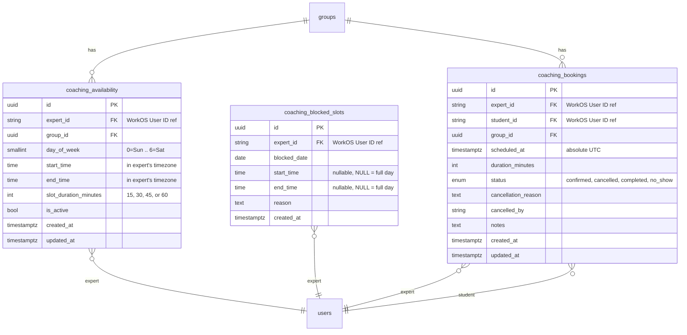

# Task: Live Coaching — Slot Booking System

## Status

- [x] Defined
- [ ] In Progress
- [ ] Completed

## Description

As an expert within a group, I want to define my weekly availability for 1-on-1 coaching sessions so that students in my group can discover open time slots and book sessions with me.

As a student, I want a dedicated "Book Live Coaching" page (accessible from the navbar, similar to "Upload video") where I select a group, pick an expert, browse available time slots, and book a session.

This task covers the **slot booking infrastructure** — the prerequisite layer that must be in place before any video call integration (Phase 3).

---

## Architecture Decision: Virtual Slots

Classic system-design approaches recommend pre-generating concrete slot records via a nightly/weekly batch job. However, this project runs on **Google Cloud Run** which scales to 0 instances in dev, making self-hosted cron unreliable without additional infrastructure.

Instead, the system uses **virtual (computed) slots**: experts define recurring weekly patterns, and the API computes concrete available time windows on-the-fly by subtracting existing bookings and blocked periods. No cron dependency for core functionality. When an expert changes their schedule, all future queries immediately reflect the change. Only actual bookings and blocked-off times are stored — not thousands of hypothetical empty slots.

**Cloud Scheduler** is used only for non-critical side effects (session reminders, no-show cleanup) via HTTP calls to internal API endpoints. The booking system functions correctly without it.

---

## Timezone Handling

Experts and students may be in different timezones. The system handles this as follows:

- A new `timezone` column (`TEXT`, e.g. `"Europe/Berlin"`) is added to `user_preferences`. Experts set their timezone when configuring availability. If not set, it defaults to `UTC`.
- Expert availability (`coaching_availability`) stores `start_time` / `end_time` as `TIME` — these are **interpreted in the expert's timezone**. Example: an expert in `Europe/Berlin` sets availability Mon 10:00–14:00 — this means 10:00–14:00 Berlin time.
- When a student requests available slots, the server converts the expert's local time blocks into UTC, then computes available slots and returns them as `TIMESTAMPTZ` (absolute UTC moments). The frontend displays them in the student's browser-local timezone via standard `Intl.DateTimeFormat`.
- `coaching_bookings.scheduled_at` is `TIMESTAMPTZ` — an absolute point in time, timezone-agnostic. Both parties see the correct local time in their respective timezone.
- The availability editor on the frontend shows the expert a note: "Times are in your timezone (Europe/Berlin)". The timezone is selected once in the availability settings, not per-slot.
- The slot picker on the student side shows all times in the student's browser timezone. Confirmation dialog explicitly displays: "Wednesday, April 8, 14:00–14:30 (your local time)".
- Email notifications include time in both the expert's and student's timezones for clarity.

---

## Database Schema

### New Tables and Types



The `user_preferences` table gets a new column:

```sql
ALTER TABLE user_preferences ADD COLUMN timezone TEXT NOT NULL DEFAULT 'UTC';
```

New enum:

```sql
CREATE TYPE coaching_booking_status AS ENUM (
    'confirmed',
    'cancelled',
    'completed',
    'no_show'
);
```

Bookings are created with status `confirmed` immediately (no `pending` state — auto-confirmed).

---

## Slot Computation

The core of the system: computing available slots for a given expert within a date range. This runs entirely server-side in Go.

1. Fetch the expert's timezone from `user_preferences`.
2. Fetch recurring `coaching_availability` rows for `(expert_id, group_id)` where `is_active = true`.
3. Fetch `coaching_blocked_slots` for the expert within the requested date range.
4. Fetch existing `coaching_bookings` for the expert within the date range (excluding `cancelled`).
5. For each date in the range:
   - Find matching availability rows by `day_of_week`.
   - Generate concrete slots every `slot_duration_minutes` from `start_time` to `end_time` in the expert's timezone. Convert each slot's start/end to UTC.
   - Remove slots that overlap with any blocked slot on that date.
   - Remove slots that overlap with any existing booking.
   - Remove slots in the past or within the minimum booking notice (2 hours from now).
6. Return available slots as absolute UTC timestamps.

At booking time, the server **recomputes** availability within a database transaction to prevent double-booking. If a conflicting booking exists, the request is rejected with 409 Conflict.

---

## Permissions

New permission strings and their role mapping:

| Permission                     | admin | expert | student | Description                                 |
| ------------------------------ | ----- | ------ | ------- | ------------------------------------------- |
| `coaching:availability:manage` | ✅    | ✅     | ❌      | CRUD weekly availability and blocked slots  |
| `coaching:slots:read`          | ✅    | ✅     | ✅      | Browse available time slots                 |
| `coaching:book`                | ❌    | ❌     | ✅      | Book a coaching session                     |
| `coaching:bookings:read`       | ✅    | ✅     | ✅      | View own bookings                           |
| `coaching:bookings:manage`     | ✅    | ✅     | ❌      | Mark sessions completed, cancel any booking |

- Only students can **book** sessions. Experts and admins cannot book themselves.
- Students can cancel their own bookings. Experts can cancel any booking they host.
- Cancellations must be at least 1 hour before the session.

---

## Flows

### Expert Sets Up Availability

1. Expert opens the group details page (`/groups/:id`).
2. A "Coaching Sessions" section is visible below the Users list for all group members. It shows a read-only table of upcoming sessions across **all experts** in the group (see "Group Details — Coaching Sessions Section" below for layout).
3. At the bottom of this section, experts with `coaching:availability:manage` see a "Manage My Availability" button. This navigates to a dedicated page: `/groups/:id/coaching/availability`.
4. The **Manage Availability page** (`/groups/:id/coaching/availability`) is a full page (not a section inside group details) containing:
   - A "Weekly Schedule" header with a timezone label ("Times are in your timezone (Europe/Berlin)").
   - A list of current time blocks, each showing day, time range, and slot duration, with edit/delete actions.
   - An "Add Availability" button → inline form: day-of-week dropdown, start time picker, end time picker, slot duration dropdown (15/30/45/60 min).
   - A "Blocked Dates" section listing blocked ranges. A "Block Time" button opens a dialog with a date picker, optional start/end time, and an optional reason field.
   - A back link/button to return to the group details page.

### Student Books a Session

This flow follows the same pattern as "Upload video": a dedicated page accessible from the navbar with a multi-step flow.

1. Student clicks "Book Live Coaching" in the navbar → navigates to `/book-coaching`.
2. **Step 1 — Select Group**: A group dropdown (identical pattern to the upload page) shows all groups the student belongs to, with avatar + name. Student selects a group.
3. **Step 2 — Select Expert**: The page fetches experts in the selected group who have active coaching availability.
   - **If there is only one expert** in the group with active availability, this step is **automatically skipped** — that expert is pre-selected and the flow advances directly to Step 3 (slot picker). A note is shown above the slot picker: "Booking with [Expert Name]" so the student knows who they're booking with.
   - **If there are multiple experts**, each is shown as a card with: avatar, name, and a preview of their next available slot date. Student clicks on an expert to proceed.
   - **If there are zero experts** with availability, the page shows a message: "No experts have availability in this group yet."
4. **Step 3 — Select Slot**: A slot picker shows a week-by-week calendar (default window: next 4 weeks). Each day lists available time slots as clickable chips, displayed in the student's browser timezone. Student clicks a slot.
5. **Step 4 — Confirm**: A confirmation view shows: expert name and avatar, group name, date and time (in student's local timezone), duration, and an optional notes field. Student clicks "Book Session".
6. Server validates the slot is still available, creates the booking, and sends email notifications to both parties.
7. On success → student is redirected to their "My Sessions" page showing the new booking.
8. If the slot was already taken (race condition), the student sees an error and the slot picker refreshes.

### Managing Sessions (Expert & Student)

#### Home Page — Upcoming Sessions Widget

The home page (`/`) shows a coaching sessions widget **above** the "All my videos" section for users with `coaching:bookings:read`:

- **When sessions exist**: A compact table showing the next few upcoming sessions (max 3–5 rows). Each row displays: the other party's avatar and name, group name, date/time (local timezone), and a status badge. Below the table, a "View all sessions" link navigates to `/my-sessions`.
- **When no sessions exist**: A centered illustration (`/illustrations/live-coaching.png`) with a short text below: "No coaching sessions yet". For students, a "Book Live Coaching" button links to `/book-coaching`. For experts, a brief text: "Set up your availability in a group to start coaching."

#### My Sessions Page

1. All users with `coaching:bookings:read` see a "My Sessions" link in the navbar → navigates to `/my-sessions`.
2. The page has three tabs: **Upcoming**, **Past**, **Cancelled**.
3. Each row shows: the other party's name and avatar, group name, date and time (in the viewer's local timezone), status badge, and action buttons.
4. **Upcoming** tab: Cancel button (if > 1 hour before session). For experts: "Mark Completed" button.
5. Clicking Cancel opens a dialog with an optional reason field. After cancellation, an email is sent to the other party.

### Email Notifications

| Trigger            | Recipients       | Content                                      |
| ------------------ | ---------------- | -------------------------------------------- |
| Booking created    | Expert + Student | Session date/time in both parties' timezones |
| Booking cancelled  | The other party  | Who cancelled, date/time, optional reason    |
| 1-day reminder     | Expert + Student | Session tomorrow, date/time                  |
| 1-hour reminder    | Expert + Student | Session in 1 hour, date/time                 |
| 15-minute reminder | Expert + Student | Session in 15 minutes, date/time             |
| No-show marked     | Expert + Student | Missed session notification                  |

---

## Pages & Components

### Modified Pages

- **Home Page** (`/`): New "Upcoming Coaching Sessions" widget above the "All my videos" section. Shows a compact session table or the `live-coaching.png` illustration empty state. Visible to users with `coaching:bookings:read`.
- **Group Details Page** (`/groups/:id`): New "Coaching Sessions" section below Users list, visible to all group members. Shows a read-only table of upcoming sessions for all experts in the group (see layout below). Experts see a "Manage My Availability" button linking to the dedicated availability page.
- **Navbar**: Two new links:
  - "Book Live Coaching" — visible to users with `coaching:book` (students only). Navigates to `/book-coaching`. Icon: `@tui.calendar-plus` or similar.
  - "My Sessions" — visible to users with `coaching:bookings:read` (all roles). Navigates to `/my-sessions`. Icon: `@tui.calendar-check` or similar.
  - Both links appear in desktop tabs and mobile drawer menu, following the existing navbar pattern.

### Group Details — Coaching Sessions Section

This section appears below the Users list on the group details page, visible to all group members:

**Desktop layout**: A table with columns: Expert (avatar + name), Student (avatar + name), Date & Time (local timezone), Status badge. Sorted by date ascending (upcoming first).

**Mobile layout**: The table columns collapse. Each session renders as a stacked card: expert name, student name, date/time, and status. Uses the same `max-width: 47.9375em` breakpoint as the navbar.

**Below the table**:

- Experts with `coaching:availability:manage`: "Manage My Availability" button → navigates to `/groups/:id/coaching/availability`.
- If no sessions exist yet, a brief "No coaching sessions in this group yet" message. For experts, the "Manage My Availability" button remains visible.

### New Pages

| Page                    | Route                               | Permission Guard               | Description                                                                                                                                                                                |
| ----------------------- | ----------------------------------- | ------------------------------ | ------------------------------------------------------------------------------------------------------------------------------------------------------------------------------------------ |
| **Book Live Coaching**  | `/book-coaching`                    | `coaching:book`                | Multi-step booking flow: select group → select expert (auto-skipped if only one) → select slot → confirm. Follows the same `app-page-container` + stepper layout as the upload video page. |
| **My Sessions**         | `/my-sessions`                      | `coaching:bookings:read`       | Tabbed list (Upcoming / Past / Cancelled) of all coaching sessions across all groups. Each row shows the other party, group, date/time, status, and actions (Cancel, Mark Completed).      |
| **Manage Availability** | `/groups/:id/coaching/availability` | `coaching:availability:manage` | Dedicated page for an expert to manage their weekly schedule and blocked dates within a specific group. Back link to group details page. Uses `app-page-container` for consistent layout.  |

### New Shared Components

| Component                  | Location                       | Description                                                                                                                                                                                                                                                                                 |
| -------------------------- | ------------------------------ | ------------------------------------------------------------------------------------------------------------------------------------------------------------------------------------------------------------------------------------------------------------------------------------------- |
| `availability-editor`      | `shared/components/`           | Weekly schedule builder used on the Manage Availability page. Day selector, time range pickers, duration dropdown, list of blocks with edit/delete, timezone label. Includes "Block Time" button that opens the block-time-dialog. Full-width layout, responsive — stacks inputs on mobile. |
| `coaching-sessions-widget` | `shared/components/`           | Compact upcoming sessions table used on the home page. Shows max 3–5 rows + "View all" link. Falls back to illustration empty state (`/illustrations/live-coaching.png`) when no sessions exist. Responsive — collapses to stacked cards on mobile.                                         |
| `group-sessions-table`     | `shared/components/`           | Read-only sessions table for the group details page. Shows all upcoming sessions across experts in the group. Responsive — collapses to stacked cards on mobile.                                                                                                                            |
| `expert-list`              | `pages/book-coaching-page/ui/` | List of expert cards for Step 2 of the booking flow. Each card shows avatar, name, and next available slot preview. Uses responsive grid (`auto-fill, minmax(16rem, 1fr)`) matching the asset-list pattern.                                                                                 |
| `slot-picker`              | `pages/book-coaching-page/ui/` | Week-by-week calendar + time chip selector for Step 3. Shows available slots in student's local timezone. On mobile, the week view collapses to a vertical day-by-day list with horizontally scrollable time chips.                                                                         |
| `session-list`             | `shared/components/`           | Reusable list of coaching sessions (used on My Sessions page). Displays rows with session details and action buttons. On mobile: stacks to full-width cards.                                                                                                                                |
| `booking-confirm-dialog`   | `shared/components/`           | TuiDialog confirming booking details before submission.                                                                                                                                                                                                                                     |
| `cancel-booking-dialog`    | `shared/components/`           | TuiDialog with optional cancellation reason.                                                                                                                                                                                                                                                |
| `block-time-dialog`        | `shared/components/`           | TuiDialog for experts to block date/time ranges.                                                                                                                                                                                                                                            |

### New Services

| Service               | Description                                                                                                                     |
| --------------------- | ------------------------------------------------------------------------------------------------------------------------------- |
| `coaching.service.ts` | HTTP client for all coaching API calls: availability CRUD, blocked slots CRUD, slot computation, booking CRUD, session listing. |

---

## Mobile Responsiveness

The application uses a single breakpoint (`max-width: 47.9375em` ≈ 767px) and Taiga UI's `tui-container_adaptive` class. All new pages and components follow these patterns:

| Component / Page                     | Desktop                                                              | Mobile (< 768px)                                                                              |
| ------------------------------------ | -------------------------------------------------------------------- | --------------------------------------------------------------------------------------------- |
| **Navbar links**                     | "Book Live Coaching" and "My Sessions" as `tui-tabs` items           | Appear in the mobile drawer menu with icons, matching existing items                          |
| **Book Coaching stepper**            | Horizontal `tui-stepper` (same as upload page)                       | Steps stack naturally via Taiga's built-in responsive behavior                                |
| **Expert list (Step 2)**             | Responsive grid: `auto-fill, minmax(16rem, 1fr)` — 2–3 cards per row | Collapses to 1 card per row                                                                   |
| **Slot picker (Step 3)**             | 7-day week grid with time chips under each day                       | Day-by-day vertical list; time chips scroll horizontally within each day                      |
| **Group selector dropdown**          | Standard `tui-select` dropdown (same as upload page)                 | Taiga UI handles native mobile select behavior                                                |
| **Home page sessions widget**        | Compact table with columns: person, group, date, status              | Stacks to cards; each session is a full-width card with stacked fields                        |
| **Group details sessions table**     | Full table columns: Expert, Student, Date, Status                    | Stacks to cards per session                                                                   |
| **My Sessions page**                 | Tab bar + table rows with action buttons                             | Tabs remain horizontal; rows become full-width cards; action buttons stack below session info |
| **Manage Availability page**         | Side-by-side inputs (day, time range, duration)                      | Inputs stack vertically; block list items remain full-width                                   |
| **Dialogs (booking, cancel, block)** | Centered dialog (Taiga default ~480px width)                         | Taiga dialogs auto-expand to full-width on mobile                                             |

---

## Infrastructure: Cloud Scheduler

Cloud Scheduler sends HTTP requests to internal API endpoints on a cron schedule. These endpoints are protected by a shared secret header (`X-Internal-Secret` from Secret Manager). The booking system functions fully without these jobs — they handle only reminders and cleanup.

| Job            | Schedule        | Description                                                                   |
| -------------- | --------------- | ----------------------------------------------------------------------------- |
| Send reminders | Every 15 min    | Checks for sessions in upcoming windows and sends appropriate reminder emails |
| Mark no-shows  | Daily 02:00 UTC | Set `confirmed` bookings older than 1 hour past `scheduled_at` to `no_show`   |

The reminder job handles all three reminder levels in a single invocation:

- **1-day reminder**: Sessions starting in 23h 45m – 24h from now.
- **1-hour reminder**: Sessions starting in 45m – 1h from now.
- **15-minute reminder**: Sessions starting in 0m – 15m from now.

Each booking tracks which reminders have been sent (via a `reminders_sent` column or a separate lightweight tracking mechanism) to avoid duplicate emails.

Terraform: new `cloud-scheduler` module in `infra/terraform/modules/`, instantiated in `envs/dev` and `envs/prod`.

---

## Implementation Phases

### Phase 1: Core Booking Infrastructure (This Task)

- [ ] Database migration (`coaching_availability`, `coaching_blocked_slots`, `coaching_bookings`, `coaching_booking_status` enum, `timezone` column on `user_preferences`)
- [ ] SQLC queries
- [ ] `internal/coaching/handler.go` — availability CRUD, blocked slots CRUD, slot computation, booking CRUD
- [ ] Permissions in `internal/permissions/permissions.go`
- [ ] Routes in `internal/api/server.go`
- [ ] Slot computation with timezone conversion
- [ ] Booking conflict prevention (transactional check)
- [ ] Email notifications (booking created, cancelled)
- [ ] Frontend: "Book Live Coaching" page with multi-step flow (group → expert [auto-skip if single] → slot → confirm)
- [ ] Frontend: "My Sessions" page with tabbed list
- [ ] Frontend: "Manage Availability" page (`/groups/:id/coaching/availability`)
- [ ] Frontend: "Coaching Sessions" section on group details page (read-only table + "Manage My Availability" button)
- [ ] Frontend: Home page coaching sessions widget with illustration empty state
- [ ] Frontend: Navbar links for "Book Live Coaching" and "My Sessions" (desktop tabs + mobile drawer)
- [ ] Frontend: `coaching.service.ts`
- [ ] Frontend: Mobile responsive layouts for all new components

### Phase 2: Cloud Scheduler Integration

- [ ] Internal endpoints (reminders, no-show cleanup)
- [ ] Internal auth middleware (shared secret)
- [ ] Terraform `cloud-scheduler` module
- [ ] Reminder emails (1-day, 1-hour, 15-minute) with duplicate prevention
- [ ] No-show email template

### Phase 3: Video Call Integration (Future)

- [ ] Video call provider integration
- [ ] Session join link generation
- [ ] In-session features

---

## Acceptance Criteria

- [ ] `coaching_availability`, `coaching_blocked_slots`, `coaching_bookings` tables created via migration.
- [ ] `coaching_booking_status` enum with `confirmed`, `cancelled`, `completed`, `no_show`.
- [ ] `timezone` column added to `user_preferences`.
- [ ] Permissions `coaching:availability:manage`, `coaching:slots:read`, `coaching:book`, `coaching:bookings:read`, `coaching:bookings:manage` registered and assigned to roles as specified.
- [ ] Expert can manage availability on a dedicated page (`/groups/:id/coaching/availability`) linked from the group details page.
- [ ] Expert can create, edit, and delete weekly availability blocks.
- [ ] Expert can block specific dates/times.
- [ ] Group details page shows a "Coaching Sessions" section with a read-only table of upcoming sessions visible to all group members.
- [ ] "Book Live Coaching" page accessible from navbar for students: group selector → expert list (auto-skipped if single expert) → slot picker → confirmation.
- [ ] Student can view computed available slots, displayed in the student's browser timezone.
- [ ] Student can book an available slot; double-booking is prevented server-side.
- [ ] On successful booking, student is redirected to "My Sessions" page.
- [ ] Both parties can cancel bookings at least 1 hour before the session.
- [ ] Expert can mark a session as completed.
- [ ] Email notifications sent on booking creation and cancellation.
- [ ] Home page shows upcoming coaching sessions widget above "All my videos", with `live-coaching.png` illustration empty state.
- [ ] "My Sessions" page shows all bookings across groups with Upcoming/Past/Cancelled tabs.
- [ ] Navbar shows "Book Live Coaching" (students) and "My Sessions" (all roles) in both desktop tabs and mobile drawer.
- [ ] All new pages and components are responsive at the 768px breakpoint (tables collapse to cards, inputs stack, grids wrap).
- [ ] `make api:build` passes.
- [ ] `make web:build` passes.
