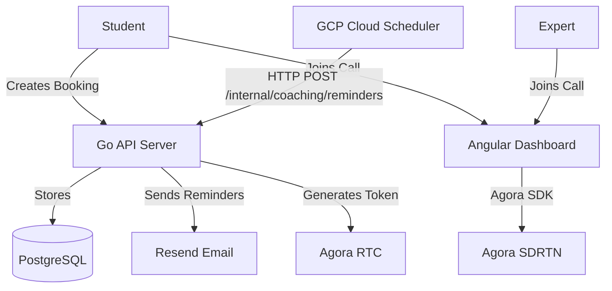
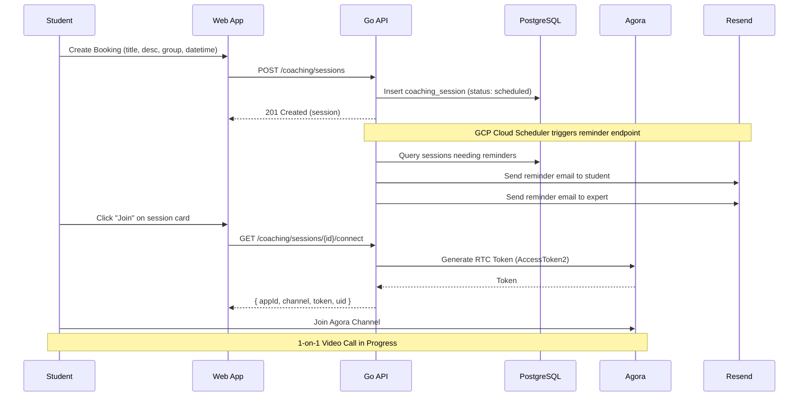
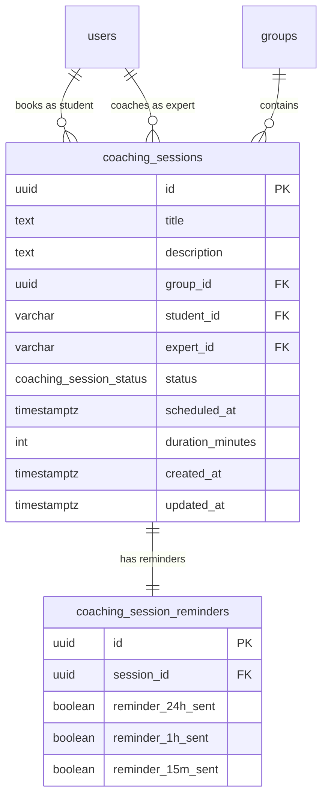
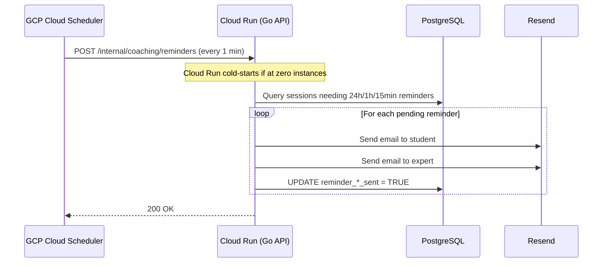
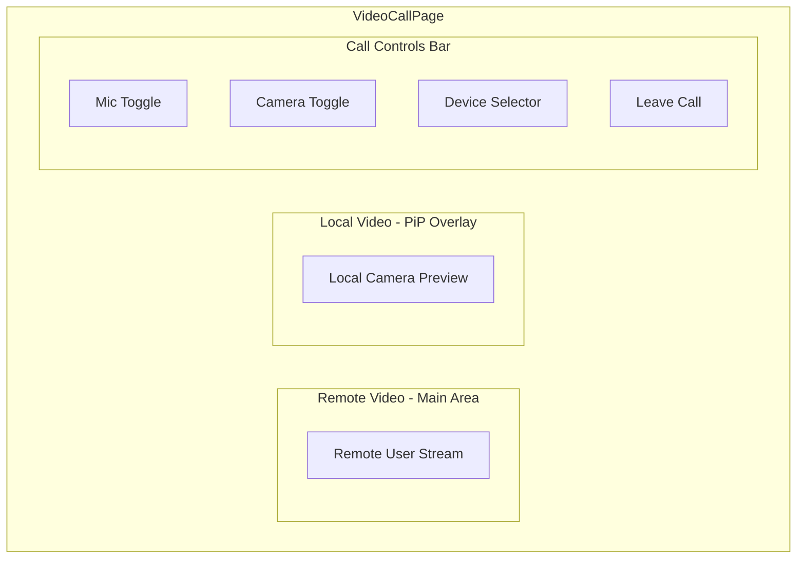

# Task: Live Coaching Feature

## Status

- [x] Defined
- [ ] In Progress
- [ ] Completed

## Description

As a student, I want the ability to book one-on-one live coaching sessions with experts and join video calls directly from the dashboard.

As an expert, I want to see upcoming coaching appointments and join scheduled video calls with students.

As an admin, I want full visibility into all live coaching sessions across the platform.

### Feature Overview

Live Coaching enables real-time video sessions between students and experts within groups. Students create bookings (appointments) by selecting a group, providing a title and description, and choosing a date/time slot. Both parties receive email reminders before the session. At the scheduled time, both participants join an Agora-powered 1-on-1 video call directly from the dashboard.

**Explicit scope exclusions for this iteration:**

- No video recording / cloud recording
- No availability slots management (future feature)
- No payment integration

### Reference Implementation

A reference project exists at `tmp/video-coach/` (Kotlin/Spring Boot + Angular 19). It implements a similar live coaching flow with Agora RTC, cloud recording, and Cal.com booking integration. This plan adapts the relevant patterns to Zeta's existing Go + Angular + Taiga UI stack, omitting recording and payment, and correcting architectural issues identified in the reference.

## High-Level Architecture





## Database Schema

### New Enum: `coaching_session_status`

```sql
CREATE TYPE coaching_session_status AS ENUM ('scheduled', 'in_progress', 'completed', 'cancelled');
```

### New Table: `coaching_sessions`

```sql
CREATE TABLE coaching_sessions (
    id UUID PRIMARY KEY DEFAULT gen_random_uuid(),
    title TEXT NOT NULL,
    description TEXT NOT NULL DEFAULT '',
    group_id UUID NOT NULL REFERENCES groups(id) ON DELETE CASCADE,
    student_id VARCHAR(255) NOT NULL,
    expert_id VARCHAR(255) NOT NULL,
    status coaching_session_status NOT NULL DEFAULT 'scheduled',
    scheduled_at TIMESTAMPTZ NOT NULL,
    duration_minutes INTEGER NOT NULL DEFAULT 60,
    created_at TIMESTAMPTZ NOT NULL DEFAULT NOW(),
    updated_at TIMESTAMPTZ NOT NULL DEFAULT NOW()
);

CREATE INDEX idx_coaching_sessions_student ON coaching_sessions(student_id);
CREATE INDEX idx_coaching_sessions_expert ON coaching_sessions(expert_id);
CREATE INDEX idx_coaching_sessions_group ON coaching_sessions(group_id);
CREATE INDEX idx_coaching_sessions_scheduled ON coaching_sessions(scheduled_at);
```

### New Table: `coaching_session_reminders`

Separate table to track which reminders have been sent per session, keeping `coaching_sessions` lean.

```sql
CREATE TABLE coaching_session_reminders (
    id UUID PRIMARY KEY DEFAULT gen_random_uuid(),
    session_id UUID NOT NULL REFERENCES coaching_sessions(id) ON DELETE CASCADE,
    reminder_24h_sent BOOLEAN NOT NULL DEFAULT FALSE,
    reminder_1h_sent BOOLEAN NOT NULL DEFAULT FALSE,
    reminder_15m_sent BOOLEAN NOT NULL DEFAULT FALSE
);

CREATE UNIQUE INDEX idx_coaching_session_reminders_session ON coaching_session_reminders(session_id);
```

A row is inserted into `coaching_session_reminders` automatically when a `coaching_session` is created. The three boolean columns track which tiers have been sent.



## API Endpoints

### New Routes Under `/coaching`

| Route                             | Method | Auth             | Permission        | Description                                                     |
| --------------------------------- | ------ | ---------------- | ----------------- | --------------------------------------------------------------- |
| `/coaching/sessions`              | POST   | Yes              | `coaching:create` | Create a new coaching session (student)                         |
| `/coaching/sessions`              | GET    | Yes              | `coaching:read`   | List coaching sessions for current user                         |
| `/coaching/sessions/{id}`         | GET    | Yes              | `coaching:read`   | Get session details                                             |
| `/coaching/sessions/{id}`         | PUT    | Yes              | `coaching:edit`   | Update session (title, desc, datetime)                          |
| `/coaching/sessions/{id}/cancel`  | POST   | Yes              | `coaching:cancel` | Cancel a session                                                |
| `/coaching/sessions/{id}/connect` | GET    | Yes              | `coaching:read`   | Get Agora connection data (token, channel, appId)               |
| `/internal/coaching/reminders`    | POST   | Scheduler Secret | —                 | Process pending email reminders (called by GCP Cloud Scheduler) |

### Agora Token Generation (Backend)

The Go API generates Agora RTC tokens using the official `AccessToken2` builder from `github.com/AgoraIO/Tools/DynamicKey/AgoraDynamicKey/go/src/rtctokenbuilder2`.

```go
import rtctokenbuilder "github.com/AgoraIO/Tools/DynamicKey/AgoraDynamicKey/go/src/rtctokenbuilder2"

token, err := rtctokenbuilder.BuildTokenWithUid(
    appID,           // AGORA_APP_ID env var
    appCertificate,  // AGORA_APP_CERTIFICATE env var
    channelName,     // e.g. "coaching_{sessionID}"
    uid,             // unique per participant
    rtctokenbuilder.RolePublisher,
    3600,            // token expiration (1 hour)
    3600,            // privilege expiration (1 hour)
)
```

**Channel naming convention**: `coaching_{session_uuid}` — each session gets a unique Agora channel.

**UID assignment**: Student = UID derived from a hash of their user ID; Expert = UID derived from a hash of their user ID. Both are `uint32` values. This avoids the hardcoded UID 1/2 problem from the reference project.

### Connect Endpoint Response

```json
{
  "app_id": "AGORA_APP_ID",
  "channel": "coaching_{session_uuid}",
  "token": "<generated_rtc_token>",
  "uid": 12345
}
```

## Permissions

### New Permission Constants

| Permission        | Admin | Expert       | Student      |
| ----------------- | ----- | ------------ | ------------ |
| `coaching:create` | ✓     | ✗            | ✓            |
| `coaching:read`   | ✓     | ✓            | ✓            |
| `coaching:edit`   | ✓     | ✗            | ✓ (own only) |
| `coaching:cancel` | ✓     | ✓ (own only) | ✓ (own only) |

- **Students** can create sessions (selecting an expert from the group), view their own sessions, edit/cancel their own.
- **Experts** can view sessions where they are the assigned expert, cancel their own.
- **Admins** can view all sessions and cancel any session.

### Backend Authorization Logic

- `POST /coaching/sessions` — Require `coaching:create`. Validate that the student is a member of the specified group.
- `GET /coaching/sessions` — Require `coaching:read`. Filter by role: admin sees all, expert sees sessions where `expert_id = user.id`, student sees sessions where `student_id = user.id`.
- `GET /coaching/sessions/{id}/connect` — Require `coaching:read`. Validate the user is either the student or expert for the session. Only allow connection if session status is `scheduled` and current time is within 15 minutes before `scheduled_at` through `scheduled_at + duration_minutes`.

## Email Reminders

### Reminder Schedule

Up to three reminder emails are sent before each session:

1. **24 hours before** — Confirms upcoming session
2. **1 hour before** — Session is approaching
3. **15 minutes before** — Session is about to start, includes direct join link

### Late-Created Sessions: Skipping Past Reminder Tiers

If a session is created with less lead time than a reminder tier requires, that tier is marked as sent immediately upon creation so it is never dispatched:

| Session created | Scheduled at | Reminders sent                        |
| --------------- | ------------ | ------------------------------------- |
| Now             | Now + 48h    | 24h, 1h, 15min (all three)            |
| Now             | Now + 30min  | 15min only                            |
| Now             | Now + 50min  | 1h, 15min                             |
| Now             | Now + 10min  | None (already inside the call window) |

**Implementation**: When inserting into `coaching_session_reminders`, pre-set `reminder_24h_sent = TRUE` if `scheduled_at - NOW() < 24 hours`, `reminder_1h_sent = TRUE` if `< 1 hour`, `reminder_15m_sent = TRUE` if `< 15 minutes`. This way the scheduler never picks up irrelevant tiers.

### Infrastructure Constraint: Cloud Run Scale-to-Zero

The Zeta API runs on **Google Cloud Run**, which can scale to zero instances when idle. An in-process background goroutine (ticker/cron) would not fire if no instances are running. Therefore, reminders must be triggered externally.

### Implementation: GCP Cloud Scheduler + Internal Endpoint

**Architecture:**



**Cloud Scheduler Job:**

- **Schedule**: `* * * * *` (every minute)
- **Target**: `POST https://<cloud-run-url>/internal/coaching/reminders`
- **Auth**: The request includes an `X-Scheduler-Secret` header validated by the API. The secret is stored as a Cloud Run environment variable (`SCHEDULER_SECRET`). This prevents unauthorized external access to the internal endpoint.

**Internal API Endpoint**: `POST /internal/coaching/reminders`

- Not registered under the standard auth middleware — uses a dedicated secret-header check instead.
- Joins `coaching_sessions` with `coaching_session_reminders` to find sessions needing each reminder tier:

```sql
-- Find sessions needing 24h reminder
SELECT cs.* FROM coaching_sessions cs
JOIN coaching_session_reminders csr ON csr.session_id = cs.id
WHERE cs.status = 'scheduled'
  AND NOT csr.reminder_24h_sent
  AND cs.scheduled_at BETWEEN NOW() + INTERVAL '23 hours 59 minutes' AND NOW() + INTERVAL '24 hours 1 minute';
```

- Similar queries for 1-hour and 15-minute windows.
- After sending, the corresponding `reminder_*_sent` flag in `coaching_session_reminders` is set to `TRUE` in a single transaction to prevent duplicate sends on overlapping scheduler invocations.
- The boolean flags provide idempotency — even if Cloud Scheduler fires twice in quick succession, reminders are only sent once.
- Late-created sessions already have irrelevant tiers pre-marked as sent (see [Late-Created Sessions](#late-created-sessions-skipping-past-reminder-tiers)), so the scheduler never processes them.

**Terraform Resource:**

```hcl
resource "google_cloud_scheduler_job" "coaching_reminders" {
  name             = "coaching-reminders"
  schedule         = "* * * * *"
  time_zone        = "UTC"
  attempt_deadline = "30s"

  http_target {
    uri         = "${google_cloud_run_v2_service.api.uri}/internal/coaching/reminders"
    http_method = "POST"
    headers = {
      "X-Scheduler-Secret" = var.scheduler_secret
    }
  }
}
```

Both the student and the expert receive the email. The email contains:

- Session title and description
- Partner name (student sees expert name, expert sees student name)
- Scheduled date/time
- Duration
- Direct link to the session page

Uses the existing Resend email service (`internal/email/service.go`).

## Frontend

### New Pages

#### 1. Create Coaching Session Page (`/coaching/create`)

**Guard**: `coaching:create` permission.

A form page where the student creates a new booking:

- **Title** — `TuiTextfield` (required, 5–75 chars)
- **Description** — `TuiTextarea` (optional)
- **Group** — `TuiSelect` dropdown populated from the user's groups
- **Expert** — `TuiSelect` dropdown populated from group members with `expert` role (loaded after group is selected)
- **Date & Time** — `TuiInputDateTime` for selecting the appointment date and time
- **Duration** — `TuiSelect` with preset options (30 min, 45 min, 60 min)
- **Submit** button → calls `POST /coaching/sessions`
- On success → redirect to My Coaching Sessions page

#### 2. My Coaching Sessions Page (`/coaching`)

**Guard**: `coaching:read` permission.

Displays all coaching sessions for the current user with **TuiTabs** (two tabs):

- **Upcoming** — Sessions where `scheduled_at >= now`, sorted by `scheduled_at ASC`
- **Past** — Sessions where `scheduled_at + duration < now`, sorted by `scheduled_at DESC`

Each tab displays sessions as a **TuiTable** with columns:
| Column | Description |
|--------|-------------|
| Title | Session title (clickable → navigates to session detail) |
| Partner | Expert name (for student) or Student name (for expert) |
| Group | Group name |
| Date & Time | Formatted `scheduled_at` |
| Duration | e.g. "60 min" |
| Status | Badge: Scheduled / In Progress / Completed / Cancelled |
| Actions | "Join" button (enabled within 15 min of start through end of session) |

The "Join" button uses the same connectability logic: enabled when current time is within 15 minutes before `scheduled_at` and before `scheduled_at + duration_minutes`.

#### 3. Video Call Page (`/coaching/{id}/call`)

**Guard**: `coaching:read` permission. Additional runtime check that user is either the student or expert.

Full-screen video call page using Agora Web SDK (`agora-rtc-sdk-ng`):

- On mount: call `GET /coaching/sessions/{id}/connect` to get Agora credentials
- Create `AgoraRTCClient` with `{ mode: 'rtc', codec: 'vp8' }`
- Register event listeners (`user-published`, `user-unpublished`, `user-joined`, `user-left`) **before** joining
- Join channel with the received `appId`, `channel`, `token`, `uid`
- Create and publish local media tracks (microphone + camera)
- Display local video in a preview panel
- Display remote user's video in the main panel

**Controls** (toolbar at bottom):

- Mute/unmute microphone toggle
- Camera on/off toggle
- Device selector (audio input, video input) using `AgoraRTC.getDevices()`
- Leave call button → stop tracks, unpublish, leave channel, navigate back

**Layout** (responsive):

- Desktop: Side-by-side (remote video large, local video small overlay)
- Mobile: Stacked (remote video top, local video bottom, controls overlay)



### Home Page Widget

A coaching sessions widget on the home page showing the next **3 upcoming sessions** as a compact table:

| Column  | Description                           |
| ------- | ------------------------------------- |
| Title   | Session title                         |
| Partner | Expert/Student name                   |
| Date    | Formatted date and time               |
| Action  | "Join" button (conditionally enabled) |

Below the table, a "View All" link navigates to `/coaching`.

The widget is only visible to users with `coaching:read` permission. If no upcoming sessions exist, it is not displayed.

### New Angular Routes

```
/coaching                    → CoachingSessionsPageComponent (guard: coaching:read)
/coaching/create             → CreateCoachingSessionPageComponent (guard: coaching:create)
/coaching/{id}/call          → VideoCallPageComponent (guard: coaching:read)
```

### New Angular Service: `CoachingService`

```typescript
@Injectable({ providedIn: "root" })
export class CoachingService {
  getSessions(): Observable<CoachingSession[]>;
  getSession(id: string): Observable<CoachingSession>;
  createSession(data: CreateCoachingSession): Observable<CoachingSession>;
  updateSession(
    id: string,
    data: UpdateCoachingSession,
  ): Observable<CoachingSession>;
  cancelSession(id: string): Observable<void>;
  getConnectData(id: string): Observable<CoachingConnectData>;
}
```

### New Angular Service: `AgoraService`

```typescript
@Injectable({ providedIn: "root" })
export class AgoraService {
  // State signals
  channelJoined: Signal<boolean>;
  localTracks: Signal<{
    mic: IMicrophoneAudioTrack | null;
    video: ICameraVideoTrack | null;
  }>;
  remoteUsers: Signal<
    Map<
      UID,
      { audio: IRemoteAudioTrack | null; video: IRemoteVideoTrack | null }
    >
  >;

  // Methods
  joinChannel(
    channel: string,
    token: string,
    appId: string,
    uid: number,
  ): Promise<void>;
  leaveChannel(): Promise<void>;
  toggleMic(): Promise<void>;
  toggleCamera(): Promise<void>;
  setAudioDevice(deviceId: string): Promise<void>;
  setVideoDevice(deviceId: string): Promise<void>;
}
```

### Frontend File Structure

```
web/dashboard/src/app/
├── pages/
│   ├── coaching-sessions-page/          # /coaching — list with tabs
│   ├── create-coaching-session-page/    # /coaching/create — booking form
│   └── video-call-page/                # /coaching/{id}/call — Agora video call
├── shared/
│   ├── services/
│   │   ├── coaching.service.ts          # REST client for /coaching/*
│   │   └── agora.service.ts             # Agora RTC wrapper
│   └── components/
│       └── coaching-widget/             # Home page upcoming sessions widget
```

## Backend File Structure

```
internal/
├── coaching/
│   ├── handler.go          # HTTP handlers for /coaching/* routes
│   ├── service.go          # Business logic (create, connect, list, cancel)
│   ├── reminder.go         # Reminder processing logic (triggered by Cloud Scheduler)
│   └── agora.go            # Agora token generation
db/
├── migrations/
│   ├── YYYYMMDD_create_coaching_sessions.up.sql
│   └── YYYYMMDD_create_coaching_sessions.down.sql
├── queries/
│   └── coaching_sessions.sql
```

## Key Differences from Reference Project

| Aspect              | Reference (video-coach)            | Zeta Implementation                                 |
| ------------------- | ---------------------------------- | --------------------------------------------------- |
| Backend             | Kotlin/Spring Boot                 | Go/Chi router                                       |
| Token generation    | External token service             | In-process using Go `rtctokenbuilder2`              |
| Booking calendar    | Cal.com integration                | Manual date/time picker (no availability slots yet) |
| Payment             | Payment service integration        | Not included                                        |
| Cloud recording     | Agora Cloud Recording + Azure Blob | Not included                                        |
| UID assignment      | Hardcoded 1=student, 2=expert      | Hash-based UIDs from user IDs                       |
| Agora codec         | VP9                                | VP8 (wider browser support per Agora docs)          |
| Email reminders     | 15 min only                        | 24h, 1h, 15 min                                     |
| Frontend UI lib     | Custom EPUI                        | Taiga UI                                            |
| Recording lifecycle | Scheduled auto-stop                | Not applicable                                      |

## Architectural Corrections from Reference

1. **No hardcoded UIDs** — The reference assigns UID 1 to student and UID 2 to expert, which breaks if either joins from multiple devices or if the feature extends to group calls. Zeta uses deterministic UIDs derived from user IDs.
2. **Token generation in-process** — The reference delegates to an external token service. Zeta generates tokens directly using the Agora Go SDK, reducing latency and external dependencies.
3. **Event listeners before join** — Agora docs recommend registering event listeners before calling `join()`. The reference does this correctly; we preserve this pattern.
4. **VP8 codec** — VP8 has broader browser compatibility than VP9 according to Agora's compatibility table. The reference uses VP9, which may fail on older Safari versions.
5. **Proper track cleanup** — Use `close()` (not just `stop()`) on local tracks when leaving, as recommended by Agora docs. The reference uses `stop()` only.

## Environment Variables

New environment variables to add to `.env`:

```
AGORA_APP_ID=<your_agora_app_id>
AGORA_APP_CERTIFICATE=<your_agora_app_certificate>
SCHEDULER_SECRET=<random_secret_for_cloud_scheduler>
```

## Acceptance Criteria

- [ ] `coaching_sessions` table is created with proper schema, indexes, and enum type.
- [ ] `coaching_session_reminders` table is created with a 1:1 relationship to `coaching_sessions`.
- [ ] `coaching:create`, `coaching:read`, `coaching:edit`, `coaching:cancel` permissions are defined and assigned to appropriate roles.
- [ ] `POST /coaching/sessions` creates a session and validates group membership.
- [ ] `GET /coaching/sessions` returns sessions filtered by user role (admin, expert, student).
- [ ] `GET /coaching/sessions/{id}/connect` returns Agora credentials and enforces time-based connectivity check.
- [ ] `POST /coaching/sessions/{id}/cancel` cancels a session.
- [ ] `POST /internal/coaching/reminders` endpoint processes pending reminders, protected by `X-Scheduler-Secret` header.
- [ ] GCP Cloud Scheduler job is configured (Terraform) to call the reminders endpoint every minute.
- [ ] Reminder emails are sent at 24h, 1h, and 15min before session start.
- [ ] Late-created sessions have past reminder tiers pre-marked as sent (e.g., session in 30 min → only 15min reminder fires).
- [ ] Reminder processing is idempotent (duplicate scheduler invocations do not send duplicate emails).
- [ ] Reminder emails are sent to both the student and the expert.
- [ ] Create Coaching Session page has a form with title, description, group, expert, date/time, and duration.
- [ ] My Coaching Sessions page displays sessions in a table with Upcoming and Past tabs.
- [ ] "Join" button is enabled only within the connectable time window (15 min before start through session end).
- [ ] Video Call page establishes a 1-on-1 Agora RTC connection with mic/camera controls.
- [ ] Video Call page handles device selection (audio/video input).
- [ ] Video Call page is responsive (desktop and mobile layouts).
- [ ] Home page displays an upcoming coaching sessions widget.
- [ ] Navbar includes a link to the coaching sessions page.
- [ ] Root `README.md` is updated with Live Coaching feature description, diagrams, and updated DB schema.
- [ ] `make api:build` passes.
- [ ] `make web:build` passes.
