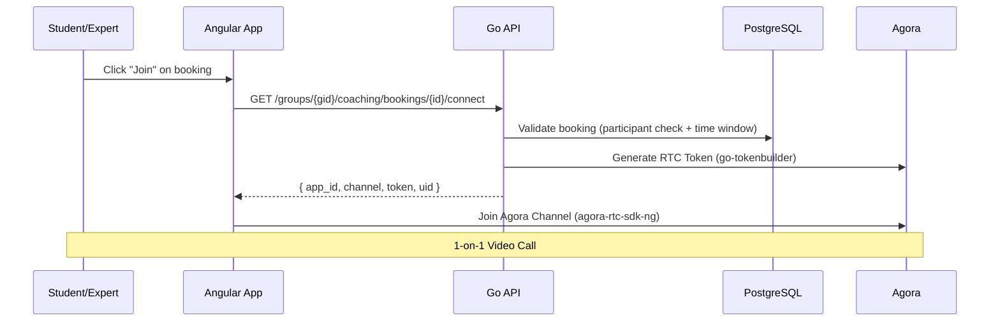
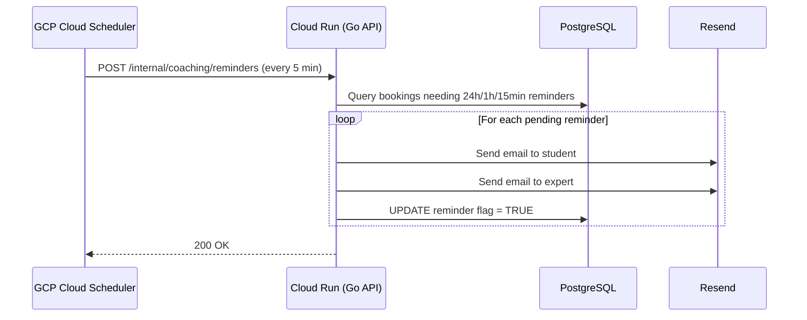
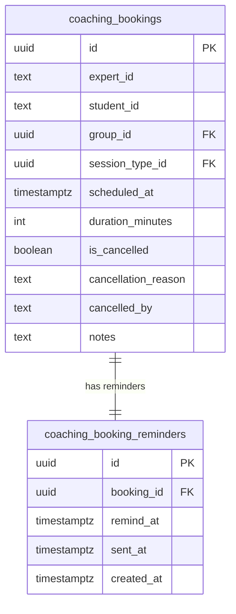
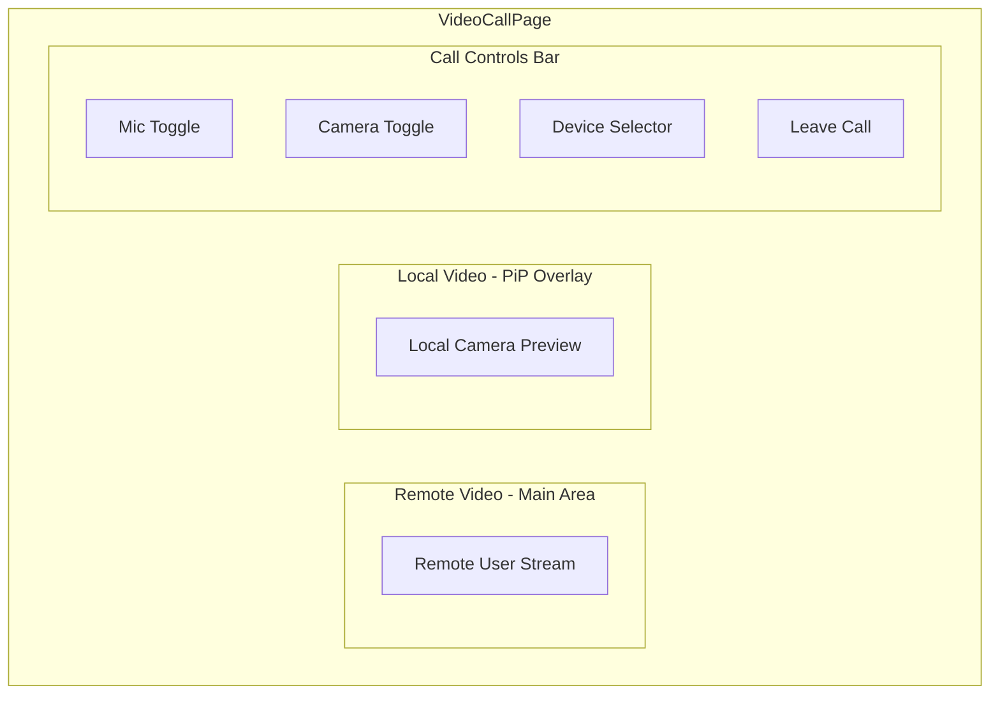

# Task: Live Video Coaching

## Status

- [x] Defined
- [x] In Progress
- [ ] Completed

## Description

Add real-time 1-on-1 video calling to the existing coaching booking system so students and experts can join Agora-powered video sessions directly from the dashboard, and wire up booking email notifications that are currently stubbed.

### What Already Exists

The coaching booking system is **fully implemented**:

- **Session types** — experts create per-group session types (name, description, duration 15–120 min)
- **Availability** — weekly recurring availability with overlap merging, per expert per group
- **Blocked slots** — full-day or time-range blocks
- **Slot computation** — 28-day lookahead, timezone-aware, conflict-free slot generation
- **Bookings** — creation with SERIALIZABLE transaction + 3× retry, configurable minimum notice (default 2h), conflict detection
- **Booking management** — list (my bookings, group sessions), cancel (configurable notice, default 1h)
- **Expert listing** — per group, with user details from WorkOS
- **Timezone** — per-user IANA timezone in `user_preferences`
- **Permissions** — `coaching:availability:manage`, `coaching:slots:read`, `coaching:book`, `coaching:bookings:read`, `coaching:bookings:manage`
- **API routes** — all under `/groups/{groupID}/coaching/*` with group membership middleware
- **Frontend** — book coaching wizard (multi-step: group → expert → session type → slot → confirm), manage availability page, my sessions page (upcoming/past/cancelled tabs), home page widget (up to 5 upcoming bookings)
- **Bruno collection** — 20 .bru files covering all endpoints

### What This Task Adds

1. **Agora video calls** — token generation on backend, connect endpoint, full video call page in Angular
2. **Email notifications** — wire up existing stubs to actually send via Resend (booking created, booking cancelled, reminders)
3. **Email reminders infrastructure** — GCP Cloud Scheduler + internal endpoint for timed reminders

### Explicit Scope Exclusions

- No video recording / cloud recording
- No payment integration
- No group video calls (1-on-1 only)

### Reference Implementation

A reference project exists at `tmp/video-coach/` (Kotlin/Spring Boot + Angular 19). This task adapts the Agora video call patterns to Zeta's Go + Angular + Taiga UI stack, correcting architectural issues from the reference.

## Architecture

### Video Call Flow



### Email Reminders Flow



## Database Changes

### New Table: `coaching_booking_reminders`

Tracks individual reminder timestamps per booking. Multiple rows are inserted per booking (one per reminder tier: 24h, 1h, 15min). Reminders already in the past at booking time are skipped.

```sql
CREATE TABLE coaching_booking_reminders (
    id          UUID PRIMARY KEY DEFAULT gen_random_uuid(),
    booking_id  UUID NOT NULL REFERENCES coaching_bookings(id) ON DELETE CASCADE,
    remind_at   TIMESTAMPTZ NOT NULL,
    sent_at     TIMESTAMPTZ,
    created_at  TIMESTAMPTZ NOT NULL DEFAULT now()
);

CREATE INDEX idx_coaching_booking_reminders_pending
    ON coaching_booking_reminders (remind_at)
    WHERE sent_at IS NULL;

CREATE INDEX idx_coaching_booking_reminders_booking_id
    ON coaching_booking_reminders (booking_id);
```

**Late-created bookings**: When inserting reminder rows, only reminders whose `remind_at` is in the future are created. Past reminders are simply not inserted.

| Booking created | Scheduled at | Reminder rows created |
| --------------- | ------------ | --------------------- |
| Now             | Now + 48h    | 3 rows (24h, 1h, 15m) |
| Now             | Now + 30min  | 1 row (15m only)      |
| Now             | Now + 50min  | 2 rows (1h, 15m)      |

### Existing Schema Reference

Already exists (migration `20260403000001`):

```
coaching_session_types  (id, expert_id, group_id, name, description, duration_minutes, is_active, ...)
coaching_availability   (id, expert_id, group_id, day_of_week, start_time, end_time, is_active, ...)
coaching_blocked_slots  (id, expert_id, blocked_date, start_time, end_time, reason, ...)
coaching_bookings       (id, expert_id, student_id, group_id, session_type_id, scheduled_at, duration_minutes, is_cancelled, cancellation_reason, cancelled_by, notes, ...)
```

The booking status is **derived** (not stored as an enum): `is_cancelled` → cancelled, `scheduled_at > now` → pending, else → done.



## API Changes

### New Endpoints

All routes are under the existing `/groups/{groupID}/coaching` prefix with `RequireGroupMembership` middleware.

| Route                                                     | Method | Permission               | Description                             |
| --------------------------------------------------------- | ------ | ------------------------ | --------------------------------------- |
| `/groups/{groupID}/coaching/bookings/{bookingID}/connect` | GET    | `coaching:video:connect` | Get Agora connection data for a booking |
| `/internal/coaching/reminders`                            | POST   | Scheduler Secret         | Process pending email reminders         |

### Connect Endpoint

**`GET /groups/{groupID}/coaching/bookings/{bookingID}/connect`**

Authorization:

- Requires `coaching:video:connect` permission
- User must be either the `student_id` or `expert_id` on the booking
- Booking must not be cancelled
- Current time must be within the configurable connect window (default: **15 minutes before**) `scheduled_at` through `scheduled_at + duration_minutes`

Response:

```json
{
  "app_id": "AGORA_APP_ID",
  "channel": "coaching_{booking_uuid}",
  "token": "<generated_rtc_token>",
  "uid": 12345
}
```

### Agora Token Generation

Use the `github.com/AgoraIO-Community/go-tokenbuilder` Go library directly — no separate token service deployment needed. This is the same library used by the [agora-token-service](https://github.com/AgoraIO-Community/agora-token-service) Docker image, but imported as a Go package.

```go
import rtctokenbuilder "github.com/AgoraIO-Community/go-tokenbuilder/rtctokenbuilder2"

token, err := rtctokenbuilder.BuildTokenWithUid(
    appID,           // AGORA_APP_ID env var
    appCertificate,  // AGORA_APP_CERTIFICATE env var
    channelName,     // "coaching_{bookingID}"
    uid,             // uint32 derived from user ID hash
    rtctokenbuilder.RolePublisher,
    3600,            // token expiration (seconds)
    3600,            // privilege expiration (seconds)
)
```

**Channel naming**: `coaching_{booking_uuid}` — each booking gets a unique Agora channel.

**UID assignment**: Deterministic `uint32` derived from a hash of the WorkOS user ID. Both student and expert get a stable UID. This avoids the hardcoded UID 1/2 problem from the reference project.

### Internal Reminders Endpoint

**`POST /internal/coaching/reminders`**

- Not behind standard auth middleware — validated by `Authorization: Bearer <SCHEDULER_SECRET>` header
- Queries `coaching_booking_reminders` for rows where `sent_at IS NULL AND remind_at <= NOW()`
- Skips cancelled bookings (marks reminder as sent without emailing)
- Sends emails to both student and expert via Resend
- Sets `sent_at = NOW()` after successful send (idempotency — already-sent reminders are never re-queried)

No complex time-window queries needed — each reminder row has an explicit `remind_at` timestamp, and the query simply finds all unsent reminders whose time has arrived.

## Permissions

### Existing (no changes needed)

| Permission                     | Admin | Expert | Student | Used For                                         |
| ------------------------------ | ----- | ------ | ------- | ------------------------------------------------ |
| `coaching:availability:manage` | ✓     | ✓      | ✗       | Session types, availability, blocked slots       |
| `coaching:slots:read`          | ✓     | ✓      | ✓       | View available slots, list experts               |
| `coaching:book`                | ✓     | ✗      | ✓       | Create bookings                                  |
| `coaching:bookings:read`       | ✓     | ✓      | ✓       | List bookings, view booking details              |
| `coaching:bookings:manage`     | ✓     | ✓      | ✗       | Cancel any booking in group (admin/expert scope) |

### New Permission

| Permission               | Admin | Expert | Student | Used For                                 |
| ------------------------ | ----- | ------ | ------- | ---------------------------------------- |
| `coaching:video:connect` | ✓     | ✓      | ✓       | Generate Agora token and join video call |

Add `CoachingVideoConnect = "coaching:video:connect"` to `internal/permissions/permissions.go`.

### Why a separate permission for video connect?

Connecting to a video call is a distinct action from reading bookings:

- **`coaching:bookings:read`** — list/view booking data (low risk, read-only)
- **`coaching:video:connect`** — generate a live Agora RTC token and join a real-time video channel (higher risk, resource-consuming)

A dedicated permission allows admins to independently disable video calls without breaking booking visibility (e.g., during maintenance, or for specific roles in the future).

The connect endpoint uses `coaching:video:connect` at the middleware level, plus fine-grained handler checks (participant validation + time window).

## Email Notifications

### Wire Up Existing Stubs

The coaching module already has `sendBookingCreatedEmail()` and `sendCancellationEmail()` in `internal/coaching/bookings.go` that build subject/body strings but **discard them** (assigned to `_`). These need to be wired to `emailService.Send()`.

**Booking created email** (sent to both student and expert):

- Session type name and notes
- Partner name
- Scheduled date/time (in recipient's timezone)
- Duration
- Group name

**Booking cancelled email** (sent to the other party):

- Session details
- Who cancelled
- Cancellation reason (if provided)

### Reminder Schedule

Three tiers sent before each booking:

1. **24 hours before** — confirms upcoming session
2. **1 hour before** — session is approaching
3. **15 minutes before** — session is about to start, includes direct "Join" link

### Cloud Scheduler Configuration

The Zeta API runs on **GCP Cloud Run** (scales to zero). Reminders must be triggered externally.

**Terraform resource:**

```hcl
resource "google_cloud_scheduler_job" "coaching_reminders" {
  name             = "coaching-reminders"
  schedule         = "*/5 * * * *"
  time_zone        = "UTC"
  attempt_deadline = "30s"

  http_target {
    uri         = "${google_cloud_run_v2_service.api.uri}/internal/coaching/reminders"
    http_method = "POST"
    headers = {
      "Authorization" = "Bearer ${var.scheduler_secret}"
    }
  }
}
```

Every 5 minutes. The ±5 min window tolerance in reminder queries ensures no reminders are missed between scheduler invocations.

## Frontend

### New: Video Call Page (`/sessions/{id}/call`)

**Guard**: `coaching:video:connect` permission. Runtime check: user is participant.

True full-screen video call page — **no navbar, no sidebar, no app chrome**. The page takes over the entire viewport. Uses Agora Web SDK (`agora-rtc-sdk-ng` npm package). The route is **outside the ShellComponent** so no app chrome is rendered.

**Route**: `/sessions/:groupId/:bookingId/call`

**Lifecycle:**

1. On mount → call `POST /groups/{gid}/coaching/bookings/{id}/connect`
2. Create `AgoraRTCClient` with `{ mode: 'rtc', codec: 'vp8' }`
3. Register event listeners (`user-published`, `user-unpublished`, `user-joined`, `user-left`) **before** joining
4. Join channel with received `appId`, `channel`, `token`, `uid`
5. Create and publish local tracks (microphone + camera)
6. On `user-published` → subscribe and play remote tracks
7. On leave → `close()` local tracks (not just `stop()`), unpublish, leave channel, navigate back

**Controls** (bottom toolbar):

- Mic mute/unmute toggle
- Camera on/off toggle
- Device selector (audio input, video input) via `AgoraRTC.getDevices()`
- Leave call button

**Layout:**

- Desktop: remote video large, local video small PiP overlay
- Mobile: stacked layout with controls overlay



### Existing Pages: Add "Join" Button

The **my sessions page** and **home page widget** already display bookings. Add a "Join" button that:

- Is visible only when user is a participant (student or expert)
- Is enabled only within the connectable time window (configurable via `CONNECT_WINDOW` env var, default 15 min before `scheduled_at` through `scheduled_at + duration_minutes`)
- Navigates to `/sessions/:groupId/:bookingId/call`

### New Angular Route

```
/sessions/:groupId/:bookingId/call → VideoCallPageComponent (guard: coaching:video:connect, outside ShellComponent)
```

Added alongside existing routes:

```
/sessions           → MySessionsPageComponent (existing)
/sessions/book      → BookCoachingPageComponent (existing)
/sessions/settings  → ManageAvailabilityPageComponent (existing)
```

### New Angular Service: `AgoraService`

```typescript
@Injectable({ providedIn: "root" })
export class AgoraService {
  channelJoined: Signal<boolean>;
  localTracks: Signal<{
    mic: IMicrophoneAudioTrack | null;
    video: ICameraVideoTrack | null;
  }>;
  remoteUsers: Signal<
    Map<
      UID,
      { audio: IRemoteAudioTrack | null; video: IRemoteVideoTrack | null }
    >
  >;

  joinChannel(
    channel: string,
    token: string,
    appId: string,
    uid: number,
  ): Promise<void>;
  leaveChannel(): Promise<void>;
  toggleMic(): Promise<void>;
  toggleCamera(): Promise<void>;
  setAudioDevice(deviceId: string): Promise<void>;
  setVideoDevice(deviceId: string): Promise<void>;
}
```

### CoachingService Addition

Add one method to the existing `coaching.service.ts`:

```typescript
connectToBooking(groupId: string, bookingId: string): Observable<AgoraConnectData>;
// AgoraConnectData = { app_id: string; channel: string; token: string; uid: number }
```

### Frontend File Structure (new files only)

```
web/dashboard/src/app/
├── pages/
│   └── video-call-page/             # NEW: /sessions/{id}/call
│       ├── video-call-page.component.ts
│       └── video-call-page.component.html
├── shared/
│   └── services/
│       └── agora.service.ts         # NEW: Agora RTC wrapper
```

## Backend File Structure (new/modified files)

```
internal/
├── coaching/
│   ├── handler.go          # MODIFY: add connect route registration
│   ├── bookings.go         # MODIFY: wire email stubs, create reminder row on booking
│   ├── connect.go          # NEW: connect endpoint handler + Agora token generation
│   └── reminder.go         # NEW: reminder processing logic
db/
├── migrations/
│   ├── YYYYMMDD_create_coaching_booking_reminders.up.sql    # NEW
│   └── YYYYMMDD_create_coaching_booking_reminders.down.sql  # NEW
├── queries/
│   └── coaching.sql        # MODIFY: add reminder queries
```

## Architectural Decisions

| Decision                                   | Rationale                                                                                                                       |
| ------------------------------------------ | ------------------------------------------------------------------------------------------------------------------------------- |
| Use `go-tokenbuilder` Go library directly  | Same library used by agora-token-service Docker, but as an import — avoids deploying a separate service. Zero latency overhead. |
| VP8 codec (not VP9)                        | Broader browser support per Agora compatibility docs. VP9 may fail on older Safari.                                             |
| Deterministic UID from user ID hash        | Avoids hardcoded UID 1/2 from reference. Stable across reconnections. `uint32` from FNV-1a of WorkOS user ID.                   |
| Event listeners before `join()`            | Agora best practice — prevents missing the initial `user-published` event if remote user is already in channel.                 |
| `close()` not `stop()` on tracks           | Agora docs: `close()` releases the underlying media resources. `stop()` only pauses the track.                                  |
| GET for connect (not POST)                 | Token generation is idempotent — same inputs produce equivalent tokens. GET simplifies client-side usage.                       |
| Row-per-reminder (not boolean flags)       | Simpler queries (`WHERE sent_at IS NULL AND remind_at <= NOW()`), no ±5min tolerance needed, naturally handles late bookings.   |
| Configurable time constraints via env vars | `MIN_BOOKING_NOTICE`, `CANCELLATION_NOTICE`, `CONNECT_WINDOW` allow instant testing without code changes.                       |

## Environment Variables

New variables to add to `.env` and Cloud Run config:

```
# Required for video calls
AGORA_APP_ID=<your_agora_app_id>
AGORA_APP_CERTIFICATE=<your_agora_app_certificate>

# Required for reminder scheduler
SCHEDULER_SECRET=<random_secret_for_cloud_scheduler>

# Configurable time constraints (Go duration syntax: 0s, 5m, 2h)
# Defaults are production-safe — override for testing.
MIN_BOOKING_NOTICE=2h       # Minimum lead time for booking (set to 0s for instant testing)
CANCELLATION_NOTICE=1h      # Minimum lead time for cancellation
CONNECT_WINDOW=15m          # How early before scheduled_at you can join (set to 24h for testing)
```

Parsed in `server.go` via `time.ParseDuration` with defaults. Read via `HandlerConfig` struct passed to `coaching.NewHandler()`.

## Acceptance Criteria

### Permissions

- [x] `coaching:video:connect` permission constant added to `internal/permissions/permissions.go`
- [ ] `coaching:video:connect` assigned to admin, expert, and student roles (via WorkOS)
- [ ] `coaching:bookings:manage` activated for admin-level cancel operations (middleware-gated)
- [x] Frontend `permissions.service.ts` updated with new permission constant

### Backend — Agora Video Call

- [x] `go get github.com/AgoraIO-Community/go-tokenbuilder` is added to `go.mod`
- [x] `AGORA_APP_ID` and `AGORA_APP_CERTIFICATE` env vars are read in `server.go` via `HandlerConfig`
- [x] `GET /groups/{groupID}/coaching/bookings/{bookingID}/connect` generates an Agora RTC token
- [x] Connect endpoint is gated by `coaching:video:connect` permission
- [x] Connect endpoint validates: user is participant, booking not cancelled, within time window (configurable via `CONNECT_WINDOW`, default 15 min before → end)
- [x] Channel name follows `coaching_{bookingID}` convention
- [x] UID is a deterministic `uint32` derived from user ID (FNV-1a hash)

### Backend — Email Notifications

- [x] `sendBookingCreatedEmail()` calls `emailService.Send()` (was a stub)
- [x] `sendCancellationEmail()` calls `emailService.Send()` (was a stub)
- [ ] Emails include session details, partner name, scheduled time, and group name

### Backend — Reminders

- [x] `coaching_booking_reminders` migration is created (row-per-reminder design with `remind_at`/`sent_at`)
- [x] Reminder rows are inserted when a booking is created (past reminders are skipped)
- [x] `POST /internal/coaching/reminders` processes pending reminders (where `sent_at IS NULL AND remind_at <= NOW()`)
- [x] Internal endpoint is protected by `Authorization: Bearer <SCHEDULER_SECRET>` header (not standard auth)
- [x] Reminder processing is idempotent (`sent_at` timestamp prevents re-query)
- [ ] 15-min reminder email includes a direct "Join" link
- [ ] Terraform Cloud Scheduler job is defined (every 5 minutes)

### Backend — Configurable Time Constraints

- [x] `MIN_BOOKING_NOTICE` env var configures minimum booking lead time (default `2h`, set `0s` for testing)
- [x] `CANCELLATION_NOTICE` env var configures minimum cancellation lead time (default `1h`)
- [x] `CONNECT_WINDOW` env var configures how early before a session participants may join (default `15m`)
- [x] Time constraints parsed via `time.ParseDuration` in `server.go`, passed via `HandlerConfig`

### Frontend — Video Call

- [x] `agora-rtc-sdk-ng` npm package is installed
- [x] `AgoraService` wraps Agora client lifecycle (join, leave, toggle mic/camera)
- [x] Video call page at `/sessions/:groupId/:bookingId/call` with full-screen 1-on-1 video (outside ShellComponent)
- [x] Controls: mic toggle, camera toggle, leave button
- [ ] Device selector (audio input, video input) via `AgoraRTC.getDevices()`
- [ ] Responsive layout (mobile stacked)
- [x] Event listeners registered before `join()`
- [x] Tracks cleaned up with `close()` on leave

### Frontend — Join Button

- [x] "Join" button added to my sessions page and home page widget
- [x] Button enabled only within connectable time window
- [x] Button navigates to `/sessions/:groupId/:bookingId/call`

### Configuration

- [ ] `AGORA_APP_ID`, `AGORA_APP_CERTIFICATE`, `SCHEDULER_SECRET` added to `.env` with real values
- [x] `AGORA_APP_ID`, `AGORA_APP_CERTIFICATE`, `SCHEDULER_SECRET` added to `.env.example` with placeholder values
- [x] `MIN_BOOKING_NOTICE`, `CANCELLATION_NOTICE`, `CONNECT_WINDOW` added to `.env.example`
- [ ] New env vars added to Cloud Run configuration / Terraform variables

### Documentation

- [x] Root `README.md` updated with Live Coaching feature description (booking + availability + video call flow)
- [x] Root `README.md` updated with coaching system diagrams (booking flow, video call sequence, reminder architecture)
- [x] Root `README.md` updated with coaching DB schema (session types, availability, blocked slots, bookings, reminders)
- [x] Root `README.md` updated with Agora prerequisites (app ID, certificate) in the setup section

### Build

- [x] `make api:build` passes
- [x] `make web:build` passes
