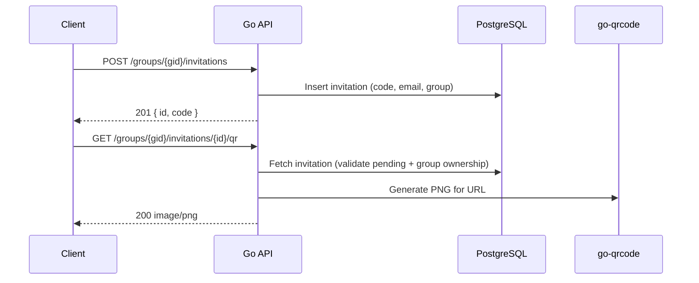

# Task: Invitation QR Codes

## Status

- [x] Defined
- [ ] In Progress
- [ ] Completed

## Description

As a group admin or expert, I want to generate a QR code for a group invitation so that I can share it in person (on screen, printed, or at an event) and allow others to join the group by scanning it.

### Current Invitation Flow

The existing system generates a 6-character alphanumeric invite code and sends an email with a link (`http://localhost:4200/groups?invite=<CODE>`). Recipients open the link, see a confirmation dialog with the group name and avatar, and accept to join.

### What This Task Adds

A **server-side QR code generation endpoint** that encodes the invitation URL into a PNG image. The frontend displays the QR code after creating an invitation, alongside options to copy the link and download the image.

### Invitation QR Flow

1. Admin/expert creates an invitation (existing flow, with or without an email).
2. After creation, the frontend requests the QR code from the new endpoint.
3. The QR code encodes a **universal link**: `{FRONTEND_URL}/groups?invite={code}` (e.g., `https://app.zeta.dev/groups?invite=Ab3xYz`).
4. The dialog displays the QR code image, a "Copy Link" button, and a "Download QR" button.
5. The recipient scans the QR code with their phone camera or QR reader, which opens the link in a browser, triggering the standard acceptance flow.

### Design Decisions

- **Server-side generation**: QR code is generated on the backend (Go) to keep the frontend lightweight and allow reuse (e.g., embedding in emails later).
- **PNG response**: The endpoint returns `image/png` directly (not base64/JSON) for simplicity and native `` tag support.
- **Universal link over custom scheme**: The QR encodes an `https://` URL rather than `zeta://` so it works regardless of whether the mobile app is installed.
- **No database changes**: QR codes are generated on the fly from existing invitation data.

## Architecture

### QR Code Generation Flow

### Backend Changes

1. **New dependency**: `github.com/skip2/go-qrcode` (MIT license, pure Go, no CGO).
2. **New endpoint**: `GET /groups/{groupID}/invitations/{invitationID}/qr`
   - Optional query parameter: `size` (default 256, min 128, max 1024).
   - Requires authentication and group membership.
   - Returns `image/png` with appropriate cache headers.
3. **Reuses existing configuration**: `FRONTEND_URL` environment variable (already used by auth redirects; defaults to `http://localhost:4200` in development).
4. **New SQL query**: `GetGroupInvitationByID` — fetch invitation by UUID, validate group ownership and pending status.

### Permissions

No new permissions required. The QR code endpoint reuses the existing group membership check — any authenticated group member can generate a QR code for an invitation belonging to their group. Invitation **creation** is already gated by the `groups:invites:create` permission (admin and expert roles only), so access to QR generation is implicitly scoped to invitations the user's group owns.

### Frontend Changes

1. **Invitation service**: Add `getQrCode(groupId: string, invitationId: string): Observable<Blob>` method.
2. **Invite dialog**: After successful invitation creation, display:
   - The QR code image (loaded from the new endpoint via `URL.createObjectURL`).
   - A "Copy Link" button that copies the invite URL to clipboard.
   - A "Download QR" button that triggers a PNG download.
3. **Styling**: The QR code section appears below the success message within the existing invite dialog.

## Context

- **Invitation handler**: `internal/invitations/handler.go` — add QR generation method.
- **Invitation queries**: `db/queries/groups.sql` — add `GetGroupInvitationByID` query.
- **API router**: `internal/api/` — register the new route.
- **Frontend invite dialog**: `web/dashboard/src/app/shared/components/invite-dialog/`
- **Frontend invitation service**: `web/dashboard/src/app/shared/services/invitations.service.ts`
- **Existing invitation task**: `instructions/tasks/20260321194650_group_invitations/`
- **Configuration**: Reuses existing `FRONTEND_URL` env var (already set in CI/CD pipelines).

## Acceptance Criteria

- [ ] `GET /groups/{groupID}/invitations/{invitationID}/qr` returns a valid PNG image containing a scannable QR code.
- [ ] The QR code encodes the correct invitation URL (`{FRONTEND_URL}/groups?invite={code}`).
- [ ] The endpoint validates invitation existence, pending status, and group ownership.
- [ ] The endpoint requires authentication and group membership.
- [ ] Optional `size` query parameter controls image dimensions (default 256, range 128–1024).
- [ ] The invite dialog displays the QR code after successful invitation creation.
- [ ] A "Copy Link" button copies the invite URL to the clipboard.
- [ ] A "Download QR" button downloads the QR code as a PNG file.
- [ ] Bruno test file exists for the new endpoint.
- [ ] Root `README.md` updated with the QR code flow documentation.
- [ ] `make api:build` passes.
- [ ] `make web:build` passes.
