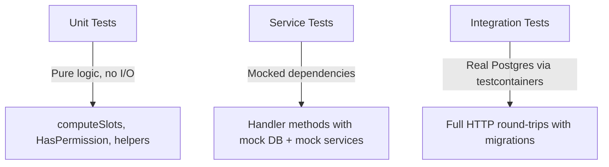
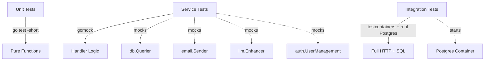

# Task: Backend Testing Architecture

## Status

- [x] Defined
- [x] In Progress
- [x] Completed

## Description

As a developer, I want a robust and maintainable testing architecture for the Go backend so that all modules can be tested in isolation (unit tests) and in combination (integration tests), with external dependencies properly abstracted and mocked.

### Current State

The backend has **zero tests**. No test files, no test infrastructure, no mocking framework, no coverage reporting. All external services (Email, LLM, Auth, Video, RTC) are concrete dependencies — handlers cannot be tested without calling real APIs.

### Key Problems

1. **No interfaces for external services** — Email (Resend), LLM (OpenRouter), Auth (WorkOS), Video (Mux), and RTC (Agora) are all concrete dependencies. Handlers cannot be tested without calling real APIs.
2. **WorkOS uses global state** — `usermanagement.SetAPIKey()` is called at boot; middleware validates JWTs via a concrete `*JWKSCache`. Not mockable.
3. **Mux SDK initialised inside handler constructor** — The assets handler creates `*muxgo.APIClient` internally via `tools.GetEnv()`, making it impossible to inject a mock.
4. **No test database infrastructure** — No way to run integration tests against a real PostgreSQL instance in an automated, isolated manner.

---

## Architecture

### Testing Layers



### Layer 1 — Unit Tests

**Scope**: Pure functions with no side effects or I/O.

**Candidates**:

- `internal/coaching`: `computeSlots`, `overlapsBooking`, `isBlocked`, `parseTimeRange`, `collectUserIDs`, `formatDuration`, `bookingStatus`
- `internal/permissions`: `HasPermission`
- Any future utility/helper functions

**No new tooling required**. Standard `testing` package with table-driven tests.

### Layer 2 — Service Tests (Mocked Dependencies)

**Scope**: Handler logic tested with mocked database queries and mocked external services. Validates request parsing, authorisation checks, response formatting, and error handling without any real I/O.

**Tooling**: [uber-go/mock](https://github.com/uber-go/mock) (`go.uber.org/mock`)

This is the maintained successor to the archived `github.com/golang/mock`. It provides:

- `mockgen` code generator — creates mock implementations from interfaces
- `gomock.Controller` + `EXPECT()` — type-safe expectation setting
- Works natively with `testing.T`

**Why uber-go/mock over alternatives**:

- **testify/mock** — requires manual mock structs, no code generation, less type-safe
- **counterfeiter** — Go generate based, similar to mockgen but less widespread
- **hand-written mocks** — viable for small interfaces, does not scale for `*db.Queries` (~60 methods)

**Key prerequisite**: Interface extraction (see Refactoring section below).

### Layer 3 — Integration Tests

**Scope**: Full HTTP handler tests with real PostgreSQL, real migrations, real SQL queries. Validates that the SQL, the handler, and the router work together correctly.

#### testdb vs testcontainers

Two viable approaches exist for providing PostgreSQL to integration tests:

| Aspect               | testdb (database-per-test)                                                                                        | testcontainers                                                  |
| -------------------- | ----------------------------------------------------------------------------------------------------------------- | --------------------------------------------------------------- |
| **How it works**     | Connects to an already-running Postgres, creates a unique database per test, applies migrations, drops on cleanup | Starts a disposable Docker container per test suite via Go code |
| **New dependencies** | None — uses existing `pgx/v5` + `pgxpool`                                                                         | `testcontainers-go` + Docker SDK (heavy transitive tree)        |
| **Speed**            | ~50ms per test database                                                                                           | ~2-3s container startup (shared per package via `TestMain`)     |
| **Developer setup**  | Requires `make infra:up` (already needed for development)                                                         | Requires Docker daemon (already needed for development)         |
| **CI/CD**            | Needs `services: postgres` in pipeline definition                                                                 | Self-contained — only needs Docker                              |
| **Isolation**        | Unique database per test, dropped on cleanup                                                                      | Ephemeral container per test suite                              |
| **Port conflicts**   | Uses configured port (from `DB_URL` or test env var)                                                              | Random available port                                           |
| **Complexity**       | ~40 lines of code                                                                                                 | ~60 lines + dependency management                               |

**Recommendation: testcontainers**

The primary goal of test infrastructure is to minimise friction. If running tests requires manual steps, developers will skip them.

- **Self-contained** — `go test` just works. No need to remember `make infra:up` first. A developer who clones the repo can run all tests immediately (only Docker daemon required, which is already needed for development).
- **CI simplicity** — no `services: postgres` configuration in pipeline definitions. The test binary manages its own database.
- **No port conflicts** — each container gets a random available port. Parallel CI jobs, multiple developers on the same machine — no collisions.
- **Speed is a non-issue** — testcontainers supports `Reuse: true` which keeps the container alive between `go test` invocations. The ~2-3s startup cost only occurs on the very first run. Additionally, using `TestMain` to share one container across all tests in a package eliminates per-test overhead.
- **Industry standard** — `testcontainers-go` is the established pattern for Go integration testing. New contributors will recognise it immediately.

The testdb approach (creating databases in a pre-existing Postgres instance) has the advantage of zero additional dependencies and marginally faster per-test setup (~50ms). However, it introduces a manual prerequisite (`make infra:up`) that is easy to forget and produces confusing `connection refused` errors when missed. The dependency cost of testcontainers is acceptable for test infrastructure.

#### testcontainers Implementation

```go
package testdb

import (
    "context"
    "testing"

    "github.com/jackc/pgx/v5/pgxpool"
    "github.com/testcontainers/testcontainers-go"
    "github.com/testcontainers/testcontainers-go/modules/postgres"
    "github.com/testcontainers/testcontainers-go/wait"
)

// New starts a Postgres container (or reuses an existing one),
// applies all migrations, and returns a connection pool.
// The container is terminated when the test completes.
func New(t *testing.T) *pgxpool.Pool {
    t.Helper()
    ctx := context.Background()

    ctr, err := postgres.Run(ctx,
        "postgres:16-alpine",
        postgres.WithDatabase("zeta_test"),
        postgres.WithUsername("test"),
        postgres.WithPassword("test"),
        testcontainers.WithWaitStrategy(
            wait.ForLog("database system is ready to accept connections").
                WithOccurrence(2),
        ),
    )
    if err != nil {
        t.Fatal(err)
    }
    t.Cleanup(func() { ctr.Terminate(ctx) })

    connStr, err := ctr.ConnectionString(ctx, "sslmode=disable")
    if err != nil {
        t.Fatal(err)
    }

    // Apply all migrations from db/migrations/
    applyMigrations(t, connStr)

    pool, err := pgxpool.New(ctx, connStr)
    if err != nil {
        t.Fatal(err)
    }
    t.Cleanup(pool.Close)

    return pool
}
```

#### Optimisation: Shared Container Per Package

To avoid starting a new container for every test function, use `TestMain` to start one container per package:

```go
var testPool *pgxpool.Pool

func TestMain(m *testing.M) {
    ctx := context.Background()
    ctr, pool := setupContainer(ctx)
    testPool = pool
    code := m.Run()
    ctr.Terminate(ctx)
    os.Exit(code)
}
```

Each test function uses `testPool` and wraps its work in a transaction that rolls back, ensuring test isolation without per-test container overhead.

---

## Refactoring Plan

### Phase 1 — Interface Extraction (prerequisite for service tests)

These interfaces must be created before mock generation is possible.

#### 1.1 Database Querier Interface

**Priority**: HIGH
**Location**: `internal/db/querier.go`

`sqlc` supports generating a `Querier` interface automatically. Add to `sqlc.yaml`:

```yaml
gen:
  go:
    - emit_interface: true
```

This generates a `Querier` interface with all ~60 query methods. Handlers then depend on `db.Querier` instead of `*db.Queries`. Mock generation: `mockgen -source=internal/db/querier.go -destination=internal/db/mocks/mock_querier.go`.

#### 1.2 Email Service Interface

**Priority**: HIGH
**Location**: `internal/email/service.go`

```go
type Sender interface {
    Send(to, subject, text string) error
}
```

All handlers that currently take `*email.Service` switch to `email.Sender`. The concrete `Service` struct already satisfies this interface.

#### 1.3 LLM Service Interface

**Priority**: MODERATE
**Location**: `internal/llm/service.go`

```go
type Enhancer interface {
    EnhanceReviewText(ctx context.Context, text string) (string, error)
}
```

Only the reviews handler depends on this.

#### 1.4 WorkOS Auth Interface

**Priority**: HIGH
**Location**: `internal/auth/workos.go` (new file)

```go
type UserManagement interface {
    GetAuthorizationURL(opts workos.GetAuthorizationURLOpts) (*url.URL, error)
    AuthenticateWithCode(ctx context.Context, opts workos.AuthenticateWithCodeOpts) (workos.AuthResponse, error)
    GetUser(ctx context.Context, opts workos.GetUserOpts) (workos.User, error)
    ListOrganizationMemberships(ctx context.Context, opts workos.ListOrganizationMembershipsOpts) (workos.ListResult, error)
}
```

This is the highest-impact change. Currently WorkOS is called via global package-level functions — wrapping them in a struct that implements this interface enables full auth flow testing.

#### 1.5 Mux Video Client Interface

**Priority**: MODERATE
**Location**: `internal/assets/mux.go` (new file)

Extract from assets handler. Move Mux client initialisation out of the handler constructor into an injectable dependency.

#### 1.6 Agora Token Interface

**Priority**: LOW
**Location**: `internal/coaching/agora.go` (new file)

Agora token generation is a single function call. A small interface or a function type suffices.

### Phase 2 — Handler Constructor Updates

After interfaces are defined, update handler constructors to accept interfaces:

```go
// Before
func NewHandler(q *db.Queries, email *email.Service, logger *slog.Logger) *Handler

// After
func NewHandler(q db.Querier, email email.Sender, logger *slog.Logger) *Handler
```

This change is backwards-compatible — concrete types already satisfy the interfaces.

### Phase 3 — Mock Generation

Install `uber-go/mock` and add a `Makefile` target:

```makefile
mocks:
	mockgen -source=internal/db/querier.go -destination=internal/db/mocks/mock_querier.go -package=mocks
	mockgen -source=internal/email/service.go -destination=internal/email/mocks/mock_sender.go -package=mocks
	mockgen -source=internal/llm/service.go -destination=internal/llm/mocks/mock_enhancer.go -package=mocks
	mockgen -source=internal/auth/workos.go -destination=internal/auth/mocks/mock_workos.go -package=mocks
```

### Phase 4 — testcontainers Infrastructure

Create `internal/testdb/testdb.go` with the testcontainers-based `New(t *testing.T) *pgxpool.Pool` helper described above. The package is still named `testdb` for a clean import (`testdb.New(t)`).

---

## Coverage

### Makefile Targets

```makefile
test\:unit:
	go test -short -count=1 ./internal/...

test\:integration:
	go test -count=1 ./internal/...

test\:verbose:
	go test -v -count=1 ./internal/...

test\:coverage:
	go test -coverprofile=coverage.out -count=1 ./internal/...
	go tool cover -func=coverage.out

test\:coverage\:html:
	go test -coverprofile=coverage.out -count=1 ./internal/...
	go tool cover -html=coverage.out -o coverage.html
	@echo "Open coverage.html in your browser"
```

- `test:unit` — runs only unit tests (tests that call `t.Skip` when `-short` is set)
- `test:integration` — runs all tests including database-dependent ones
- `test:coverage` — generates `coverage.out` and prints per-function coverage summary
- `test:coverage:html` — generates a browsable HTML coverage report

### .gitignore

Add `coverage.out` and `coverage.html` to `.gitignore`.

### CI Coverage Gate (future)

Once baseline coverage is established, add a threshold check:

```bash
go test -coverprofile=coverage.out ./internal/...
COVERAGE=$(go tool cover -func=coverage.out | grep total | awk '{print $3}' | tr -d '%')
if (( $(echo "$COVERAGE < 60" | bc -l) )); then
    echo "Coverage $COVERAGE% is below 60% threshold"
    exit 1
fi
```

Starting threshold recommendation: **60%** (achievable with service tests for all handlers). Increase to 80% as the test suite matures.

---

## Module-by-Module Test Plan

### `internal/permissions`

| Test Type | What to Test                                        | Dependencies |
| --------- | --------------------------------------------------- | ------------ |
| Unit      | `HasPermission` — present, absent, empty, nil slice | None         |

### `internal/coaching`

| Test Type   | What to Test                                                                                  | Dependencies                           |
| ----------- | --------------------------------------------------------------------------------------------- | -------------------------------------- |
| Unit        | `computeSlots` — window generation, min notice, blocked slots, bookings, timezones, durations | None                                   |
| Unit        | `overlapsBooking`, `isBlocked`, `parseTimeRange`, `formatDuration`                            | None                                   |
| Service     | `handleListSlots` — mock DB returns availability/bookings, verify HTTP response               | `db.Querier` mock                      |
| Service     | `handleCreateBooking` — mock DB, verify email sent                                            | `db.Querier` mock, `email.Sender` mock |
| Service     | `handleCancelBooking` — token authorisation, status transitions                               | `db.Querier` mock                      |
| Integration | Full booking flow: create availability → list slots → book → cancel                           | testcontainers Postgres                |

### `internal/groups`

| Test Type   | What to Test                                              | Dependencies            |
| ----------- | --------------------------------------------------------- | ----------------------- |
| Service     | `handleCreateGroup` — validation errors, success response | `db.Querier` mock       |
| Service     | `handleListGroups` — pagination, empty results            | `db.Querier` mock       |
| Integration | CRUD: create → list → get → update                        | testcontainers Postgres |

### `internal/assets`

| Test Type   | What to Test                                                | Dependencies                              |
| ----------- | ----------------------------------------------------------- | ----------------------------------------- |
| Service     | `handleCreateAsset` — Mux upload URL generation, DB insert  | `db.Querier` mock, `MuxClient` mock       |
| Service     | `handleCompleteUpload` — status transition, Mux playback ID | `db.Querier` mock, `MuxClient` mock       |
| Integration | Upload flow end-to-end (with mocked Mux)                    | testcontainers Postgres, `MuxClient` mock |

### `internal/invitations`

| Test Type   | What to Test                                                                  | Dependencies                           |
| ----------- | ----------------------------------------------------------------------------- | -------------------------------------- |
| Service     | `handleCreateInvitation` — code generation, email sending, duplicate handling | `db.Querier` mock, `email.Sender` mock |
| Service     | `handleAcceptInvitation` — WorkOS user lookup, group membership creation      | `db.Querier` mock, `WorkOS` mock       |
| Integration | Invite flow: create → get info → accept                                       | testcontainers Postgres                |

### `internal/reviews`

| Test Type   | What to Test                                           | Dependencies                           |
| ----------- | ------------------------------------------------------ | -------------------------------------- |
| Service     | `handleCreateReview` — LLM enhancement, DB insert      | `db.Querier` mock, `llm.Enhancer` mock |
| Service     | `handleUpdateReview` — ownership check, re-enhancement | `db.Querier` mock, `llm.Enhancer` mock |
| Integration | CRUD: create → list → update → delete                  | testcontainers Postgres                |

### `internal/auth`

| Test Type   | What to Test                                                     | Dependencies                     |
| ----------- | ---------------------------------------------------------------- | -------------------------------- |
| Service     | `RequireAuth` middleware — valid JWT, expired JWT, missing token | `JWKSProvider` mock              |
| Service     | `RequireGroupMembership` — member, non-member, admin elevation   | `db.Querier` mock                |
| Service     | `handleCallback` — code exchange, user creation                  | `WorkOS` mock, `db.Querier` mock |
| Integration | Auth flow with real DB (group membership checks)                 | testcontainers Postgres          |

### `internal/users`

| Test Type | What to Test                                                | Dependencies                     |
| --------- | ----------------------------------------------------------- | -------------------------------- |
| Service   | `handleListGroupUsers` — WorkOS user enrichment, pagination | `db.Querier` mock, `WorkOS` mock |

---

## Dependencies to Add

```bash
go install go.uber.org/mock/mockgen@latest
go get github.com/testcontainers/testcontainers-go
go get github.com/testcontainers/testcontainers-go/modules/postgres
```

- `uber-go/mock` — dev-time code generator (`go install`). The generated mock files import `go.uber.org/mock/gomock`, which is added to `go.mod` automatically when mocks are first generated.
- `testcontainers-go` — test-only dependency for spinning up Postgres containers. Added to `go.mod` but not imported by any production code.

---

## Execution Order

```mermaid
graph LR
    A[Phase 1: Interfaces] --> B[Phase 2: Constructor Updates]
    B --> C[Phase 3: Mock Generation]
    C --> D[Phase 4: testcontainers Infrastructure]
    D --> E[Phase 5: Unit Tests]
    E --> F[Phase 6: Service Tests]
    F --> G[Phase 7: Integration Tests]
    G --> H[Phase 8: Coverage + Makefile]
    H --> I[Phase 9: Root README Update]
```



1. **Phase 1** — Extract interfaces (`db.Querier` via sqlc, `email.Sender`, `llm.Enhancer`, `auth.UserManagement`, `assets.MuxClient`)
2. **Phase 2** — Update handler constructors to accept interfaces (backwards-compatible)
3. **Phase 3** — Install `uber-go/mock`, generate mocks, add `make mocks` target
4. **Phase 4** — Create `internal/testdb/testdb.go` with testcontainers
5. **Phase 5** — Write unit tests (permissions, coaching pure functions)
6. **Phase 6** — Write service tests for all handler modules with mocks
7. **Phase 7** — Write integration tests for critical flows (booking, invitations, groups)
8. **Phase 8** — Add `test:*` and `test:coverage*` targets to Makefile, update `.gitignore`
9. **Phase 9** — Update root `README.md` with testing section and instructions

### Root README.md Update

Per the Task Constitution, the root `README.md` must be updated when the project architecture changes. Add:

1. A **"Testing"** section under "How to start" with:
   - Prerequisites (Docker daemon must be running — testcontainers handles the rest)
   - Commands: `make test:unit`, `make test:integration`, `make test:coverage`
   - Coverage report generation: `make test:coverage:html`
2. A **Testing Architecture diagram** in the Diagrams section:



---

## Acceptance Criteria

- [x] Interfaces extracted for all external dependencies (DB, Email, LLM, WorkOS, Mux)
- [x] Handler constructors updated to accept interfaces (backwards-compatible)
- [x] `uber-go/mock` installed and mocks generated for all interfaces
- [x] `internal/testdb/testdb.go` created with testcontainers-based `New(t *testing.T) *pgxpool.Pool`
- [x] Unit tests cover all pure functions (permissions, coaching helpers)
- [ ] Service-level tests exist for every handler in every module
- [x] Integration tests cover critical multi-step flows (groups CRUD)
- [x] `make test:unit`, `make test:integration`, `make test:coverage` targets added
- [ ] `coverage.out` and `coverage.html` added to `.gitignore`
- [ ] Root `README.md` updated with Testing section and architecture diagram
- [x] `make api:build` passes with no regressions
- [x] All tests pass with only Docker daemon running (no `make infra:up` required)

## Context

- Handler implementations: `internal/*/handler.go`
- Database layer: `internal/db/` (SQLC-generated)
- SQLC config: `sqlc.yaml`
- Docker Compose: `infra/docker-compose.yml`
- Makefile: `Makefile`
- Root README: `README.md`
