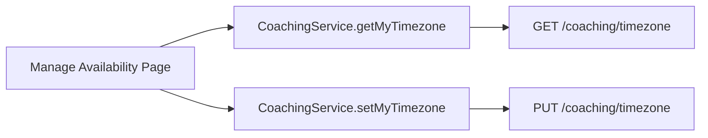
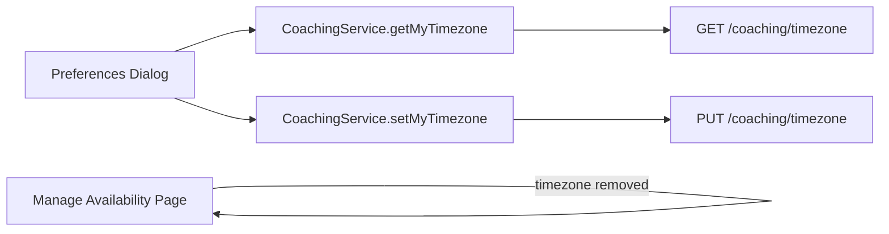
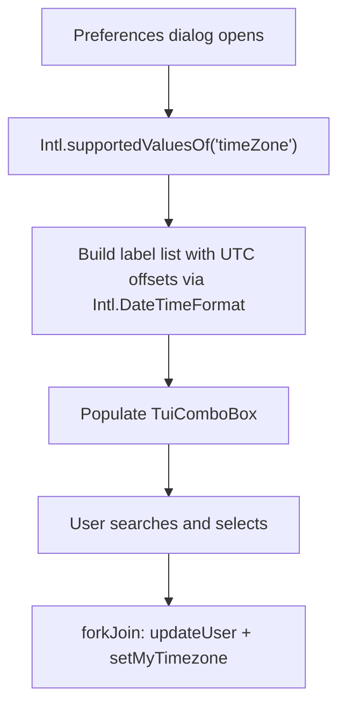

# Task: Timezone Settings Improvement

## Status

- [x] Defined
- [x] In Progress
- [x] Completed

---

## User Stories

> **As a user, I want to manage my timezone in the Preferences dialog** alongside my other profile settings (name, language, avatar), because timezone is a personal account preference.

> **As a user, I want to select my timezone from a list of recognisable locations** (e.g., "Berlin", "New York", "Tokyo"), rather than typing a raw identifier — because I may not know the exact IANA string for my location, but I can identify a nearby city.

---

## Problem Statement

The current implementation has two significant UX deficiencies:

1. **Incorrect placement.** Timezone configuration is embedded in the Manage Availability page. A timezone preference is a personal account setting and should reside in the **Preferences dialog** alongside name, language, and avatar.

2. **Free-text input.** The user must manually type an IANA timezone identifier (e.g., `Europe/Berlin`). This is an expert-only UX pattern — most users do not know their IANA identifier. The UI must replace this with a searchable, human-readable selector.

---

## Technical Background

### IANA Timezone Identifiers

The [IANA Time Zone Database](https://www.iana.org/time-zones) is the authoritative standard for timezone identifiers (e.g., `Europe/Berlin`, `America/New_York`, `Asia/Tokyo`). These identifiers encode both the UTC offset and DST rules, making them correct across all dates.

The backend already stores the timezone as a `TEXT` column in `user_preferences` and validates it via Go's `time.LoadLocation()`, which uses the IANA database. This is the correct approach.

### Why TEXT, not a DB ENUM

A Postgres `ENUM` for timezones would require schema migrations every time the IANA database is updated (several times per year). `TEXT` with application-level validation via `time.LoadLocation()` is the correct and maintainable solution.

### IANA List on the Frontend

Modern browsers expose `Intl.supportedValuesOf('timeZone')`, which returns all IANA timezone identifiers known to the browser's ICU library. This is sufficient to populate the selector without requiring a dedicated backend endpoint. No third-party library is strictly required for the list itself.

However, to display human-friendly labels with UTC offsets (e.g., `"Europe/Berlin (UTC+02:00)"`), a utility is needed to compute the current offset for each timezone. This can be accomplished using the browser's built-in `Intl.DateTimeFormat` API — no additional npm package is needed.

---

## Architecture

### Current State

### Target State

### Timezone Selector Logic (Frontend)

---

## Scope of Changes

### Backend

| File                                                       | Change                                                                                                                                                                  |
| ---------------------------------------------------------- | ----------------------------------------------------------------------------------------------------------------------------------------------------------------------- |
| `internal/coaching/timezone.go`                            | No functional change. Ensure `time/tzdata` is imported in `cmd/api/main.go` (or `internal/coaching`) to embed the IANA database for portability in Docker environments. |
| `db/migrations/YYYYMMDDHHMMSS_reset_user_timezones.up.sql` | **New migration.** Resets all existing `timezone` values to `'UTC'`. Existing values are not preserved (pre-release, ephemeral data).                                   |

> **Note on `time/tzdata`**: By default, Go's `time.LoadLocation()` reads timezone data from the host OS. In a minimal Docker image (e.g., `scratch` or `alpine`), the tzdata package may not be present. Importing `_ "time/tzdata"` embeds the IANA database directly into the binary, making it self-contained.

### Frontend

| File                                                          | Change                                                                                                                           |
| ------------------------------------------------------------- | -------------------------------------------------------------------------------------------------------------------------------- |
| `web/dashboard/src/app/shared/components/preferences-dialog/` | Add timezone `TuiComboBox` field. Load current timezone on `ngOnInit`. Save via `forkJoin(updateUser, setMyTimezone)` on submit. |
| `web/dashboard/src/app/pages/manage-availability-page/`       | Remove the timezone display and edit section from `.ts`, `.html`, and `.scss`.                                                   |

---

## Acceptance Criteria

- [x] The **Preferences dialog** contains a timezone selector — a searchable `TuiComboBox` populated from `Intl.supportedValuesOf('timeZone')`.
- [x] Each timezone option is displayed in a human-readable format, e.g. `Europe/Berlin (UTC+02:00)`.
- [x] The timezone selector is pre-populated with the user's current timezone when the dialog opens.
- [x] Saving the dialog calls both `PUT /auth/me` (profile) and `PUT /coaching/timezone` concurrently via `forkJoin`.
- [x] The **Manage Availability page no longer contains any timezone-related UI or logic**.
- [x] The backend binary imports `_ "time/tzdata"` to embed the IANA database.
- [x] `make api:build` and `make web:build` pass without errors.
