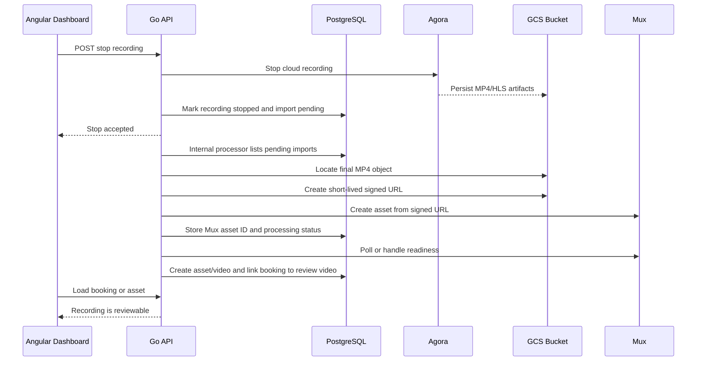
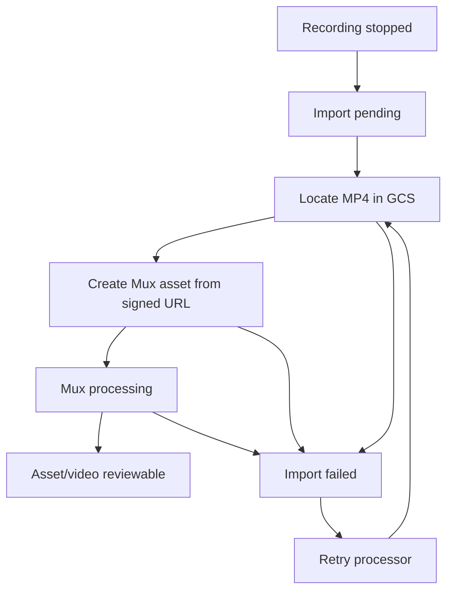

# Task: Live Coaching Recording Post Processing

## Status
- [x] Defined
- [x] In Progress
- [x] Completed

## User Story
As a student or expert, I want a completed live coaching recording to become available as a regular reviewable video, so that the session can be replayed, reviewed, and annotated after the call ends.

## Reference Behavior
The Kotlin reference in `tmp/video-coach` does not stop after storing Agora files in object storage. After the session recording is stopped, it:

- Resolves the expected MP4 object path from the Agora recording ID and session ID.
- Creates a Mux asset from the stored recording object by using a short-lived storage URL.
- Waits until the Mux asset becomes ready.
- Creates a video record with source `SESSION_RECORDING`.
- Creates a video part containing the Mux asset ID and playback ID.
- Links the live coaching session back to the created video.
- Deletes the temporary recording objects after Mux has imported the asset.

Relevant reference files:

- `tmp/video-coach/backend/live-coaching/src/main/kotlin/de/epgmbh/coachit/livecoaching/infrastructure/service/SessionRecordingServiceImpl.kt`
- `tmp/video-coach/backend/live-coaching/src/main/kotlin/de/epgmbh/coachit/livecoaching/domain/model/LiveCoachingSession.kt`
- `tmp/video-coach/backend/mux/src/main/kotlin/de/epgmbh/coachit/mux/MuxAssetService.kt`
- `tmp/video-coach/backend/video-analysis/src/main/kotlin/de/epgmbh/coachit/videoanalysis/application/listener/LiveCoachingEventListener.kt`
- `tmp/video-coach/backend/live-coaching/src/main/kotlin/de/epgmbh/coachit/livecoaching/application/listener/VideoEventListener.kt`

## Current Zeta Context
Zeta already has:

- Agora Cloud Recording start and stop for coaching bookings.
- Recording metadata in `coaching_booking_recordings`.
- Private GCS storage for Agora recording files.
- Mux-backed `assets` and `videos`.
- Review comments attached to `videos`.

The missing part is the bridge between a stopped coaching recording in GCS and the existing Mux asset review flow.

## Proposed Plan
- Add recording import state to the database, either by extending `coaching_booking_recordings` or by adding a dedicated table such as `coaching_recording_imports`.
- After a recording stops, enqueue or mark it as ready for post-processing instead of relying on the request path to complete a long import.
- Add an idempotent internal processing flow that selects stopped recordings without an imported asset.
- Resolve the final MP4 object from the configured Agora recording prefix and booking ID. Prefer the MP4 file for Mux import; retain HLS files only as raw recording artifacts.
- Generate a short-lived signed GCS URL for the MP4 object.
- Create a Mux asset from that signed URL using the current Mux API verified against official Mux documentation during implementation.
- Create an `assets` row and a `videos` row for the imported recording, using the booking student as owner and the booking group as group.
- Store Mux asset ID, playback ID, source metadata, and the created asset/video IDs on the import state.
- Link the booking/recording to the created asset or video so the UI can navigate from a coaching booking to the review page.
- Add retry-safe failure handling with structured logs for discovery, Mux import, playback ID fetch, DB linking, and cleanup.
- Decide whether to delete raw GCS recording files after successful Mux readiness or keep them for a retention period.
- Update the dashboard so completed bookings show recording status and a link to the imported reviewable video.
- Update the root `README.md` diagrams and documentation once implementation changes the architecture.

## Implementation Notes
- Recording import state is stored in the dedicated `coaching_recording_imports` table.
- Raw GCS files are retained after successful Mux import. Cleanup can be added later as an explicit retention policy.
- The API signs short-lived GCS URLs for Mux only. Dashboard users receive links to the imported Mux-backed review asset, not to raw GCS objects.
- The existing scheduler cleanup endpoint also processes recording imports. A separate `/internal/coaching/recordings/process` endpoint is available for manual scheduler-style retries.

## Permissions
The implementation should reuse existing permissions where possible:

- `coaching:bookings:read` should allow a participant to see recording status on their own booking.
- `assets:create` should not be required from the user for automatic system-created recording assets.
- Existing asset/review permissions should govern playback and review once the recording has been imported into `assets` and `videos`.

Potential new permission:

- `coaching:recordings:manage` for admin-only retry, cleanup, or manual reprocess endpoints if those endpoints are added.

No new user-facing permission was added in this implementation.

## Architecture

## Acceptance Criteria
- [x] A stopped recording is automatically discovered and imported into Mux.
- [x] A reviewable `assets` and `videos` record is created for the coaching recording.
- [x] The booking or recording state links to the created review video.
- [x] The import flow is idempotent and safe to retry.
- [x] Raw GCS files are retained or deleted according to an explicit retention decision.
- [x] Users do not receive direct access to private GCS objects.
- [x] The dashboard exposes recording availability from the booking context.
- [x] Root `README.md` is updated with the new post-processing flow and schema changes.
- [x] Task `RESOLUTION.md` records implementation decisions and verification commands.

## Test Decision
Automated tests are required for implementation because this flow crosses storage, Mux, database state, authorization, and UI behavior.

Planned coverage:

- Unit tests for selecting the correct MP4 object and import state transitions.
- Handler tests for any new internal processing or retry endpoints.
- SQLC query coverage through generated code and backend unit tests.
- Mocked Mux and GCS tests for signed URL import behavior.
- Frontend tests or build verification for booking status and review navigation changes.
- Verification commands: `make db:sqlc`, `make api:build`, `make web:build`, `make mocks`, and `make test:unit`.
