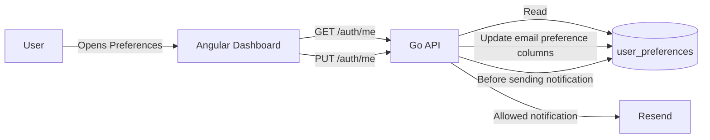

# Task: Notification Email Preferences

## Status
- [x] Defined
- [x] In Progress
- [x] Completed

## Description
As a user, notification preferences must be available on the Preferences page.

The Preferences page must include an Email Preferences section where users can enable or disable all notification emails and individual categories of notification emails.

## Context
- `user_preferences` is the local database table for application-specific user settings.
- `/auth/me` returns WorkOS identity data combined with local user preferences.
- `/auth/me` updates personal data and local preferences from the dashboard Preferences page.
- Current account-owned email notifications include asset upload notifications, asset review completion notifications, invitation activity notifications, group membership removal notifications, coaching booking updates, and coaching reminders.
- Invitation delivery to an arbitrary entered email address is an explicit invite action and is not reliably tied to an existing authenticated user preference.

## Permissions
- No new permissions are required.
- The existing authenticated `/preferences` dashboard route and `/auth/me` endpoints are used for a user editing their own preferences.

## Architecture

## Test Assessment
- Backend tests must be added for preference gating because the change affects notification delivery behavior.
- Dashboard build verification is required because the Preferences page UI and `AuthService` contract change.

## Loading State Assessment
- The Preferences page already reads user data from the authentication service and does not introduce a new asynchronous content section.
- No new loading placeholders are required for this change.

## Acceptance Criteria
- [x] The database stores a master email notification setting and per-category email notification settings.
- [x] `/auth/me` returns email notification preferences with default enabled values for existing users.
- [x] `PUT /auth/me` updates email notification preferences.
- [x] The Preferences page includes an Email Preferences section with controls for all email notifications and individual categories.
- [x] Account-owned notification emails respect the master and category preferences.
- [x] Explicit invitation emails sent to an entered email address continue to send.
- [x] Backend tests cover disabled notification categories.
- [x] Root README architecture documentation is updated.
