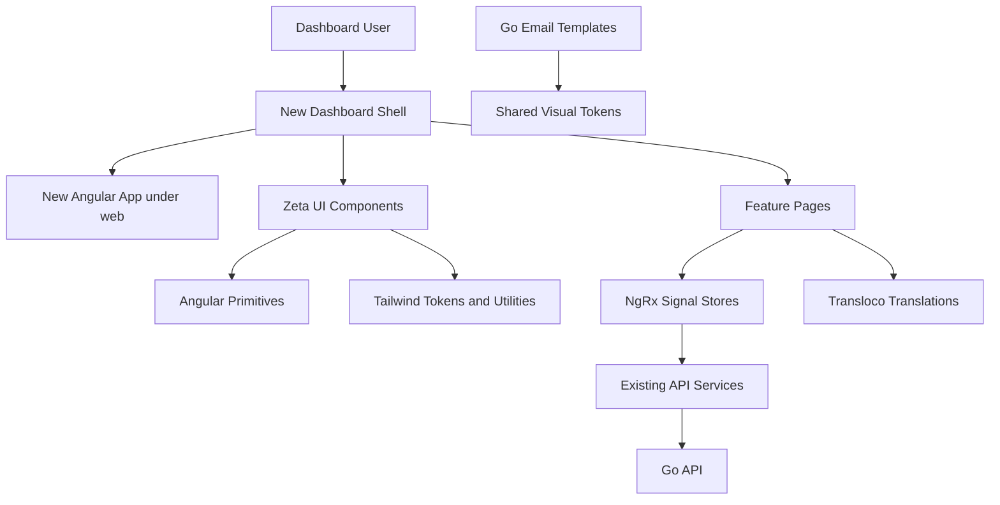
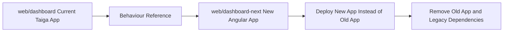

# Task: Dashboard UX/UI Rewrite Plan

## Status
- [x] Defined
- [x] In Progress
- [x] Completed

## Description
Define a phased rewrite plan for the Angular dashboard. The rewrite must improve the user experience, visual system, frontend architecture, localization, email presentation, and test strategy while keeping the existing product flows recognisable.

Implementation must not begin in the planning session. Each implementation phase must be executed as a separate agentic session and must first re-read this task file, `instructions/CONSTITUTION.md`, `instructions/TASK_CONSTITUTION.md`, the root `README.md`, and the relevant current dashboard files.

## User Story

As a Zeta user, I want a modern, mobile-first dashboard that keeps the existing video coaching, group management, live coaching, preferences, and invitation flows understandable while improving usability, visual quality, accessibility, localization, and maintainability.

As a project maintainer, I want the rewrite to be built as a new Angular application beside the old dashboard under `web/` so the old implementation remains available as a behavioural reference until the new application is ready to be deployed instead of it.

## Context

### Required Instructions

- Follow `instructions/CONSTITUTION.md` for project-wide rules.
- Follow `instructions/TASK_CONSTITUTION.md` for task documentation and verification.
- Preserve backend and database terminology in code: database/API `asset` remains the parent submission and `video` remains a child media row.
- Use user-facing dashboard, email, and translation copy that says **video** for the reviewable submission. Use **video part**, **clip**, or **part of the video** for child media rows when needed.
- Keep existing dashboard flows mainly as-is unless a targeted UX improvement is clearly justified and documented.
- Stop before implementation in the planning session, even if all steps appear clear.
- Add backend refactors or fixes to the plan when frontend work exposes API gaps, data-shape issues, permissions gaps, or email-template needs.
- Keep implementation phased. Each phase must be small enough to review and verify independently, and each phase must anticipate later phases.
- Use Storybook for reusable UI primitives, core components, and important interactive states.
- Keep Storybook local-only during the main rewrite. Treat Storybook deployment as a possible later enhancement, not a current requirement.
- Use targeted tests rather than pursuing full coverage.
- Update email templates so transactional emails visually align with the new dashboard system.

### Legacy Dashboard Surface At Planning Time

- Angular app root: `web/dashboard`.
- Current Angular version: Angular 21 package set.
- Current UI dependency: Taiga UI.
- Current dashboard i18n dependency: `@ngx-translate/core`.
- Current test target: Angular CLI `@angular/build:unit-test`; project already has `vitest` and `jsdom`.
- Current routes: `web/dashboard/src/app/core/app.routes.ts`.
- Current shell and shared components: `web/dashboard/src/app/shared/components`.
- Current pages:
  - Home
  - Videos
  - Video details
  - Upload video
  - Groups
  - Group details
  - Group preferences
  - Create group
  - User preferences
  - My sessions
  - Book coaching
  - Manage availability
  - Video call
- Current email templates:
  - `internal/email/templates/layout.html`
  - `internal/email/templates/notification.html`
  - `internal/email/templates/styles.css`
  - `internal/i18n/locales/email.en.json`
  - `internal/i18n/locales/email.de.json`
  - `internal/i18n/locales/email.fr.json`
- New dashboard target:
  - Create a completely new Angular application under `web/`, for example `web/dashboard-next`.
  - Keep `web/dashboard` as the old implementation and reference source during the rewrite.
  - The new app is intended to replace the old dashboard in deployment when ready, rather than being mounted as `/new` or `/v2` inside the old Angular app.
  - Deployment and Makefile wiring must be updated in the cutover phase.

### Required Frontend Direction

- Use Tailwind CSS as the primary styling approach.
- Use small SCSS/CSS files only where Tailwind is insufficient, for example design tokens, native animation classes, third-party component state selectors, and email CSS.
- Replace Taiga UI usage with Angular Primitives (`ng-primitives`) and custom Zeta components.
- Do not implement Angular signal facades. Use NgRx Signal Store for feature state.
- Replace `ngx-translate` with Transloco.
- Adopt Angular's modern `animate.enter` and `animate.leave` animation APIs for new UI motion.
- Avoid new legacy `@angular/animations` usage. Remove `provideAnimations()` when Taiga UI and legacy animation usage no longer require it.
- Design mobile-first.
- Keep the new Angular application next to the old dashboard under `web/` during migration. The old dashboard must remain available for comparison until deployment cutover is complete.

### Documentation Research Notes

- Angular v21 testing documentation identifies Vitest with jsdom as the default CLI testing setup for new Angular projects and describes `ng test` as launching the Vitest runner.
- Angular testing documentation also supports browser-backed Vitest tests through providers such as Playwright when browser APIs or rendering-specific assertions are needed.
- Angular animation documentation recommends `animate.enter` and `animate.leave`, with CSS transitions/keyframes, for enter and leave animations.
- Angular legacy animation documentation states that `@angular/animations` is deprecated and recommends native CSS with `animate.enter` and `animate.leave` for new code.
- Angular Tailwind documentation recommends `ng add tailwindcss` for Angular CLI setup.
- Angular Primitives provides unstyled behaviour primitives and exposes component state through `data-*` attributes, which fits Tailwind and small CSS/SCSS.
- Transloco v8 documentation recommends `ng add @jsverse/transloco` and `provideTransloco` for standalone Angular applications.
- Storybook documentation supports Angular projects and interaction tests through story `play` functions.

### Design Direction

The new Zeta dashboard should feel modern, modest, calm, and professionally useful. It must not become overly expressive, decorative, or visually fragile.

Proposed visual direction:

- **Tone:** quiet coaching workspace, not a marketing site.
- **Layout:** dense but breathable operational UI, with clear navigation, scannable lists, direct actions, and mobile-first flows.
- **Palette:** orange-white visual system with warm neutrals, restrained ink, confident orange primary actions, and limited semantic colors.
- **Example tokens:**
  - Background: `#fff8ed`
  - Surface: `#ffffff`
  - Surface warm: `#fff1dc`
  - Surface muted: `#f7e4c7`
  - Text: `#26180f`
  - Text muted: `#735f4d`
  - Primary: `#ea580c`
  - Primary strong: `#c2410c`
  - Primary soft: `#fed7aa`
  - Accent: `#f59e0b`
  - Border: `#ead2b8`
  - Success: `#15803d`
  - Warning: `#b45309`
  - Danger: `#be123c`
- **Radius:** default component radius should be 6-8 px. Avoid highly rounded card-heavy styling.
- **Motion:** subtle page, drawer, dialog, tab, and list-item transitions. Motion must communicate state changes and must not delay frequent workflows.
- **Assets:** continue using real product media, video thumbnails, avatars, and QR codes where useful. Replace placeholder illustrations with generated Zeta-specific illustrations that share the orange-white system, modest geometry, rounded forms, and calm dashboard tone. Avoid decorative abstract backgrounds.
- **Logo direction:** generate multiple candidates for a flat, geometric, rounded-corner abstract logo mark using negative space. The mark must contain a horse head in profile and use the orange palette. It must not include text, gradients, shadows, mascots, photorealism, or complex line detail. Generated logo candidates are for review; the selected direction should be refined into a production-ready SVG/vector or high-resolution transparent PNG as appropriate.

### Architecture



### Migration Shape



## Proposed Phases

### Phase 0: Planning, Audit, and Architecture Decision Record

Status: current phase.

Scope:

- Create this task file and capture all durable instructions.
- Audit current dashboard pages, shared components, i18n, tests, and email templates.
- Confirm Angular testing and animation direction from current documentation.
- Identify constitution conflicts that must be resolved before implementation.

Deliverables:

- This README with phased plan.
- Planning summary in `RESOLUTION.md`.
- No production implementation.

### Phase 1: New Angular App Foundation Beside Existing Dashboard

Scope:

- Create a completely new Angular application under `web/`, for example `web/dashboard-next`, instead of adding a parallel route inside `web/dashboard`.
- Keep the old `web/dashboard` application available as implementation and flow reference.
- Add Tailwind CSS using Angular CLI-supported setup.
- Add Angular Primitives.
- Add Storybook for Angular.
- Configure Storybook as a local development and review tool only. Do not add Storybook deployment in this phase.
- Add Transloco in the new application.
- Add NgRx Signal Store dependency and establish store conventions.
- Create the new app shell, shared UI library, layout primitives, design tokens, and Storybook stories.
- Add minimal local run/build/test commands for the new app.
- Document how the old and new Angular applications coexist during development.

Testing:

- Keep `ng test` with Vitest and jsdom for unit and component tests.
- Add Storybook smoke/build verification.
- Add first stories for buttons, inputs, cards/list rows, navigation, dialog, toast, tabs, and skeleton/loading placeholders.

Verification:

- New dashboard build command.
- New dashboard test command.
- Storybook build command added in this phase and run.

Backend considerations:

- None expected unless route/API assumptions fail.

### Phase 2: Brand Assets, Design System, and Core Application Chrome

Scope:

- Generate several logo mark candidates for review. Use the prompt guidance below and save review candidates into the new app workspace, for example `web/dashboard-next/src/assets/brand/candidates/`.
- Generate several dashboard illustration candidates in the same orange-white visual language for empty states, upload guidance, no comments, live coaching, and completion states. Save review candidates into the new app workspace.
- Do not adopt one generated asset silently. Present candidates for user review before wiring a selected logo or illustration set into production UI.
- Implement the new mobile-first shell: navigation, user menu, language switcher, route title area, responsive drawer/sheet behaviour, toast surface, and global empty/loading/error states.
- Replace Taiga-dependent shared patterns with Zeta UI components backed by Angular Primitives.
- Build reusable form controls, buttons, icon buttons, dialogs, menus, tabs, segmented controls, skeletons, badges, avatars, breadcrumbs, cards/list rows, and tables/lists.
- Use Angular `animate.enter` and `animate.leave` for drawer, dialog, toast, tab/list changes, and route-adjacent content transitions.
- Add Storybook interaction tests for critical primitives.

Logo candidate prompt baseline:

```text
Use case: logo-brand
Asset type: dashboard application logo mark candidate
Primary request: A flat, geometric, rounded-corner abstract logo mark using negative space. The mark contains a horse head in profile. Use a confident orange and warm white palette. Make it vector-friendly, modern, modest, and suitable for a professional coaching dashboard.
Style constraints: flat shapes, clean silhouette, strong negative space, rounded corners, balanced icon proportions, no text, no letters, no gradients, no shadows, no photorealism, no mascot style, no complex linework, no background scene.
Composition: centered mark with generous padding on a plain warm-white or transparent-ready background.
Output expectation: generate multiple distinct candidates for user review; final selected direction should be refined into production-ready vector/SVG or transparent PNG.
```

Illustration prompt baseline:

```text
Use case: illustration-story
Asset type: dashboard empty-state and workflow illustration
Primary request: Create a modest flat geometric illustration for the Zeta video coaching dashboard using an orange-white palette, warm neutrals, rounded forms, and simple professional composition.
Style constraints: modern operational SaaS illustration, calm and useful, no heavy gradients, no busy decorative background, no text inside the image, no photorealism.
Subject guidance: represent the specific dashboard state or workflow, such as video upload, no comments yet, live coaching completed, empty sessions, or group invitation.
Output expectation: generate several consistent candidates for user review before adopting.
```

Testing:

- Unit/component tests for shell state, navigation visibility, language switching, and representative controls.
- Storybook interaction tests for dialog, menu/select, tabs, and toast.

Backend considerations:

- None expected.

### Phase 3: Transloco and State Foundation Migration

Scope:

- Migrate dashboard translations from `public/i18n/*.json` and ngx-translate pipes/services to Transloco for the new dashboard.
- Define feature state stores with NgRx Signal Store. Use stores for async feature state, derived view models, loading/error states, and user actions.
- Avoid component-level signal facades that merely wrap services.
- Establish store patterns for API calls, optimistic updates where appropriate, errors, and refresh.
- Keep old services as API clients where suitable; stores orchestrate feature state.

Testing:

- Store tests for representative features.
- Transloco loader/config tests or focused component tests proving translations render.

Backend considerations:

- Capture API response-shape issues if stores need awkward frontend transformation.

### Phase 4: Core Video and Group Flows

Scope:

- Rebuild Home, Videos, Video details, Upload video, Groups, Group details, Create group, Group preferences, invite dialogs, QR/link handling, and member lists in the new dashboard.
- Preserve product terminology: users upload and review **videos**; backend API types remain `asset` where already established.
- Improve mobile ergonomics for upload, group invitation, and video review navigation.
- Keep old pages as reference until each new app flow is verified.

Testing:

- Component tests for upload steps, videos filtering/status display, group invitation acceptance, and group preference tabs.
- Storybook stories for major loading, empty, error, and populated states.

Backend considerations:

- Review whether API endpoints expose enough display-ready metadata for mobile-first lists and filters.
- Add backend tasks if the frontend needs inefficient fetch chains or cannot represent permissions clearly.

### Phase 5: Live Coaching Flows

Scope:

- Rebuild Sessions hub, booking, availability/session type management, blocked slots, cancellation dialog, join-call affordance, and video call entry/exit UI.
- Improve booking UX where clearly beneficial, such as expert/session/date selection, timezone visibility, empty states, and mobile slot selection.
- Keep Agora call reliability and recording lifecycle behaviour intact.

Testing:

- Store tests for bookings, availability, slots, and cancellation.
- Component tests for booking state transitions and join availability.
- Storybook interaction tests for booking wizard and availability dialogs.

Backend considerations:

- Add backend tasks if booking APIs need clearer conflict errors, timezone metadata, role-specific display fields, or better validation responses.

### Phase 6: Preferences, Notifications, and Email Template Alignment

Scope:

- Rebuild personal preferences, language selection, avatar selection, notification preferences, and related forms.
- Replace dashboard language persistence with Transloco-aware implementation.
- Refresh email layout and email CSS to align with the new visual system while remaining email-client safe.
- Update email i18n copy only where the new design or terminology requires it.
- Regenerate local email previews.

Testing:

- Component/store tests for preferences and language selection.
- Existing Go email renderer tests must pass.
- Add or update email tests only where copy/template logic changes.

Verification:

- `make email:preview`
- `make api:build`
- `make web-next:build`

Backend considerations:

- Add backend tasks if preferences APIs lack data needed by the new UI.

### Phase 7: Deployment Cutover, Cleanup, and Documentation

Scope:

- Deploy the new Angular application from `web/dashboard-next` instead of the old dashboard.
- Keep the folder name `web/dashboard-next` for now because other developers have branches based on this rewrite branch.
- Update Dockerfile, nginx, deployment, and CI references from the old dashboard app to `web/dashboard-next` as needed.
- Delete legacy `web:*` Makefile commands while keeping the `web-next:*` commands unchanged.
- Remove the old dashboard application after confirming dependent branch work has moved to `web/dashboard-next`.
- Remove Taiga UI, ngx-translate, old dashboard dependencies, and old dashboard source with the old application.
- Update `instructions/CONSTITUTION.md` frontend section to reflect the accepted new dashboard standard.
- Update root `README.md` if user journeys, architecture, setup, or commands change.
- Mark related issue entries if an `ISSUES.md` file is present.

Testing:

- Full `dashboard-next` build.
- Full `dashboard-next` tests.
- Storybook build.
- Focused manual route walkthrough across mobile and desktop sizes.

Backend considerations:

- Resolve any backend tasks discovered in earlier phases before final cutover.

## Testing Decision

Use Angular CLI's Vitest-based `ng test` setup as the default unit and component test tool because this is the current Angular CLI default for Angular 21 projects and this repository already uses `@angular/build:unit-test`, `vitest`, and `jsdom`.

Use Storybook for component documentation and interaction tests for reusable UI, layout primitives, and critical component states.

Keep Storybook local-only during the planned rewrite. Storybook deployment can be reconsidered after the design system stabilises.

Introduce browser-backed Vitest via Playwright only for components that require real browser rendering, animation behaviour, layout-sensitive assertions, or APIs not represented well by jsdom.

Do not target 100% test coverage. Prioritise:

- State stores and derived view models.
- Permission-sensitive and role-sensitive UI.
- Booking, upload, invitation, preferences, and cancellation workflows.
- Error, empty, and loading states.
- Reusable design-system components.

## Deferred Options

The following items are intentionally not part of the main rewrite plan. They may be added later if the project decides they are worth the extra maintenance:

- Deploy Storybook as a hosted artifact or internal documentation site.
- Add visual regression testing with Storybook, Chromatic, Playwright screenshots, or another screenshot-comparison workflow.
- Add broader browser-backed test coverage for responsive layout beyond targeted high-risk components.

## Acceptance Criteria
- [x] The new dashboard is implemented as a separate Angular application under `web/`.
- [x] Tailwind CSS is the primary styling mechanism for the new dashboard.
- [x] Small SCSS/CSS remains only for design tokens, native animation classes, primitive state selectors, complex layout exceptions, and email CSS.
- [x] Taiga UI is not used by new dashboard code.
- [x] Angular Primitives are used for accessible behaviour primitives where suitable.
- [x] NgRx Signal Store is used for feature state in the new dashboard.
- [x] No Angular signal facade pattern is introduced.
- [x] Transloco replaces ngx-translate for the new dashboard.
- [x] Angular `animate.enter` and `animate.leave` are used for new enter/leave motion.
- [x] Storybook is configured locally and covers core UI components and key states.
- [x] Tests are added or updated for high-value behaviour without pursuing full coverage.
- [x] Email templates visually align with the new dashboard design.
- [x] Logo and illustration candidates are generated in the orange-white style and reviewed before production adoption.
- [x] Backend refactors or fixes discovered during the rewrite are recorded as explicit tasks or phase items.
- [x] Deployment automation now builds `web/dashboard-next` for the dashboard service while preserving the `dashboard-next` folder name.
- [x] `make web-next:build` passes before any implementation phase is marked complete.
- [x] Relevant Go tests/builds pass when backend or email files change.

- [x] Remove the old `web/dashboard` source and legacy dependencies once dependent branches have moved forward.

Deferred branch-coordination cleanup:

- [ ] Rename `dashboard-next` only if and when the team decides branch coordination allows it.

## Resolved Planning Decisions

- The new dashboard will be a completely separate Angular application under `web/`, not a route inside the old dashboard.
- The new app will be deployed instead of the old dashboard when ready.
- Storybook remains local-only during the planned rewrite. Possible deployment is deferred.
- Visual regression testing is skipped for now and listed as a deferred option.
- `instructions/CONSTITUTION.md` was updated during Phase 7 to make `web/dashboard-next` the active dashboard standard after removing the old Taiga UI dashboard.
